## Learning Goals
*At the end of this exercise, you will be able to:*    
1. Build stacked bar plots of categorical variables.  
2. Build side-by-side barplots using `position= "dodge"`.  
3. Build histograms and density plots.  
4. Create new categories with `case_when()`.  

## Group project  
As you prepare to meet in groups today and think about the kind of data and project you want to pursue, consider these suggestions.  
1. You are free to use whatever data you want, but it should be reasonably sized and not too messy.  
2. It should have a mix of categorical and continuous variables.  
3. Know your audience- don't be too hip for the room.  
4. Be polite.  

## Meet your group
Please take 10 minutes to meet your partner(s) for the class project. Here is what you need to do:  
1. Introduce yourself and exchange contact information.  
2. Think about the kind of data and questions you would like to pursue.  
3. Browse around on the internet a little to see what is available- are your questions reasonable?    
4. Make a plan to collect at least two different sources of data to compare on Thursday.  

## Resources
- [ggplot2 cheatsheet](https://www.rstudio.com/wp-content/uploads/2015/03/ggplot2-cheatsheet.pdf)

## Load the libraries

```r
library(tidyverse)
library(here)
library(janitor)
library(palmerpenguins)
```


```r
options(scipen=999) #cancels the use of scientific notation for the session
```

## Data
**Database of vertebrate home range sizes.**  
Reference: Tamburello N, Cote IM, Dulvy NK (2015) Energy and the scaling of animal space use. The American Naturalist 186(2):196-211. http://dx.doi.org/10.1086/682070.  
Data: http://datadryad.org/resource/doi:10.5061/dryad.q5j65/1  

```r
homerange <- read_csv(here("lab10", "data", "Tamburelloetal_HomeRangeDatabase.csv"), na = c("", "NA", "\\"))
```

```
## 
## ── Column specification ────────────────────────────────────────────────────────
## cols(
##   .default = col_character(),
##   mean.mass.g = col_double(),
##   log10.mass = col_double(),
##   mean.hra.m2 = col_double(),
##   log10.hra = col_double(),
##   preymass = col_double(),
##   log10.preymass = col_double(),
##   PPMR = col_double()
## )
## ℹ Use `spec()` for the full column specifications.
```

## A few more useful aesthetics
There are many options to create nice plots in ggplot. One useful trick is to store the plot as a new object and then experiment with geom's and aesthetics.

```r
p <- homerange %>% 
  ggplot(aes(x= log10.mass, y= log10.hra))
#P stored, now you can play with different geoms and aesthetics
```

Play with point size.

```r
p +geom_point(size=0.75)
```

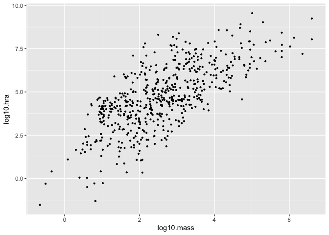<!-- -->

Map shapes to another categorical variable.

```r
p+geom_point(aes(color=thermoregulation), size=1.75)
```

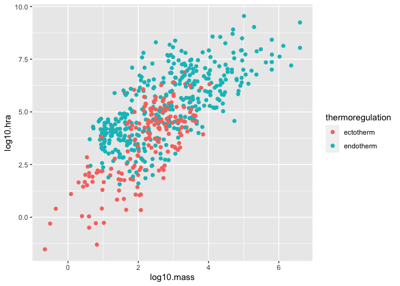<!-- -->

```r
#Coloring by caegorical variable
```


```r
p+geom_point(aes(shape=thermoregulation, color=thermoregulation), size=1.75)
```

<!-- -->

```r
#Helps differentiate further
#Consider who will be reading your report, and be aware of colorblindness!
```

## Barplots and multiple variables
At this point you should be comfortable building bar plots that shows counts of observations using `geom_bar()`. Last time we explored the `fill` option in box plots as a way to bring color to the plot; i.e. we filled by the same variable that we were plotting. What happens when we fill by a different categorical variable?  

Let's start by counting how many observations we have in each taxonomic group.

```r
homerange %>% count(taxon, sort=T)
```

```
## # A tibble: 9 x 2
##   taxon             n
##   <chr>         <int>
## 1 mammals         238
## 2 birds           140
## 3 marine fishes    90
## 4 snakes           41
## 5 river fishes     14
## 6 turtles          14
## 7 tortoises        12
## 8 lizards          11
## 9 lake fishes       9
```

```r
#Sort our via descending order by sort=T
```

Now let's make a bar plot of these data.

```r
homerange %>% 
  ggplot(aes(x = taxon)) + geom_bar() +
  coord_flip() +
  labs(title = "Observations by Taxon in Homerange Data",
       x = "Taxonomic Group")
```

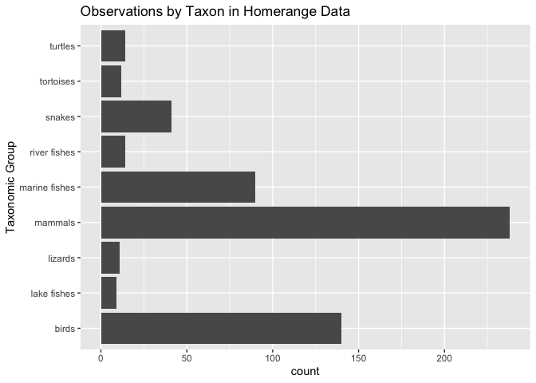<!-- -->

```r
#X axis is categorical variable
```

By specifying `fill=trophic.guild` we build a stacked bar plot that shows the proportion of a given taxonomic group that is an herbivore or carnivore.

```r
homerange %>% 
  ggplot(aes(x = taxon, fill = trophic.guild)) + geom_bar() +
  coord_flip() +
  labs(title = "Observations by Taxon in Homerange Data",
       x = "Taxonomic Group",
       fill = "Trophic Guild")
```

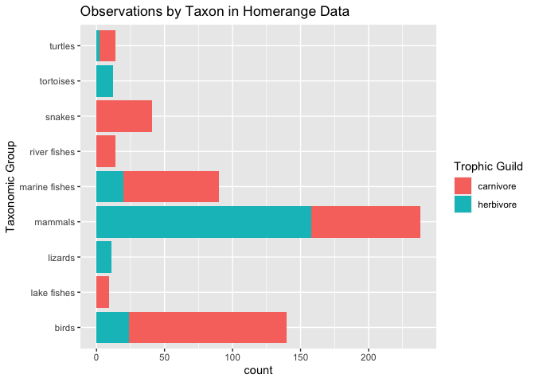<!-- -->

```r
#Not always helpful becuase ex. how many carnivores are there?
```

We can also have counts of each trophic guild within taxonomic group shown side-by-side by specifying `position="dodge"`.

```r
homerange %>% 
  ggplot(aes(x = taxon, fill = trophic.guild)) + geom_bar(position = "dodge") +
  coord_flip() +
  labs(title = "Observations by Taxon in Homerange Data",
       x = "Taxonomic Group",
       fill = "Trophic Guild")
```

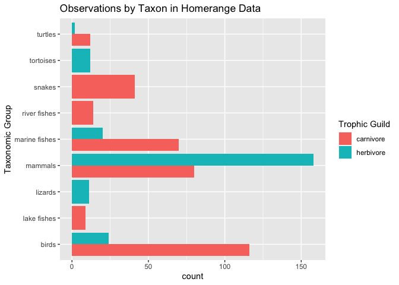<!-- -->

```r
#Dodge lets you build a side-by-side bar plot by variable
```

Here is the same plot oriented vertically.

```r
homerange %>% 
  ggplot(aes(x = taxon, fill = trophic.guild)) +
  geom_bar(position = "dodge") +
  theme(axis.text.x = element_text(angle = 60, hjust = 1)) +
  labs(title = "Observations by Taxon in Homerange Data",
       x = "Taxonomic Group",
       fill= "Trophic Guild")
```

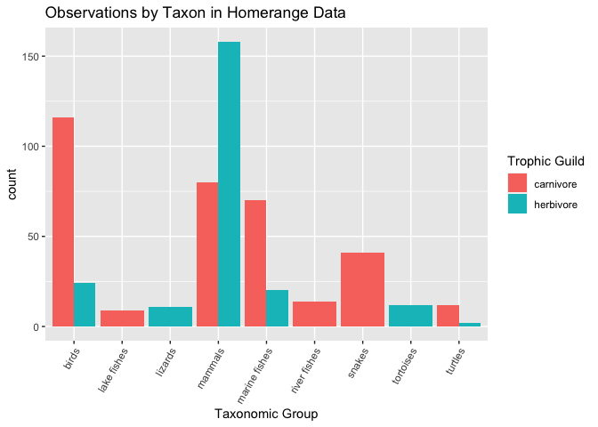<!-- -->

```r
#Position dodge, but now doing vertically. end up with annoying problem with X axis, so adjusting angle of X axis degrees by 60!
#hjust = 0 will bring words into graph since you rotated. But once you settle on aesthetic you like, you can copy and paste throughout your project
```

We can also scale all bars to a percentage (or proportion).

```r
homerange %>% 
  ggplot(aes(x = taxon, fill = trophic.guild))+
  geom_bar(position = position_fill())+ 
  scale_y_continuous(labels = scales::percent)+
  coord_flip()
```

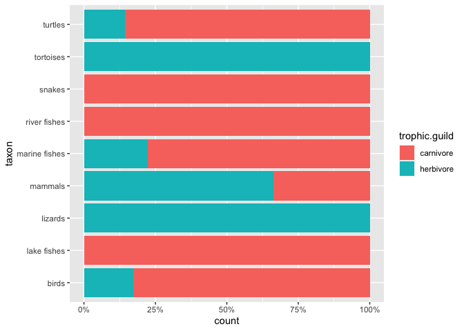<!-- -->

```r
#Scaling bars and only showing as a percentage
```

## Practice
For this practice, let's use the [palmerpenguins](https://allisonhorst.github.io/palmerpenguins/articles/intro.html) data.  

1. Make a bar plot that shows counts of individuals by island. Fill by species, and try both a stacked bar plot and `position="dodge"`.

```r
penguins
```

```
## # A tibble: 344 x 8
##    species island bill_length_mm bill_depth_mm flipper_length_… body_mass_g
##    <fct>   <fct>           <dbl>         <dbl>            <int>       <int>
##  1 Adelie  Torge…           39.1          18.7              181        3750
##  2 Adelie  Torge…           39.5          17.4              186        3800
##  3 Adelie  Torge…           40.3          18                195        3250
##  4 Adelie  Torge…           NA            NA                 NA          NA
##  5 Adelie  Torge…           36.7          19.3              193        3450
##  6 Adelie  Torge…           39.3          20.6              190        3650
##  7 Adelie  Torge…           38.9          17.8              181        3625
##  8 Adelie  Torge…           39.2          19.6              195        4675
##  9 Adelie  Torge…           34.1          18.1              193        3475
## 10 Adelie  Torge…           42            20.2              190        4250
## # … with 334 more rows, and 2 more variables: sex <fct>, year <int>
```

```r
#Good mix of continous and categorical variables
```


```r
#Straight count
penguins %>% 
  ggplot(aes(x=island))+geom_bar()
```

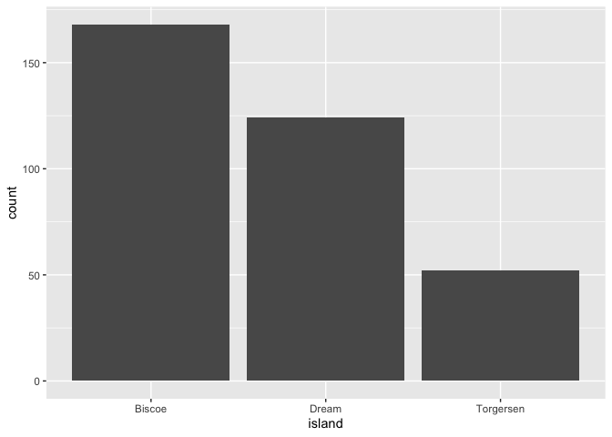<!-- -->

```r
#Counts of penguins per island
```

```r
penguins %>% 
  ggplot(aes(x=island, fill=species))+geom_bar(position="dodge")
```

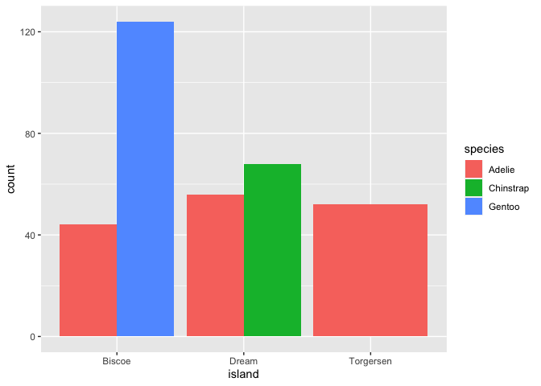<!-- -->

```r
#Number of species per island
```

2. What are the number of individuals separated by sex on each island?

```r
penguins %>% 
  ggplot(aes(x=island, fill=sex))+geom_bar(position="dodge")
```

<!-- -->

```r
#To remove NAs:
penguins %>% 
  filter(sex!="NA") %>% 
  ggplot(aes(x=island, fill=sex))+geom_bar(position="dodge")
```

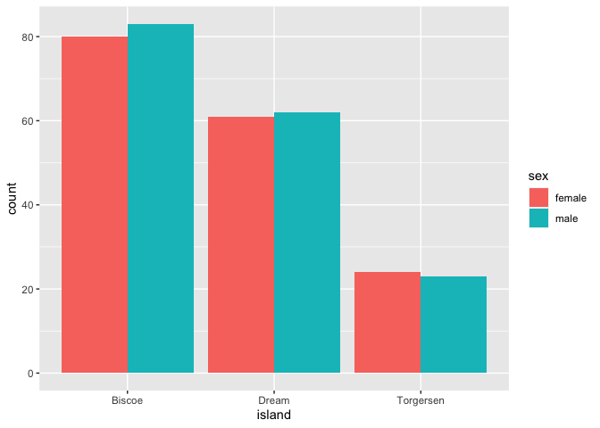<!-- -->

## Using `group`
In addition to `fill`, `group` is an aesthetic that accomplishes the same function but does not add color.

Here is a box plot that shows `log10.mass` by taxonomic `class.`

```r
glimpse(homerange)
```

```
## Rows: 569
## Columns: 24
## $ taxon                      <chr> "lake fishes", "river fishes", "river fish…
## $ common.name                <chr> "american eel", "blacktail redhorse", "cen…
## $ class                      <chr> "actinopterygii", "actinopterygii", "actin…
## $ order                      <chr> "anguilliformes", "cypriniformes", "cyprin…
## $ family                     <chr> "anguillidae", "catostomidae", "cyprinidae…
## $ genus                      <chr> "anguilla", "moxostoma", "campostoma", "cl…
## $ species                    <chr> "rostrata", "poecilura", "anomalum", "fund…
## $ primarymethod              <chr> "telemetry", "mark-recapture", "mark-recap…
## $ N                          <chr> "16", NA, "20", "26", "17", "5", "2", "2",…
## $ mean.mass.g                <dbl> 887.00, 562.00, 34.00, 4.00, 4.00, 3525.00…
## $ log10.mass                 <dbl> 2.9479236, 2.7497363, 1.5314789, 0.6020600…
## $ alternative.mass.reference <chr> NA, NA, NA, NA, NA, NA, NA, NA, NA, NA, NA…
## $ mean.hra.m2                <dbl> 282750.00, 282.10, 116.11, 125.50, 87.10, …
## $ log10.hra                  <dbl> 5.4514026, 2.4504031, 2.0648696, 2.0986437…
## $ hra.reference              <chr> "Minns, C. K. 1995. Allometry of home rang…
## $ realm                      <chr> "aquatic", "aquatic", "aquatic", "aquatic"…
## $ thermoregulation           <chr> "ectotherm", "ectotherm", "ectotherm", "ec…
## $ locomotion                 <chr> "swimming", "swimming", "swimming", "swimm…
## $ trophic.guild              <chr> "carnivore", "carnivore", "carnivore", "ca…
## $ dimension                  <chr> "3D", "2D", "2D", "2D", "2D", "2D", "2D", …
## $ preymass                   <dbl> NA, NA, NA, NA, NA, NA, 1.39, NA, NA, NA, …
## $ log10.preymass             <dbl> NA, NA, NA, NA, NA, NA, 0.1430148, NA, NA,…
## $ PPMR                       <dbl> NA, NA, NA, NA, NA, NA, 530, NA, NA, NA, N…
## $ prey.size.reference        <chr> NA, NA, NA, NA, NA, NA, "Brose U, et al. 2…
```


```r
homerange %>% 
  ggplot(aes(x = class, y = log10.mass)) +
  geom_boxplot()
```

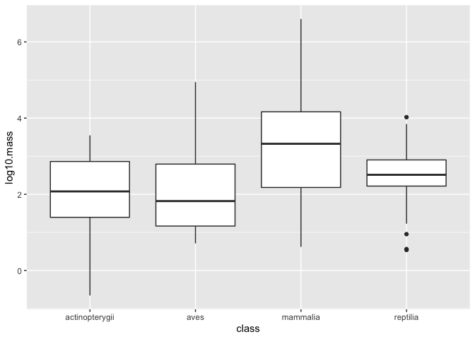<!-- -->

I use `group` to make individual box plots for each taxon.

```r
homerange %>% 
  ggplot(aes(x = class, y = log10.mass, group = taxon)) +
  geom_boxplot()
```

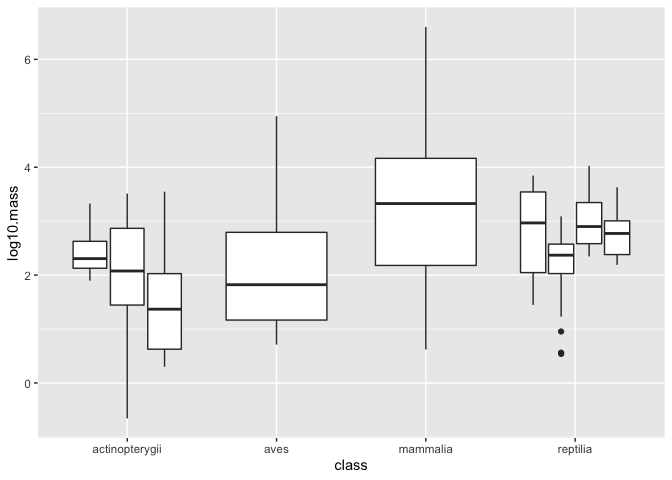<!-- -->

```r
#Use group for categorical variable But group doesn't color things
```

I can also use `fill` to associate the different taxa with a color coded key.

```r
homerange %>% 
  ggplot(aes(x = class, y = log10.mass, fill = taxon)) +
  geom_boxplot()
```

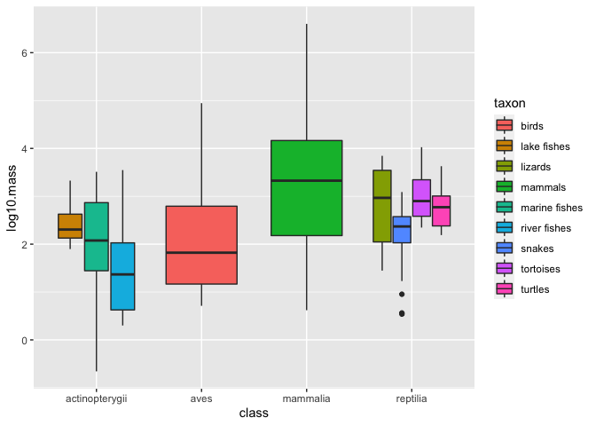<!-- -->

```r
#Fill things in with color
```

```r
#Outline in color:
homerange %>% 
  ggplot(aes(x = class, y = log10.mass, color = taxon)) +
  geom_boxplot()
```

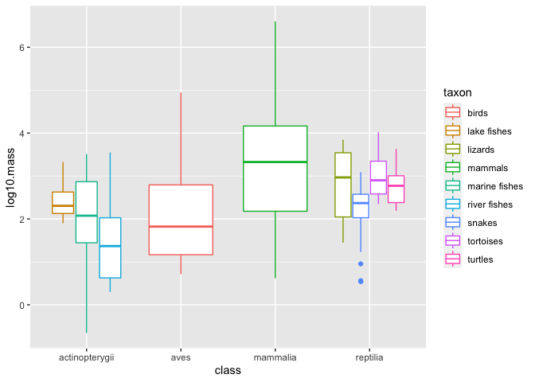<!-- -->

```r
homerange %>% 
  ggplot(aes(x = class, y = log10.mass, fill = class)) +
  geom_boxplot()
```

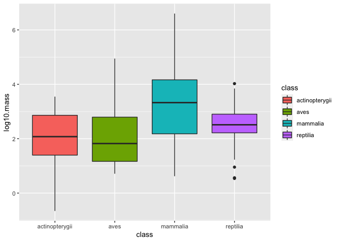<!-- -->


We can make bar plots of 2 kinds. Boxplos with range of given continous varbale by categorical. Scatterplots. Colors. Point sizes. Adding lables to axis to be clear to readers. Practice all of these for HW! Add the aesthetics that you need, like labels and titles so that your report is clean and professional-looking!


When you knit graphs, images are stored with keep.md file because github will call those images when they get that folder.


## That's it, let's take a break!   

-->[Home](https://jmledford3115.github.io/datascibiol/)
