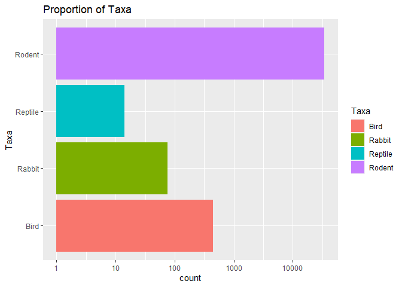
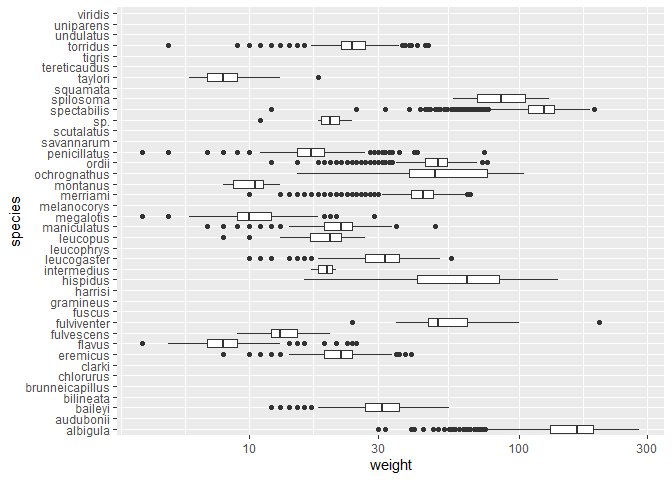
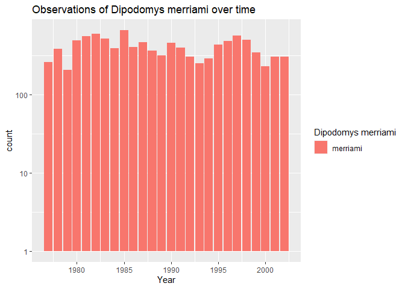
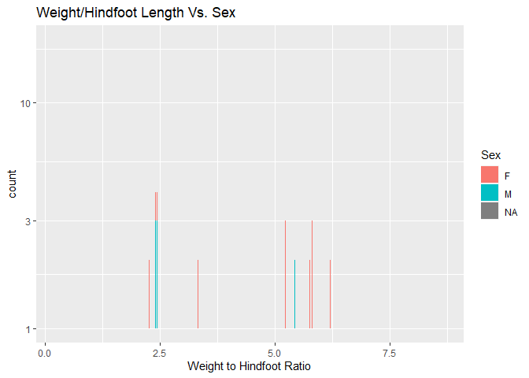

## Instructions
Answer the following questions and complete the exercises in RMarkdown. Please embed all of your code and push your final work to your repository. Your final lab report should be organized, clean, and run free from errors. Remember, you must remove the `#` for the included code chunks to run. Be sure to add your name to the author header above. For any included plots, make sure they are clearly labeled. You are free to use any plot type that you feel best communicates the results of your analysis.  

Make sure to use the formatting conventions of RMarkdown to make your report neat and clean!  

## Load the libraries

```r
library(tidyverse)
library(janitor)
library(here)
library(naniar)
```

## Desert Ecology
For this assignment, we are going to use a modified data set on [desert ecology](http://esapubs.org/archive/ecol/E090/118/). The data are from: S. K. Morgan Ernest, Thomas J. Valone, and James H. Brown. 2009. Long-term monitoring and experimental manipulation of a Chihuahuan Desert ecosystem near Portal, Arizona, USA. Ecology 90:1708.

```r
deserts <- read_csv(here("lab10", "data", "surveys_complete.csv"))
```

```
## 
## -- Column specification --------------------------------------------------------
## cols(
##   record_id = col_double(),
##   month = col_double(),
##   day = col_double(),
##   year = col_double(),
##   plot_id = col_double(),
##   species_id = col_character(),
##   sex = col_character(),
##   hindfoot_length = col_double(),
##   weight = col_double(),
##   genus = col_character(),
##   species = col_character(),
##   taxa = col_character(),
##   plot_type = col_character()
## )
```

1. Use the function(s) of your choice to get an idea of its structure, including how NA's are treated. Are the data tidy? 

```r
deserts
```

```
## # A tibble: 34,786 x 13
##    record_id month   day  year plot_id species_id sex   hindfoot_length weight
##        <dbl> <dbl> <dbl> <dbl>   <dbl> <chr>      <chr>           <dbl>  <dbl>
##  1         1     7    16  1977       2 NL         M                  32     NA
##  2         2     7    16  1977       3 NL         M                  33     NA
##  3         3     7    16  1977       2 DM         F                  37     NA
##  4         4     7    16  1977       7 DM         M                  36     NA
##  5         5     7    16  1977       3 DM         M                  35     NA
##  6         6     7    16  1977       1 PF         M                  14     NA
##  7         7     7    16  1977       2 PE         F                  NA     NA
##  8         8     7    16  1977       1 DM         M                  37     NA
##  9         9     7    16  1977       1 DM         F                  34     NA
## 10        10     7    16  1977       6 PF         F                  20     NA
## # ... with 34,776 more rows, and 4 more variables: genus <chr>, species <chr>,
## #   taxa <chr>, plot_type <chr>
```

```r
glimpse(deserts)
```

```
## Rows: 34,786
## Columns: 13
## $ record_id       <dbl> 1, 2, 3, 4, 5, 6, 7, 8, 9, 10, 11, 12, 13, 14, 15, ...
## $ month           <dbl> 7, 7, 7, 7, 7, 7, 7, 7, 7, 7, 7, 7, 7, 7, 7, 7, 7, ...
## $ day             <dbl> 16, 16, 16, 16, 16, 16, 16, 16, 16, 16, 16, 16, 16,...
## $ year            <dbl> 1977, 1977, 1977, 1977, 1977, 1977, 1977, 1977, 197...
## $ plot_id         <dbl> 2, 3, 2, 7, 3, 1, 2, 1, 1, 6, 5, 7, 3, 8, 6, 4, 3, ...
## $ species_id      <chr> "NL", "NL", "DM", "DM", "DM", "PF", "PE", "DM", "DM...
## $ sex             <chr> "M", "M", "F", "M", "M", "M", "F", "M", "F", "F", "...
## $ hindfoot_length <dbl> 32, 33, 37, 36, 35, 14, NA, 37, 34, 20, 53, 38, 35,...
## $ weight          <dbl> NA, NA, NA, NA, NA, NA, NA, NA, NA, NA, NA, NA, NA,...
## $ genus           <chr> "Neotoma", "Neotoma", "Dipodomys", "Dipodomys", "Di...
## $ species         <chr> "albigula", "albigula", "merriami", "merriami", "me...
## $ taxa            <chr> "Rodent", "Rodent", "Rodent", "Rodent", "Rodent", "...
## $ plot_type       <chr> "Control", "Long-term Krat Exclosure", "Control", "...
```

```r
naniar::miss_var_summary(deserts)
```

```
## # A tibble: 13 x 3
##    variable        n_miss pct_miss
##    <chr>            <int>    <dbl>
##  1 hindfoot_length   3348     9.62
##  2 weight            2503     7.20
##  3 sex               1748     5.03
##  4 record_id            0     0   
##  5 month                0     0   
##  6 day                  0     0   
##  7 year                 0     0   
##  8 plot_id              0     0   
##  9 species_id           0     0   
## 10 genus                0     0   
## 11 species              0     0   
## 12 taxa                 0     0   
## 13 plot_type            0     0
```

The data are tidy. (But what about plot type?)

2. How many genera and species are represented in the data? What are the total number of observations? Which species is most/ least frequently sampled in the study?

```r
deserts %>% 
  count(genus) %>% 
  arrange(desc(n))
```

```
## # A tibble: 26 x 2
##    genus                n
##    <chr>            <int>
##  1 Dipodomys        16167
##  2 Chaetodipus       6029
##  3 Onychomys         3267
##  4 Reithrodontomys   2694
##  5 Peromyscus        2234
##  6 Perognathus       1629
##  7 Neotoma           1252
##  8 Ammospermophilus   437
##  9 Amphispiza         303
## 10 Spermophilus       249
## # ... with 16 more rows
```


```r
deserts %>%
  group_by(genus, species) %>% 
  summarize(total_n=n(),
            total_observations=sum(total_n)) %>% 
  arrange(desc(total_n))
```

```
## `summarise()` has grouped output by 'genus'. You can override using the `.groups` argument.
```

```
## # A tibble: 48 x 4
## # Groups:   genus [26]
##    genus           species      total_n total_observations
##    <chr>           <chr>          <int>              <int>
##  1 Dipodomys       merriami       10596              10596
##  2 Chaetodipus     penicillatus    3123               3123
##  3 Dipodomys       ordii           3027               3027
##  4 Chaetodipus     baileyi         2891               2891
##  5 Reithrodontomys megalotis       2609               2609
##  6 Dipodomys       spectabilis     2504               2504
##  7 Onychomys       torridus        2249               2249
##  8 Perognathus     flavus          1597               1597
##  9 Peromyscus      eremicus        1299               1299
## 10 Neotoma         albigula        1252               1252
## # ... with 38 more rows
```

3. What is the proportion of taxa included in this study? Show a table and plot that reflects this count.

```r
tabyl(deserts, taxa)
```

```
##     taxa     n      percent
##     Bird   450 0.0129362387
##   Rabbit    75 0.0021560398
##  Reptile    14 0.0004024608
##   Rodent 34247 0.9845052607
```


```r
deserts %>%
   ggplot(aes(x = taxa, fill = taxa)) + geom_bar() + scale_y_log10() +
  coord_flip() +
  labs(title = "Proportion of Taxa",
       x = "Taxa",
       fill = "Taxa")
```

<!-- -->


4. For the taxa included in the study, use the fill option to show the proportion of individuals sampled by `plot_type.`

```r
deserts %>%
   ggplot(aes(x = taxa, fill = plot_type)) + geom_bar() + scale_y_log10() +
  labs(title = "Proportion of Taxa",
       x = "Taxa",
       fill = "Plot Type")
```

<!-- -->


5. What is the range of weight for each species included in the study? Remove any observations of weight that are NA so they do not show up in the plot.

```r
deserts %>%
  ggplot(aes(x=species, y=weight))+geom_boxplot(na.rm=T)+scale_y_log10()+coord_flip()
```

<!-- -->

6. Add another layer to your answer from #4 using `geom_point` to get an idea of how many measurements were taken for each species.

```r
deserts %>% 
  filter(weight != "NA") %>% 
  ggplot(aes(x=species, y=weight)) + geom_point() + coord_flip() + geom_boxplot(na.rm=T) + geom_smooth(method=lm, se=F)+  theme(plot.title = element_text(size = rel(0.95), hjust = 0.5)) +
  labs(title="Species vs. Weight",
       x="Species",
       y="Weight")
```

```
## `geom_smooth()` using formula 'y ~ x'
```

<!-- -->


7. [Dipodomys merriami](https://en.wikipedia.org/wiki/Merriam's_kangaroo_rat) is the most frequently sampled animal in the study. How have the number of observations of this species changed over the years included in the study?

```r
deserts %>% 
  filter(genus=="Dipodomys" & species=="merriami") %>% 
  ggplot(aes(x = year, fill = species)) + geom_bar() + scale_y_log10() +
  labs(title = "Observations of Dipodomys merriami over time",
       x = "Year",
       fill = "Dipodomys merriami")
```

<!-- -->

```r
  theme(plot.title = element_text(size = rel(1.5), hjust = 0.5))
```

```
## List of 1
##  $ plot.title:List of 11
##   ..$ family       : NULL
##   ..$ face         : NULL
##   ..$ colour       : NULL
##   ..$ size         : 'rel' num 1.5
##   ..$ hjust        : num 0.5
##   ..$ vjust        : NULL
##   ..$ angle        : NULL
##   ..$ lineheight   : NULL
##   ..$ margin       : NULL
##   ..$ debug        : NULL
##   ..$ inherit.blank: logi FALSE
##   ..- attr(*, "class")= chr [1:2] "element_text" "element"
##  - attr(*, "class")= chr [1:2] "theme" "gg"
##  - attr(*, "complete")= logi FALSE
##  - attr(*, "validate")= logi TRUE
```


8. What is the relationship between `weight` and `hindfoot` length? Consider whether or not over plotting is an issue.

```r
deserts %>% 
  filter(weight != "NA" & hindfoot_length !="NA") %>% 
  ggplot(aes(x=hindfoot_length, y=weight)) + geom_point() +
  labs(title = "Weight vs. Hindfoot Length",
       x = "Weight",
       y = "Hindfoot Length") +
  theme(plot.title = element_text(size = rel(1.5), hjust = 0.5))
```

<!-- -->

<style>
div.blue { background-color:#e6f0ff; border-radius: 5px; padding: 20px;}
</style>
<div class = "blue">

9. Which two species have, on average, the highest weight? Once you have identified them, make a new column that is a ratio of `weight` to `hindfoot_length`. Make a plot that shows the range of this new ratio and fill by sex.

```r
deserts %>% 
  group_by(species) %>% 
  filter(weight !="NA") %>%
  summarize(average_weight=mean(weight)) %>% 
  arrange(desc(average_weight))
```

```
## # A tibble: 22 x 2
##    species      average_weight
##    <chr>                 <dbl>
##  1 albigula              159. 
##  2 spectabilis           120. 
##  3 spilosoma              93.5
##  4 hispidus               65.6
##  5 fulviventer            58.9
##  6 ochrognathus           55.4
##  7 ordii                  48.9
##  8 merriami               43.2
##  9 baileyi                31.7
## 10 leucogaster            31.6
## # ... with 12 more rows
```

```r
deserts %>% 
  filter(weight !="NA") %>% 
  filter(species=="albigula"| species=="spectabilis") %>% 
  mutate(weight_hindfoot_ratio=weight/hindfoot_length) %>% 
  ggplot(aes(x = weight_hindfoot_ratio, fill = sex)) + geom_bar() + scale_y_log10() +
  labs(title = "Weight/Hindfoot Length Vs. Sex",
       x = "Weight to Hindfoot Ratio",
       fill = "Sex")
```

```
## Warning: Removed 424 rows containing non-finite values (stat_count).
```

```
## Warning: position_stack requires non-overlapping x intervals
```

<!-- -->
</div>


10. Make one plot of your choice! Make sure to include at least two of the aesthetics options you have learned.

```r
deserts %>% 
  ggplot(aes(x = plot_type, fill = plot_type)) +
  geom_bar(position = "dodge") +
  theme(axis.text.x = element_text(angle = 60, hjust = 1)) + coord_flip() + theme(plot.title = element_text(size = rel(2), hjust = 1)) +
  labs(title = "Plot Type Proportions",
       x = "Plot Type",
       fill= "Plot Type")
```

<!-- -->


## Push your final code to GitHub!
Please be sure that you check the `keep md` file in the knit preferences. 
