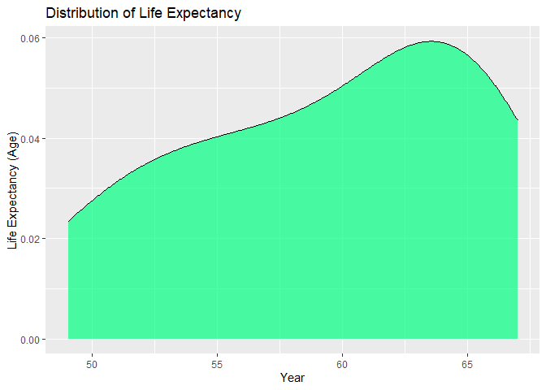
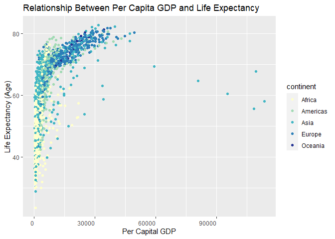
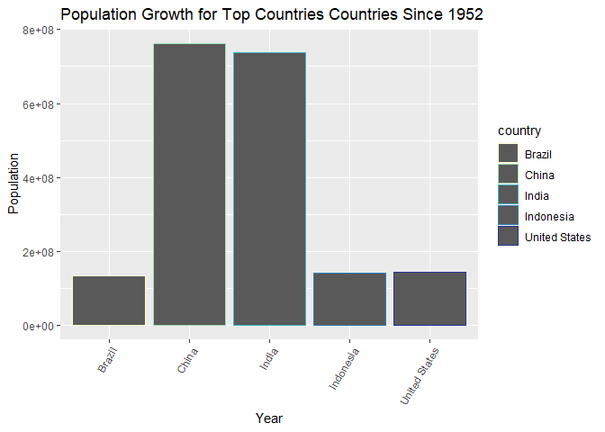

## Instructions
Answer the following questions and complete the exercises in RMarkdown. Please embed all of your code and push your final work to your repository. Your final lab report should be organized, clean, and run free from errors. Remember, you must remove the `#` for the included code chunks to run. Be sure to add your name to the author header above. For any included plots, make sure they are clearly labeled. You are free to use any plot type that you feel best communicates the results of your analysis.  

**In this homework, you should make use of the aesthetics you have learned. It's OK to be flashy!**

Make sure to use the formatting conventions of RMarkdown to make your report neat and clean!  

## Load the libraries

```r
library(tidyverse)
library(janitor)
library(here)
library(naniar)
```

## Resources
The idea for this assignment came from [Rebecca Barter's](http://www.rebeccabarter.com/blog/2017-11-17-ggplot2_tutorial/) ggplot tutorial so if you get stuck this is a good place to have a look.  

## Gapminder
For this assignment, we are going to use the dataset [gapminder](https://cran.r-project.org/web/packages/gapminder/index.html). Gapminder includes information about economics, population, and life expectancy from countries all over the world. You will need to install it before use. This is the same data that we will use for midterm 2 so this is good practice.

```r
#install.packages("gapminder")
library("gapminder")
```


```r
library(RColorBrewer)
library(ggthemes)
library(paletteer)
```


## Questions
The questions below are open-ended and have many possible solutions. Your approach should, where appropriate, include numerical summaries and visuals. Be creative; assume you are building an analysis that you would ultimately present to an audience of stakeholders. Feel free to try out different `geoms` if they more clearly present your results.  

**1. Use the function(s) of your choice to get an idea of the overall structure of the data frame, including its dimensions, column names, variable classes, etc. As part of this, determine how NA's are treated in the data.**  

```r
glimpse(gapminder)
```

```
## Rows: 1,704
## Columns: 6
## $ country   <fct> Afghanistan, Afghanistan, Afghanistan, Afghanistan, Afghani…
## $ continent <fct> Asia, Asia, Asia, Asia, Asia, Asia, Asia, Asia, Asia, Asia,…
## $ year      <int> 1952, 1957, 1962, 1967, 1972, 1977, 1982, 1987, 1992, 1997,…
## $ lifeExp   <dbl> 28.801, 30.332, 31.997, 34.020, 36.088, 38.438, 39.854, 40.…
## $ pop       <int> 8425333, 9240934, 10267083, 11537966, 13079460, 14880372, 1…
## $ gdpPercap <dbl> 779.4453, 820.8530, 853.1007, 836.1971, 739.9811, 786.1134,…
```

```r
dim(gapminder)
```

```
## [1] 1704    6
```

```r
names(gapminder)
```

```
## [1] "country"   "continent" "year"      "lifeExp"   "pop"       "gdpPercap"
```

```r
sapply(gapminder, class)
```

```
##   country continent      year   lifeExp       pop gdpPercap 
##  "factor"  "factor" "integer" "numeric" "integer" "numeric"
```

```r
summary(gapminder)
```

```
##         country        continent        year         lifeExp     
##  Afghanistan:  12   Africa  :624   Min.   :1952   Min.   :23.60  
##  Albania    :  12   Americas:300   1st Qu.:1966   1st Qu.:48.20  
##  Algeria    :  12   Asia    :396   Median :1980   Median :60.71  
##  Angola     :  12   Europe  :360   Mean   :1980   Mean   :59.47  
##  Argentina  :  12   Oceania : 24   3rd Qu.:1993   3rd Qu.:70.85  
##  Australia  :  12                  Max.   :2007   Max.   :82.60  
##  (Other)    :1632                                                
##       pop              gdpPercap       
##  Min.   :6.001e+04   Min.   :   241.2  
##  1st Qu.:2.794e+06   1st Qu.:  1202.1  
##  Median :7.024e+06   Median :  3531.8  
##  Mean   :2.960e+07   Mean   :  7215.3  
##  3rd Qu.:1.959e+07   3rd Qu.:  9325.5  
##  Max.   :1.319e+09   Max.   :113523.1  
## 
```


```r
naniar::miss_var_summary(gapminder)
```

```
## # A tibble: 6 x 3
##   variable  n_miss pct_miss
##   <chr>      <int>    <dbl>
## 1 country        0        0
## 2 continent      0        0
## 3 year           0        0
## 4 lifeExp        0        0
## 5 pop            0        0
## 6 gdpPercap      0        0
```

As far as the summary and NA functions go, there doesn't seem to be any obvious NAs in this dataset.


**2. Among the interesting variables in gapminder is life expectancy. How has global life expectancy changed between 1952 and 2007?**


```r
#gapminder %>%
#  filter(year <= "1952" & year >= "2007") %>% 
#  group_by(year) %>%
#  summarize(global_life_expectancy=mean(lifeExp, na.rm=T))
#Original code I tried, but it didn't work. Used what a classmate did instead
```

```r
gapminder %>% 
  group_by(continent, year) %>%
  filter(between(year, 1952, 2007)) %>%
  summarize(mean_lifeExp=mean(lifeExp))
```

```
## `summarise()` has grouped output by 'continent'. You can override using the `.groups` argument.
```

```
## # A tibble: 60 x 3
## # Groups:   continent [5]
##    continent  year mean_lifeExp
##    <fct>     <int>        <dbl>
##  1 Africa     1952         39.1
##  2 Africa     1957         41.3
##  3 Africa     1962         43.3
##  4 Africa     1967         45.3
##  5 Africa     1972         47.5
##  6 Africa     1977         49.6
##  7 Africa     1982         51.6
##  8 Africa     1987         53.3
##  9 Africa     1992         53.6
## 10 Africa     1997         53.6
## # … with 50 more rows
```


```r
?labs(fill)
```


```r
gapminder %>% 
  group_by(year) %>%
  filter(between(year, 1952, 2007)) %>%
  summarize(mean_lifeExp=mean(lifeExp)) %>% 
  ggplot(aes(x=year, y=mean_lifeExp))+
  geom_line(color="black")+
  geom_point(shape=1, color="black")+
  theme(axis.text.x = element_text(hjust = 1))+
  labs(title = "Global Life Expectancy From 1952 to 2007",
       x = "Year",
       y = "Life Expectancy (Age)")
```

<!-- -->

Life expectancy has generally increased from 1952 to 2007.


**3. How do the distributions of life expectancy compare for the years 1952 and 2007?**

```r
gapminder %>% 
  group_by(year) %>%
  filter(between(year, 1952, 2007)) %>%
  summarize(mean_lifeExp=mean(lifeExp)) %>%  
  ggplot(aes(x = mean_lifeExp)) +
  geom_density(alpha = 0.7, color = "black", fill = "springgreen")+
  labs(title = "Distribution of Life Expectancy",
       x = "Year",
       y = "Life Expectancy (Age)",
       fill = "Year")
```

<!-- -->


**4. Your answer above doesn't tell the whole story since life expectancy varies by region. Make a summary that shows the min, mean, and max life expectancy by continent for all years represented in the data.**

```r
summary(gapminder$lifeExp)
```

```
##    Min. 1st Qu.  Median    Mean 3rd Qu.    Max. 
##   23.60   48.20   60.71   59.47   70.85   82.60
```


```r
gapminder %>% 
  group_by(continent, year) %>%
  filter(between(year, 1952, 2007)) %>%
  summarize(mean_lifeExp=mean(lifeExp),
            min_lifeExp=min(lifeExp),
            max_lifeExp=max(lifeExp))
```

```
## `summarise()` has grouped output by 'continent'. You can override using the `.groups` argument.
```

```
## # A tibble: 60 x 5
## # Groups:   continent [5]
##    continent  year mean_lifeExp min_lifeExp max_lifeExp
##    <fct>     <int>        <dbl>       <dbl>       <dbl>
##  1 Africa     1952         39.1        30          52.7
##  2 Africa     1957         41.3        31.6        58.1
##  3 Africa     1962         43.3        32.8        60.2
##  4 Africa     1967         45.3        34.1        61.6
##  5 Africa     1972         47.5        35.4        64.3
##  6 Africa     1977         49.6        36.8        67.1
##  7 Africa     1982         51.6        38.4        69.9
##  8 Africa     1987         53.3        39.9        71.9
##  9 Africa     1992         53.6        23.6        73.6
## 10 Africa     1997         53.6        36.1        74.8
## # … with 50 more rows
```

```r
?RColorBrewer
```


```r
display.brewer.pal(5,"YlGnBu")
```

<!-- -->

```r
devAskNewPage(ask=TRUE)
```


```r
?brewer.pal
```


```r
YGB_palette <- brewer.pal(5,"YlGnBu")
YGB_palette
```

```
## [1] "#FFFFCC" "#A1DAB4" "#41B6C4" "#2C7FB8" "#253494"
```


```r
gapminder %>% 
  group_by(continent, year) %>%
  ggplot(aes(x = continent, y = lifeExp, fill=continent))+
  geom_boxplot()+ 
  labs(title = "Distribution of Life Expectancy by Continent",
       x = "Year",
       y = "Life Expectancy (Age)",
       fill = "Year")+
  scale_fill_manual(values=YGB_palette)
```

<!-- -->


**5. How has life expectancy changed between 1952-2007 for each continent?**


```r
gapminder %>% 
  group_by(continent, year) %>%
  filter(between(year, 1952, 2007)) %>%
  summarize(mean_lifeExp=mean(lifeExp)) %>% 
  ggplot(aes(x=year, y=mean_lifeExp, group=continent, color=continent))+
  geom_line()+
  geom_point(shape=1)+
  labs(title = "Global Life Expectancy From 1952 to 2007",
       x = "Year",
       y = "Life Expectancy (Age)",
       fill = "Continent")+
  scale_color_manual(values = YGB_palette)
```

```
## `summarise()` has grouped output by 'continent'. You can override using the `.groups` argument.
```

<!-- -->

**6. We are interested in the relationship between per capita GDP and life expectancy; i.e. does having more money help you live longer?**


```r
gapminder %>% 
  ggplot(aes(x = gdpPercap, y = lifeExp, color = continent)) +
  geom_point()+
  theme(axis.text.x = element_text(hjust = 1))+
  labs(title = "Relationship Between Per Capita GDP and Life Expectancy",
       x = "Per Capital GDP",
       y = "Life Expectancy (Age)")+
  scale_color_manual(values = YGB_palette)
```

<!-- -->

```r
gapminder %>% 
  ggplot(aes(x = gdpPercap, y = lifeExp, color = continent)) +
  geom_point()+
  theme(axis.text.x = element_text(hjust = 1))+
  labs(title = "Relationship Between Per Capita GDP and Life Expectancy",
       x = "Per Capital GDP",
       y = "Life Expectancy (Age)",
       fill = "Continent")+
  xlim(0, 50000) +
  ylim(20, 90)+
    scale_color_manual(values = YGB_palette)
```

```
## Warning: Removed 6 rows containing missing values (geom_point).
```

<!-- -->

**7. Which countries have had the largest population growth since 1952?**

```r
gapminder %>%
  filter(year >=1952) %>%
  select(country, pop, year) %>% 
  group_by(country) %>%
  summarize(sum_pop_growth=sum(pop)) %>% 
  arrange(desc(sum_pop_growth))
```

```
## # A tibble: 142 x 2
##    country       sum_pop_growth
##    <fct>                  <dbl>
##  1 China            11497920623
##  2 India             8413568878
##  3 United States     2738534790
##  4 Indonesia         1779874000
##  5 Brazil            1467745520
##  6 Japan             1341105696
##  7 Pakistan          1124200629
##  8 Bangladesh        1089064744
##  9 Germany            930564520
## 10 Nigeria            884496214
## # … with 132 more rows
```


```r
gapminder$year <- as.character(gapminder$year)
```


```r
gapminder %>% 
  filter(year == 1952 | year==2007) %>% 
  select(country, pop, year) %>%   #Somehow take difference in years from here
  separate(year, c("1952", "2007"), extra = "drop", fill = "right") #Trying to shift 2007 values to the right
```

```
## # A tibble: 284 x 4
##    country          pop `1952` `2007`
##    <fct>          <int> <chr>  <chr> 
##  1 Afghanistan  8425333 1952   <NA>  
##  2 Afghanistan 31889923 2007   <NA>  
##  3 Albania      1282697 1952   <NA>  
##  4 Albania      3600523 2007   <NA>  
##  5 Algeria      9279525 1952   <NA>  
##  6 Algeria     33333216 2007   <NA>  
##  7 Angola       4232095 1952   <NA>  
##  8 Angola      12420476 2007   <NA>  
##  9 Argentina   17876956 1952   <NA>  
## 10 Argentina   40301927 2007   <NA>  
## # … with 274 more rows
```


```r
#Another way a classmate suggested and got different results:
gapminder_7 <-  gapminder %>% 
  filter(year == 1952 | year==2007) %>% 
  select(country, pop, year) %>% 
  group_by(country) %>% 
  mutate(growth=pop-lag(pop,default = pop[1])) %>% 
  filter(year==2007) %>% 
  summarize(country, growth) %>% 
  arrange(desc(growth))
gapminder_7
```

```
## # A tibble: 142 x 2
##    country          growth
##    <fct>             <int>
##  1 China         762419569
##  2 India         738396331
##  3 United States 143586947
##  4 Indonesia     141495000
##  5 Brazil        133408087
##  6 Pakistan      127924057
##  7 Bangladesh    103561480
##  8 Nigeria       101912068
##  9 Mexico         78556574
## 10 Philippines    68638596
## # … with 132 more rows
```


**8. Use your results from the question above to plot population growth for the top five countries since 1952.**

```r
gapminder_7 %>%
  top_n(5) %>% 
  ggplot(aes(x=country, y=growth, group=country, color=country))+
  geom_col()+
  theme(axis.text.x = element_text(angle = 60, hjust = 1)) +
  labs(title = "Population Growth for Top Countries Countries Since 1952",
       x = "Year",
       y = "Population",
       fill = "Country")+
  scale_color_manual(values = YGB_palette)
```

```
## Selecting by growth
```

<!-- -->


**9. How does per-capita GDP growth compare between these same five countries?**

```r
gapminder %>% 
  filter(year == 1952 | year==2007) %>% 
  select(country, pop, year, gdpPercap) %>% 
  group_by(country) %>% 
  mutate(growth=pop-lag(pop,default = pop[1])) %>% 
  filter(year==2007) %>% 
  summarize(country, growth) %>% 
  arrange(desc(growth)) %>% 
  top_n(5)
```

```
## Selecting by growth
```

```
## # A tibble: 5 x 2
##   country          growth
##   <fct>             <int>
## 1 China         762419569
## 2 India         738396331
## 3 United States 143586947
## 4 Indonesia     141495000
## 5 Brazil        133408087
```


**10. Make one plot of your choice that uses faceting!**

```r
gapminder %>% 
  ggplot(aes(x = lifeExp)) +
  geom_density()+
  facet_wrap(~continent)
```

<!-- -->


## Push your final code to GitHub!
Please be sure that you check the `keep md` file in the knit preferences. 
