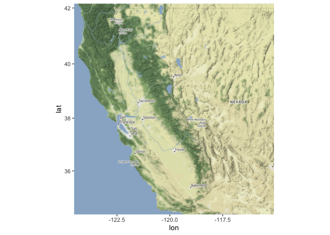
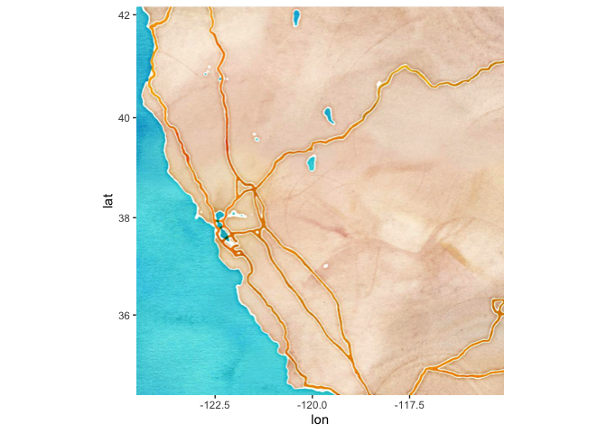
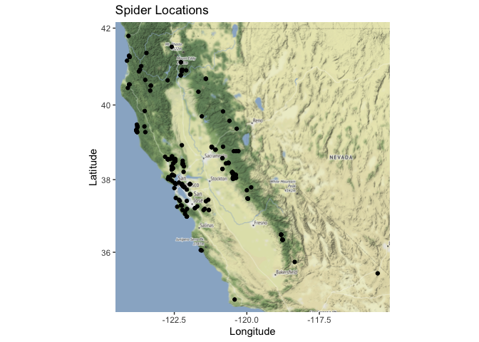
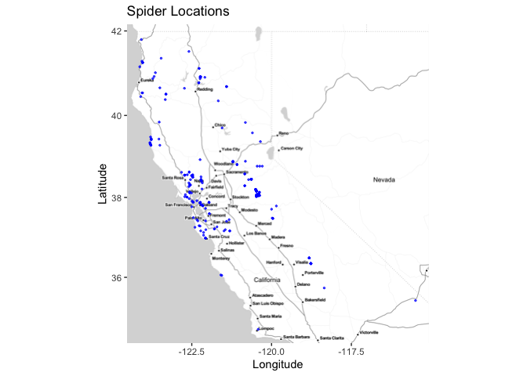
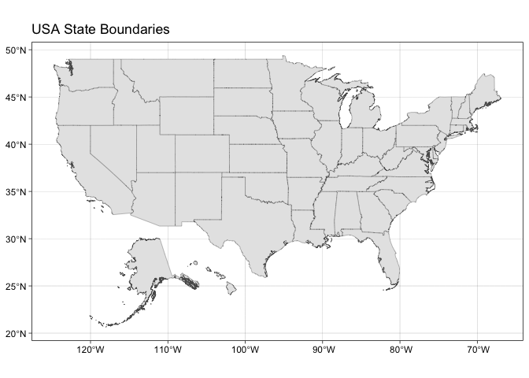
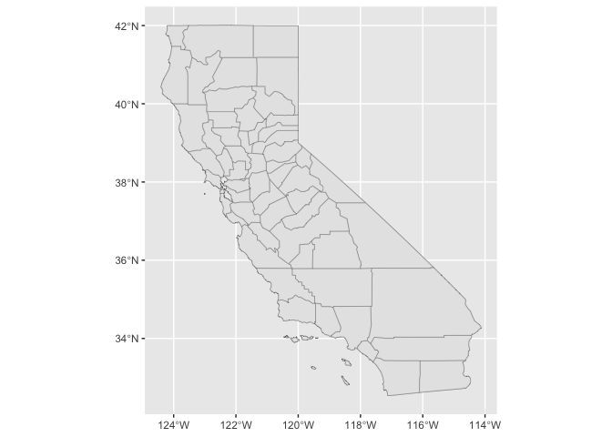
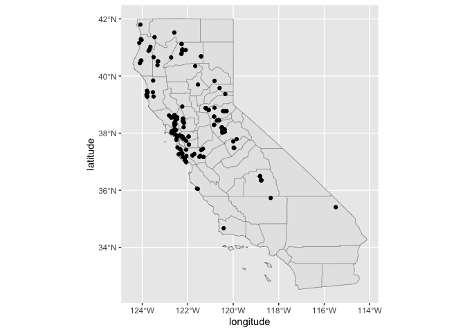
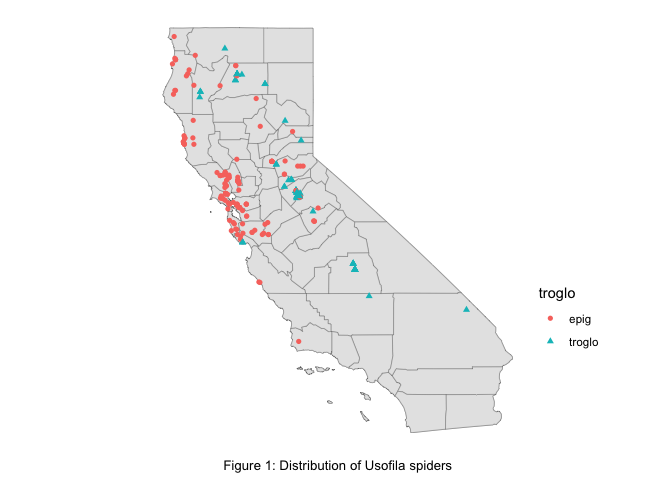

## Learning Goals
*At the end of this exercise, you will be able to:*  
1. Produce distribution maps in R.  
 
## Resources
[Overview of Cooordinate Reference Systems in R](https://www.nceas.ucsb.edu/~frazier/RSpatialGuides/OverviewCoordinateReferenceSystems.pdf)

## Spatial Data in R
There are many packages and techniques for working with spatial data in R. We will cover just some of the basics. One nice package is `ggmap`, which allows us to get base maps from Google Maps, OpenStreetMap, and Stamen Maps. It also works well with `ggplot2`.  

If you completed part 1 of today's lab then you should have the following packages installed. If not, then you should get them going now. You need to do these in order!  

`devtools` and `ggmap`

```r
#install.packages("devtools")
#library(devtools)
#devtools::install_github("dkahle/ggmap")
```


```r
#install.packages("devtools")
```

```r
library(usethis)
```


```r
#devtools::install_github("dkahle/ggmap")
```


```r
library(devtools)
```


```r
#install.packages("usethis")
```


`albersusa`

```r
#install.packages("albersusa")
```


```r
#devtools::install_github("hrbrmstr/albersusa", force = TRUE)
```


## Load the libraries

```r
library(tidyverse)
library(here)
library(janitor)
library(ggmap)
```

Let's load our processed data from the first part of the lab.

```r
spiders <- read_csv(here("lab12", "data", "spiders_with_locs.csv")) %>% clean_names()
```

There is an error in one of the coordinates that we will fix here.

```r
spiders <- spiders %>% filter(latitude<=42)
```

## Create Base Map
Our goal here is to plot the spiders locations from the columns which contain the latitude and longitude. First, we need to get a base map for plotting our points on. We could plot them without a base map, but that wouldn't give us any context as to where they are in space. To get a base map we specify a min and max of each x and y coordinate, and create a bounding box.  

We set the bounding box to a little outside our min and max locations with `f = 0.05`.    

`summary()` gives us our min and max.

```r
spiders %>% 
  select(latitude, longitude) %>% 
  summary()
```

```
##     latitude       longitude     
##  Min.   :34.67   Min.   :-124.1  
##  1st Qu.:37.88   1st Qu.:-122.5  
##  Median :38.19   Median :-122.1  
##  Mean   :38.47   Mean   :-121.6  
##  3rd Qu.:38.88   3rd Qu.:-120.5  
##  Max.   :41.80   Max.   :-115.5
```

Now we set the bounding box.

```r
lat <- c(34.67, 41.80) #Concatenating min and max
long <- c(-124.1, -115.5)
bbox <- make_bbox(long, lat, f = 0.05) #f is a way of slightly expanding bounding box beyond coordinates. If you don't do this, sometimes you'll have coordinates on the edge of the map and it doesn't look nice
```

Let's get a base map for our bounding box area. We will use the stamen maps because they are free. There are several different map types, including: `terrain-labels`, `terrain-lines`, `toner`, `toner-2011`, `toner-background`, `toner-hybrid`, `toner-lines`, `toner-lite`, and `watercolor.`

```r
map1 <- get_map(bbox, maptype = "terrain", source = "stamen") #Maptype: one of the options. Source is because stamen is free and opensource, otherwise Google wants your credit card number. Don't give Google your credit card number lol
```

```
## Map tiles by Stamen Design, under CC BY 3.0. Data by OpenStreetMap, under ODbL.
```


```r
ggmap(map1)
```

<!-- -->

```r
map2 <- get_map(bbox, maptype = "watercolor", source = "stamen")
```

```
## Map tiles by Stamen Design, under CC BY 3.0. Data by OpenStreetMap, under CC BY SA.
```


```r
ggmap(map2)
```

<!-- -->

```r
#WHOA it looks like a pirate map! :D
```


## Adding Points to Base Map
`ggmap` works well with `ggplot2`. To add our points we only need to specify the x and y location similar to how we made charts in previous labs. 

```r
ggmap(map1) + #Adding layers
  geom_point(data = spiders, aes(longitude, latitude)) +
  labs(x = "Longitude", y = "Latitude", title = "Spider Locations")
```

<!-- -->

## Practice
1. Map the spider locations with a different type of base map. Try to adjust the map using different aesthetics including `size`, `color`, and `alpha`.

```r
map3 <- get_map(bbox, maptype = "toner-lite", source = "stamen")
```

```
## Map tiles by Stamen Design, under CC BY 3.0. Data by OpenStreetMap, under ODbL.
```


```r
ggmap(map3) +
  geom_point(data = spiders, aes(longitude, latitude), size = 0.5, alpha = 0.7, color = "blue") +
  labs(x = "Longitude", y = "Latitude", title = "Spider Locations")
```

<!-- -->

## Albers USA
The Albers USA [package](https://github.com/hrbrmstr/albersusa) is a very fast way to produce clean maps that include nice overlays of counties across the US. I haven't explored it fully, but here are some nice examples.

```r
library(albersusa)
#Good if you're working with data in the lower 48, meaning doesn't work well with Hawaii or Alaska
```

State Boundaries.

```r
us_comp <- usa_sf() # get a composite map of the USA
```

County boundaries in each state.

```r
cnty_comp <- counties_sf() # get a composite map of USA counties
```

Map of the USA- notice that you can still use themes. `geom_sf` stands for simple feature.

```r
ggplot() + 
  geom_sf(data = us_comp, size = 0.125) + #Size is width of lines that define state borders
  theme_linedraw()+
  labs(title = "USA State Boundaries")
```

<!-- -->

RStudio thinks Alaska and Hawaii are mapped as shown, but not, so doesn't work well with those states.

Since we want to produce a map of our spiders we need to restrict the map to California.

```r
ca_comp <- us_comp %>% 
  filter(name=="California") #Polygon layers for state and counties of CA
```


```r
ca_cnty_comp <- cnty_comp %>% 
  filter(state=="California")
```

Our base map

```r
ggplot() +
  geom_sf(data = ca_comp, size = 0.125)+
  geom_sf(data = ca_cnty_comp, size = 0.125)
```

<!-- -->

All we do now is add the `geom_point()` layer.

```r
ggplot() +
  geom_sf(data = ca_comp, size = 0.125)+
  geom_sf(data = ca_cnty_comp, size = 0.125)+
  geom_point(data = spiders, aes(longitude, latitude))
```

<!-- -->

One issue: this map looks great in R, but needs to be exported into another format in order for it to show!   


We can spice things up a bit by adding aesthetics.


```r
#install.packages("svglite")
```


```r
library(svglite)
```


```r
ggplot() +
  geom_sf(data = ca_comp, size = 0.125)+
  geom_sf(data = ca_cnty_comp, size = 0.125)+
  geom_point(data = spiders, aes(longitude, latitude))+
  labs(x = "Figure 1: Distribution of Usofila spiders")+
  theme_minimal() +
  theme(axis.text = element_blank()) +
  theme(axis.title.x = element_text(hjust=0.5, size = 10)) +
  theme(axis.title.y = element_blank()) +
  theme(panel.grid = element_blank()) +
  theme(legend.position = c(0.9, 0.3)) -> uso_map #Putting everything into a new object called uso_map

ggsave(filename = "map.svg", device = "svg", plot = uso_map, height = 5, width = 7) #Different file types to export your plot. Svg is good to export because it's infinitely scaleable
#Can also export as pdf!
```

## Practice
1. Make a new new column that labels each specimen as occurring in a cave or on the surface. The word "Cave" is part of the locality information.

```r
#In some localities, says "cave," but no column if there's anything in a cave, so need to revisit package
spiders <- spiders %>% 
  mutate(troglo=if_else(str_detect(locality, "Cave"), "troglo", "epig")) 
#Use dplyr version of if_else
#If you find in the locality column, a string of characters that matches cave, put troglo and if not, put in EPIG
spiders
```

```
## # A tibble: 269 x 12
##    accession family  genus  country state county locality   date       collector
##        <dbl> <chr>   <chr>  <chr>   <chr> <chr>  <chr>      <date>     <chr>    
##  1   9038521 Telemi… Usofi… USA     Cali… Alame… Berkeley   2019-03-02 LM Smith 
##  2   9038522 Telemi… Usofi… USA     Cali… Alame… Castro Va… 2019-03-24 WM Pearce
##  3   9038523 Telemi… Usofi… USA     Cali… Alame… Niles, of… 2019-01-02 V Roth   
##  4   9038524 Telemi… Usofi… USA     Cali… Alame… Oakland    2019-02-18 WG Benti…
##  5   9038525 Telemi… Usofi… USA     Cali… Alame… Oakland    2019-01-25 R Schust…
##  6   9038526 Telemi… Usofi… USA     Cali… Alame… Oakland    2019-02-18 WC Benti…
##  7   9038527 Telemi… Usofi… USA     Cali… Alame… Oakland    2019-12-10 J Helfer 
##  8  90386281 Telemi… Usofi… USA     Cali… Alame… Oakland, … 2019-10-17 Roth, Sc…
##  9   9038529 Telemi… Usofi… USA     Cali… Alame… Oakland, … 2019-10-17 Roth, Sc…
## 10  90387441 Telemi… Usofi… USA     Cali… Alame… Berkeley,… 2019-02-17 PR Craig…
## # … with 259 more rows, and 3 more variables: latitude <dbl>, longitude <dbl>,
## #   troglo <chr>
```

2. Now adjust the plot above to give a different color for specimens that occur in caves.

```r
ggplot() +
  geom_sf(data = ca_comp, size = 0.125)+
  geom_sf(data = ca_cnty_comp, size = 0.125)+
  geom_point(data = spiders, aes(longitude, latitude, color = troglo, shape = troglo))+
  labs(x = "Figure 1: Distribution of Usofila spiders")+
  theme_minimal() +
  theme(axis.text = element_blank()) +
  theme(axis.title.x = element_text(hjust=0.5, size = 10)) +
  theme(axis.title.y = element_blank()) +
  theme(panel.grid = element_blank()) +
  theme(legend.position = c(1.1, 0.3)) -> uso_map #Adjust legend position as well!
uso_map
```

<!-- -->

## That's it, let's take a break!   

-->[Home](https://jmledford3115.github.io/datascibiol/)
