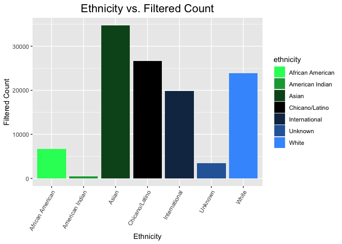
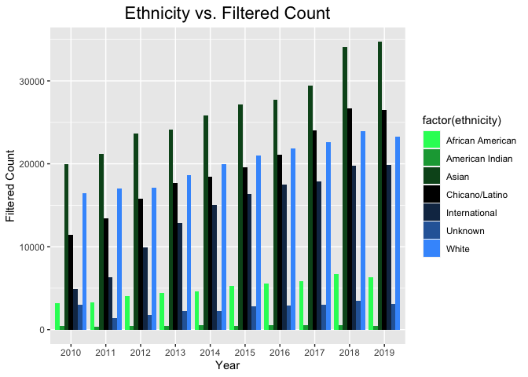

## Instructions
Answer the following questions and complete the exercises in RMarkdown. Please embed all of your code and push your final work to your repository. Your final lab report should be organized, clean, and run free from errors. Remember, you must remove the `#` for the included code chunks to run. Be sure to add your name to the author header above. For any included plots, make sure they are clearly labeled. You are free to use any plot type that you feel best communicates the results of your analysis.  

Make sure to use the formatting conventions of RMarkdown to make your report neat and clean!  

## Libraries

```r
#if (!require("tidyverse")) install.packages('tidyverse')
```


```r
library(tidyverse)
library(shiny)
library(shinydashboard)
library(here)
library(janitor)
library(trekcolors)
library(ggplot2)
```


```r
library(ggthemes)
library(paletteer)
```


```r
options(scipen=999)
```


## Data
The data for this assignment come from the [University of California Information Center](https://www.universityofcalifornia.edu/infocenter). Admissions data were collected for the years 2010-2019 for each UC campus. Admissions are broken down into three categories: applications, admits, and enrollees. The number of individuals in each category are presented by demographic.  


```r
UC_admit <- read_csv(here("lab13/data/UC_admit.csv")) %>% clean_names()
```

```
## 
## ── Column specification ────────────────────────────────────────────────────────
## cols(
##   Campus = col_character(),
##   Academic_Yr = col_double(),
##   Category = col_character(),
##   Ethnicity = col_character(),
##   `Perc FR` = col_character(),
##   FilteredCountFR = col_double()
## )
```


**1. Use the function(s) of your choice to get an idea of the overall structure of the data frame, including its dimensions, column names, variable classes, etc. As part of this, determine if there are NA's and how they are treated.**  


```r
glimpse(UC_admit)
```

```
## Rows: 2,160
## Columns: 6
## $ campus            <chr> "Davis", "Davis", "Davis", "Davis", "Davis", "Davis"…
## $ academic_yr       <dbl> 2019, 2019, 2019, 2019, 2019, 2019, 2019, 2019, 2018…
## $ category          <chr> "Applicants", "Applicants", "Applicants", "Applicant…
## $ ethnicity         <chr> "International", "Unknown", "White", "Asian", "Chica…
## $ perc_fr           <chr> "21.16%", "2.51%", "18.39%", "30.76%", "22.44%", "0.…
## $ filtered_count_fr <dbl> 16522, 1959, 14360, 24024, 17526, 277, 3425, 78093, …
```

```r
dim(UC_admit)
```

```
## [1] 2160    6
```

```r
names(UC_admit)
```

```
## [1] "campus"            "academic_yr"       "category"         
## [4] "ethnicity"         "perc_fr"           "filtered_count_fr"
```


```r
sapply(UC_admit, class)
```

```
##            campus       academic_yr          category         ethnicity 
##       "character"         "numeric"       "character"       "character" 
##           perc_fr filtered_count_fr 
##       "character"         "numeric"
```

```r
naniar::miss_var_summary(UC_admit)
```

```
## # A tibble: 6 x 3
##   variable          n_miss pct_miss
##   <chr>              <int>    <dbl>
## 1 perc_fr                1   0.0463
## 2 filtered_count_fr      1   0.0463
## 3 campus                 0   0     
## 4 academic_yr            0   0     
## 5 category               0   0     
## 6 ethnicity              0   0
```

```r
UC_admit %>% 
  summarize(number_nas = sum(is.na(UC_admit)))
```

```
## # A tibble: 1 x 1
##   number_nas
##        <int>
## 1          2
```
There are NAs in the data, and they are treated as "NA".   


**2. The president of UC has asked you to build a shiny app that shows admissions by ethnicity across all UC campuses. Your app should allow users to explore year, campus, and admit category as interactive variables. Use shiny dashboard and try to incorporate the aesthetics you have learned in ggplot to make the app neat and clean.**


```r
UC_admit_no_all <- UC_admit %>% 
  filter(ethnicity !="All")
UC_admit_no_all
```

```
## # A tibble: 1,890 x 6
##    campus academic_yr category   ethnicity        perc_fr filtered_count_fr
##    <chr>        <dbl> <chr>      <chr>            <chr>               <dbl>
##  1 Davis         2019 Applicants International    21.16%              16522
##  2 Davis         2019 Applicants Unknown          2.51%                1959
##  3 Davis         2019 Applicants White            18.39%              14360
##  4 Davis         2019 Applicants Asian            30.76%              24024
##  5 Davis         2019 Applicants Chicano/Latino   22.44%              17526
##  6 Davis         2019 Applicants American Indian  0.35%                 277
##  7 Davis         2019 Applicants African American 4.39%                3425
##  8 Davis         2018 Applicants International    19.87%              15507
##  9 Davis         2018 Applicants Unknown          2.83%                2208
## 10 Davis         2018 Applicants White            18.96%              14797
## # … with 1,880 more rows
```


```r
UC_admit_no_all %>% 
  ggplot(aes(x=ethnicity, y=filtered_count_fr, fill = ethnicity))+
  geom_col(position = "dodge")+
  labs(title = "Ethnicity vs. Filtered Count",
       x = "Ethnicity",
       y = "Filtered Count") +
  theme(axis.text.x = element_text(angle = 60, hjust = 1)) +
  theme(plot.title = element_text(size = rel(1.5), hjust = 0.5))+
  scale_fill_trek("romulan")
```

```
## Warning: Removed 1 rows containing missing values (geom_col).
```

<!-- -->


Geom_col that's working

```r
ui <- dashboardPage(
  dashboardHeader(title = "Admissions By Ethnicity For UC Campuses"),
  dashboardSidebar(),
  dashboardBody(
  selectInput("x", "Select X Variable", choices = c("academic_yr", "campus", "category", "ethnicity", "filtered_count_fr"), selected = "ethnicity"),
  selectInput("y", "Select Y Variable", choices = c("filtered_count_fr"), selected = "filtered_count_fr"),
  plotOutput("plot", width = "500px", height = "400px"))
)

server <- function(input, output, session) { 
  output$plot <- renderPlot({
  ggplot(UC_admit_no_all, aes_string(x = input$x, y = input$y, fill= "ethnicity")) + geom_col(position = "dodge") + theme(axis.text.x = element_text(angle = 60, hjust = 1)) + theme(plot.title = element_text(size = rel(1.5), hjust = 0.5))+ scale_fill_trek("romulan")
  })
  session$onSessionEnded(stopApp)
  }

shinyApp(ui, server)
```


**3. Make alternate version of your app above by tracking enrollment at a campus over all of the represented years while allowing users to interact with campus, category, and ethnicity.**

```r
UC_admit_no_all %>% 
  ggplot(aes(x=factor(academic_yr), y=filtered_count_fr, fill = factor(ethnicity)))+
  geom_col(position = "dodge")+
  labs(title = "Ethnicity vs. Filtered Count",
       x = "Year",
       y = "Filtered Count") +
  theme(axis.text.x = element_text(hjust = 0.5)) +
  theme(plot.title = element_text(size = rel(1.5), hjust = 0.5))+
  scale_x_discrete(breaks = c("2010", "2011", "2012", "2013", "2014", "2015", "2016", "2017", "2018", "2019"), labels=c("2010", "2011", "2012", "2013", "2014", "2015", "2016", "2017", "2018", "2019"))+
  scale_fill_trek("romulan")
```

```
## Warning: Removed 1 rows containing missing values (geom_col).
```

<!-- -->

```r
#Not sure why X axis labels here are missing
```


```r
ui <- dashboardPage(
  dashboardHeader(title = "Admissions By Ethnicity For UC Campuses"),
  dashboardSidebar(),
  dashboardBody(
  selectInput("x", "Select X Variable", choices = c("academic_yr", "campus", "category"), selected = "academic_yr"),
  selectInput("y", "Select Y Variable", choices = c("filtered_count_fr"), selected = "filtered_count_fr"),
  plotOutput("plot", width = "500px", height = "400px"))
)

server <- function(input, output, session) { 
  output$plot <- renderPlot({
  ggplot(UC_admit_no_all, aes_string(x = input$x, y = input$y, fill= "ethnicity")) + geom_col(position = "dodge") + theme(axis.text.x = element_text(angle = 60, hjust = 1)) + theme(plot.title = element_text(size = rel(1.5), hjust = 0.5))+ scale_fill_trek("romulan")
  })
  session$onSessionEnded(stopApp)
  }

shinyApp(ui, server)
```

```r
#This one I attempted to fix the x axis labels but it wasn't working
ui <- dashboardPage(
  dashboardHeader(title = "Admissions By Ethnicity For UC Campuses"),
  dashboardSidebar(),
  dashboardBody(
  selectInput("x", "Select X Variable", choices = c("academic_yr", "campus", "category"), selected = "academic_yr"),
  selectInput("y", "Select Y Variable", choices = c("filtered_count_fr"), selected = "filtered_count_fr"),
  plotOutput("plot", width = "500px", height = "400px"))
)

server <- function(input, output, session) { 
  output$plot <- renderPlot({
  ggplot(UC_admit_no_all, aes_string(x = input$x, y = input$y, fill= "ethnicity")) + geom_col(position = "dodge") + theme(axis.text.x = element_text(angle = 60, hjust = 1)) + theme(plot.title = element_text(size = rel(1.5), hjust = 0.5))+ scale_x_discrete(breaks = c("2010", "2011", "2012", "2013", "2014", "2015", "2016", "2017", "2018", "2019"), labels=c("2010", "2011", "2012", "2013", "2014", "2015", "2016", "2017", "2018", "2019"))+ scale_fill_trek("romulan")
  })
  session$onSessionEnded(stopApp)
  }

shinyApp(ui, server)
```


## Push your final code to GitHub!
Please be sure that you check the `keep md` file in the knit preferences. 
