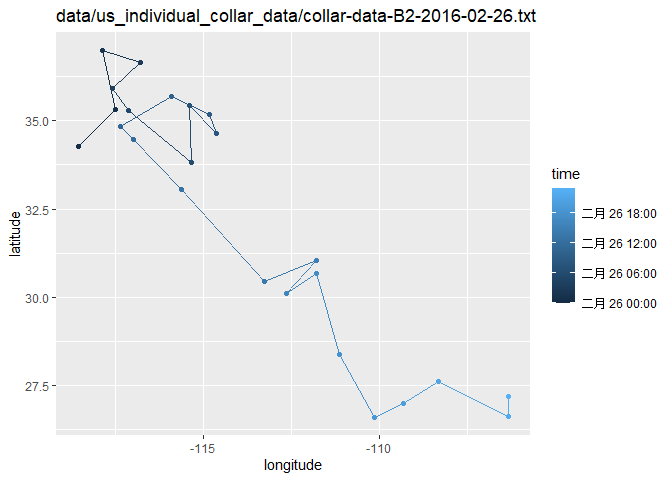
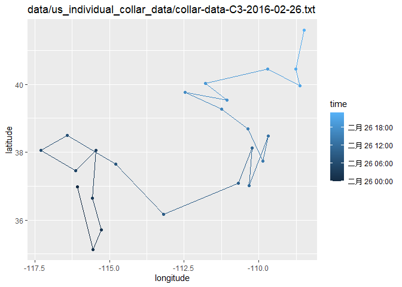
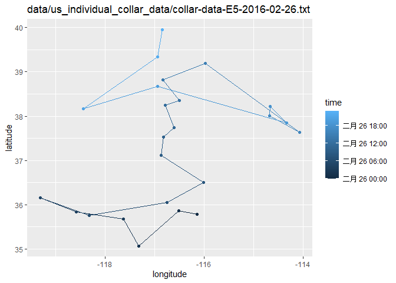
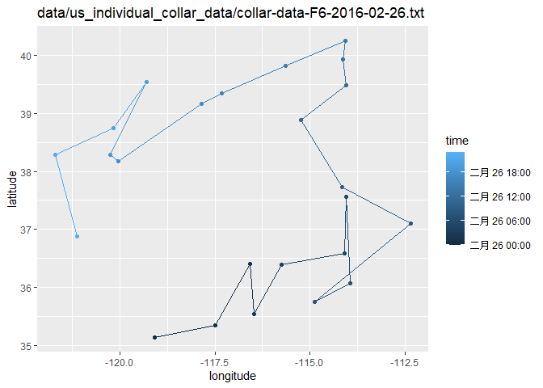
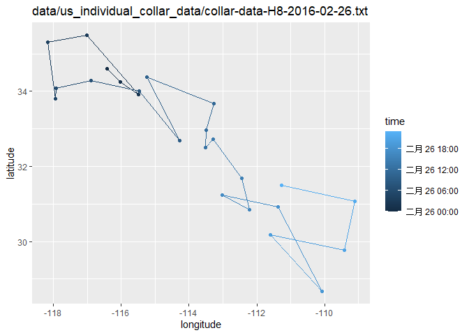
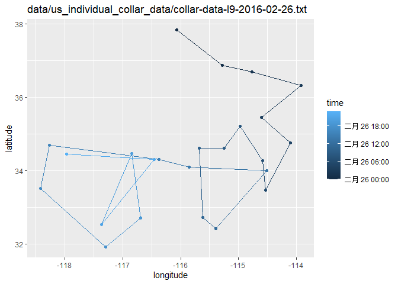
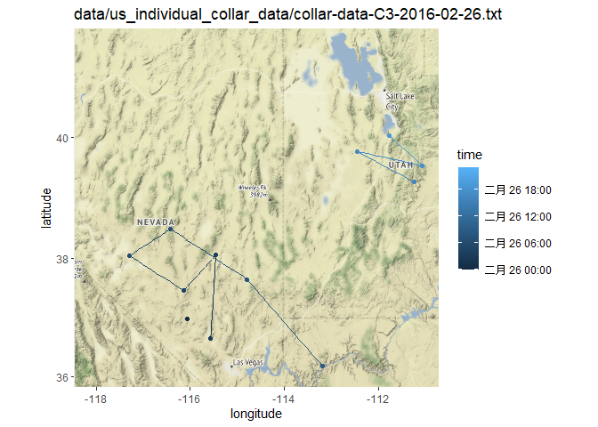
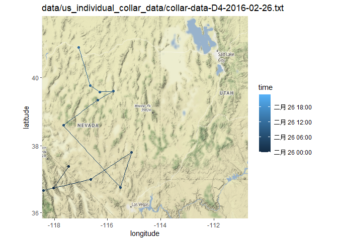

## Instructions
Answer the following questions and complete the exercises in RMarkdown. Please embed all of your code and push your final work to your repository. Your final lab report should be organized, clean, and run free from errors. Remember, you must remove the `#` for the included code chunks to run. Be sure to add your name to the author header above. For any included plots, make sure they are clearly labeled. You are free to use any plot type that you feel best communicates the results of your analysis.  

Make sure to use the formatting conventions of RMarkdown to make your report neat and clean!  

## Load the libraries

```r
library(qtl)
library(qtlcharts)
library(tidyverse)
library(ggmap)
```


```r
getwd()
```

```
## [1] "/Users/Astrobeecal/Desktop/GitHub/BIS15W2021_bdegroen/lab14"
```


<style>
div.blue { background-color:#e6f0ff; border-radius: 5px; padding: 20px;}
</style>
<div class = "blue">

**1. We have a satellite collars on a number of different individuals and want to be able to quickly look at all of their recent movements at once. Please load all the data files from `us_individual_collar_data` and use for loop to create plots for all different individuals of the path they move on longitude and latitude.**

```r
collar_data <- list.files("data/us_individual_collar_data", full.names = TRUE)
collar_data
```

```
##  [1] "data/us_individual_collar_data/collar-data-A1-2016-02-26.txt" 
##  [2] "data/us_individual_collar_data/collar-data-B2-2016-02-26.txt" 
##  [3] "data/us_individual_collar_data/collar-data-C3-2016-02-26.txt" 
##  [4] "data/us_individual_collar_data/collar-data-D4-2016-02-26.txt" 
##  [5] "data/us_individual_collar_data/collar-data-E5-2016-02-26.txt" 
##  [6] "data/us_individual_collar_data/collar-data-F6-2016-02-26.txt" 
##  [7] "data/us_individual_collar_data/collar-data-G7-2016-02-26.txt" 
##  [8] "data/us_individual_collar_data/collar-data-H8-2016-02-26.txt" 
##  [9] "data/us_individual_collar_data/collar-data-I9-2016-02-26.txt" 
## [10] "data/us_individual_collar_data/collar-data-J10-2016-02-26.txt"
```


```r
head(collar_data)
```

```
## [1] "data/us_individual_collar_data/collar-data-A1-2016-02-26.txt"
## [2] "data/us_individual_collar_data/collar-data-B2-2016-02-26.txt"
## [3] "data/us_individual_collar_data/collar-data-C3-2016-02-26.txt"
## [4] "data/us_individual_collar_data/collar-data-D4-2016-02-26.txt"
## [5] "data/us_individual_collar_data/collar-data-E5-2016-02-26.txt"
## [6] "data/us_individual_collar_data/collar-data-F6-2016-02-26.txt"
```

```r
for (i in 1:length(collar_data)){
  collar_data_1 <- as.data.frame(read_csv(collar_data[i]))
  print(
    ggplot(collar_data_1, aes(x = long,y = lat, color = time))+
      geom_path()+
      geom_point()+
      labs(title = collar_data[i], x = "longitude", y = "latitude")
  )
}
```

```
## Warning: Missing column names filled in: 'X1' [1]
```

```
## 
## ── Column specification ────────────────────────────────────────────────────────
## cols(
##   X1 = col_double(),
##   date = col_date(format = ""),
##   collar = col_character(),
##   time = col_datetime(format = ""),
##   lat = col_double(),
##   long = col_double()
## )
```

```
## Warning: Missing column names filled in: 'X1' [1]
```

```
## 
## ── Column specification ────────────────────────────────────────────────────────
## cols(
##   X1 = col_double(),
##   date = col_date(format = ""),
##   collar = col_character(),
##   time = col_datetime(format = ""),
##   lat = col_double(),
##   long = col_double()
## )
```

<!-- -->

```
## Warning: Missing column names filled in: 'X1' [1]
```

```
## 
## ── Column specification ────────────────────────────────────────────────────────
## cols(
##   X1 = col_double(),
##   date = col_date(format = ""),
##   collar = col_character(),
##   time = col_datetime(format = ""),
##   lat = col_double(),
##   long = col_double()
## )
```

<!-- -->

```
## Warning: Missing column names filled in: 'X1' [1]
```

```
## 
## ── Column specification ────────────────────────────────────────────────────────
## cols(
##   X1 = col_double(),
##   date = col_date(format = ""),
##   collar = col_character(),
##   time = col_datetime(format = ""),
##   lat = col_double(),
##   long = col_double()
## )
```

<!-- -->

```
## Warning: Missing column names filled in: 'X1' [1]
```

```
## 
## ── Column specification ────────────────────────────────────────────────────────
## cols(
##   X1 = col_double(),
##   date = col_date(format = ""),
##   collar = col_character(),
##   time = col_datetime(format = ""),
##   lat = col_double(),
##   long = col_double()
## )
```

<!-- -->

```
## Warning: Missing column names filled in: 'X1' [1]
```

```
## 
## ── Column specification ────────────────────────────────────────────────────────
## cols(
##   X1 = col_double(),
##   date = col_date(format = ""),
##   collar = col_character(),
##   time = col_datetime(format = ""),
##   lat = col_double(),
##   long = col_double()
## )
```

<!-- -->

```
## Warning: Missing column names filled in: 'X1' [1]
```

```
## 
## ── Column specification ────────────────────────────────────────────────────────
## cols(
##   X1 = col_double(),
##   date = col_date(format = ""),
##   collar = col_character(),
##   time = col_datetime(format = ""),
##   lat = col_double(),
##   long = col_double()
## )
```

<!-- -->

```
## Warning: Missing column names filled in: 'X1' [1]
```

```
## 
## ── Column specification ────────────────────────────────────────────────────────
## cols(
##   X1 = col_double(),
##   date = col_date(format = ""),
##   collar = col_character(),
##   time = col_datetime(format = ""),
##   lat = col_double(),
##   long = col_double()
## )
```

<!-- -->

```
## Warning: Missing column names filled in: 'X1' [1]
```

```
## 
## ── Column specification ────────────────────────────────────────────────────────
## cols(
##   X1 = col_double(),
##   date = col_date(format = ""),
##   collar = col_character(),
##   time = col_datetime(format = ""),
##   lat = col_double(),
##   long = col_double()
## )
```

<!-- -->

```
## Warning: Missing column names filled in: 'X1' [1]
```

```
## 
## ── Column specification ────────────────────────────────────────────────────────
## cols(
##   X1 = col_double(),
##   date = col_date(format = ""),
##   collar = col_character(),
##   time = col_datetime(format = ""),
##   lat = col_double(),
##   long = col_double()
## )
```

<!-- --><!-- -->


**2. Please load all the data files from `us_individual_collar_data` and combine all data into one data frame. Create a summary to show what is the maximum and minimum of recorded data points on longitude and latitude.**

```r
#names <- list.files(path = "data/us_individual_collar_data", pattern = ".txt")
```

```r
#names_list <- strsplit(names, split = ".txt")
```

```r
#names_list
```


```r
#names_vec <- unlist(names_list)
#names_vec
```

```r
#names(collar_data) <- names_vec
#names(collar_data)
```

```r
#collar_data_all <- bind_rows(collar_data)
#collar_data_all
```
##Please ignore above, went in the wrong direction


```r
#?lapply
```


```r
collar_data_list <- lapply(collar_data, read_csv)
```

```
## Warning: Missing column names filled in: 'X1' [1]
```

```
## 
## ── Column specification ────────────────────────────────────────────────────────
## cols(
##   X1 = col_double(),
##   date = col_date(format = ""),
##   collar = col_character(),
##   time = col_datetime(format = ""),
##   lat = col_double(),
##   long = col_double()
## )
```

```
## Warning: Missing column names filled in: 'X1' [1]
```

```
## 
## ── Column specification ────────────────────────────────────────────────────────
## cols(
##   X1 = col_double(),
##   date = col_date(format = ""),
##   collar = col_character(),
##   time = col_datetime(format = ""),
##   lat = col_double(),
##   long = col_double()
## )
```

```
## Warning: Missing column names filled in: 'X1' [1]
```

```
## 
## ── Column specification ────────────────────────────────────────────────────────
## cols(
##   X1 = col_double(),
##   date = col_date(format = ""),
##   collar = col_character(),
##   time = col_datetime(format = ""),
##   lat = col_double(),
##   long = col_double()
## )
```

```
## Warning: Missing column names filled in: 'X1' [1]
```

```
## 
## ── Column specification ────────────────────────────────────────────────────────
## cols(
##   X1 = col_double(),
##   date = col_date(format = ""),
##   collar = col_character(),
##   time = col_datetime(format = ""),
##   lat = col_double(),
##   long = col_double()
## )
```

```
## Warning: Missing column names filled in: 'X1' [1]
```

```
## 
## ── Column specification ────────────────────────────────────────────────────────
## cols(
##   X1 = col_double(),
##   date = col_date(format = ""),
##   collar = col_character(),
##   time = col_datetime(format = ""),
##   lat = col_double(),
##   long = col_double()
## )
```

```
## Warning: Missing column names filled in: 'X1' [1]
```

```
## 
## ── Column specification ────────────────────────────────────────────────────────
## cols(
##   X1 = col_double(),
##   date = col_date(format = ""),
##   collar = col_character(),
##   time = col_datetime(format = ""),
##   lat = col_double(),
##   long = col_double()
## )
```

```
## Warning: Missing column names filled in: 'X1' [1]
```

```
## 
## ── Column specification ────────────────────────────────────────────────────────
## cols(
##   X1 = col_double(),
##   date = col_date(format = ""),
##   collar = col_character(),
##   time = col_datetime(format = ""),
##   lat = col_double(),
##   long = col_double()
## )
```

```
## Warning: Missing column names filled in: 'X1' [1]
```

```
## 
## ── Column specification ────────────────────────────────────────────────────────
## cols(
##   X1 = col_double(),
##   date = col_date(format = ""),
##   collar = col_character(),
##   time = col_datetime(format = ""),
##   lat = col_double(),
##   long = col_double()
## )
```

```
## Warning: Missing column names filled in: 'X1' [1]
```

```
## 
## ── Column specification ────────────────────────────────────────────────────────
## cols(
##   X1 = col_double(),
##   date = col_date(format = ""),
##   collar = col_character(),
##   time = col_datetime(format = ""),
##   lat = col_double(),
##   long = col_double()
## )
```

```
## Warning: Missing column names filled in: 'X1' [1]
```

```
## 
## ── Column specification ────────────────────────────────────────────────────────
## cols(
##   X1 = col_double(),
##   date = col_date(format = ""),
##   collar = col_character(),
##   time = col_datetime(format = ""),
##   lat = col_double(),
##   long = col_double()
## )
```

```r
collar_data_all <- bind_rows(collar_data_1)
collar_data_all
```

```
##    X1       date collar                time      lat      long
## 1   1 2016-02-26    J10 2016-02-26 00:00:00 36.33831 -118.1143
## 2   2 2016-02-26    J10 2016-02-26 01:00:00 36.91621 -117.6941
## 3   3 2016-02-26    J10 2016-02-26 02:00:00 37.13177 -116.6614
## 4   4 2016-02-26    J10 2016-02-26 03:00:00 36.08752 -116.1529
## 5   5 2016-02-26    J10 2016-02-26 04:00:00 37.57884 -114.2264
## 6   6 2016-02-26    J10 2016-02-26 05:00:00 37.15852 -114.6688
## 7   7 2016-02-26    J10 2016-02-26 06:00:00 37.53077 -113.7483
## 8   8 2016-02-26    J10 2016-02-26 07:00:00 37.52153 -112.6165
## 9   9 2016-02-26    J10 2016-02-26 08:00:00 37.26112 -112.0605
## 10 10 2016-02-26    J10 2016-02-26 09:00:00 37.31770 -112.3986
## 11 11 2016-02-26    J10 2016-02-26 10:00:00 37.16028 -111.4770
## 12 12 2016-02-26    J10 2016-02-26 11:00:00 36.08252 -112.4724
## 13 13 2016-02-26    J10 2016-02-26 12:00:00 36.65177 -111.0878
## 14 14 2016-02-26    J10 2016-02-26 13:00:00 38.21406 -111.3782
## 15 15 2016-02-26    J10 2016-02-26 14:00:00 38.34965 -111.9870
## 16 16 2016-02-26    J10 2016-02-26 15:00:00 39.08027 -113.1694
## 17 17 2016-02-26    J10 2016-02-26 16:00:00 40.32003 -113.8180
## 18 18 2016-02-26    J10 2016-02-26 17:00:00 40.71097 -112.4123
## 19 19 2016-02-26    J10 2016-02-26 18:00:00 41.47619 -112.9811
## 20 20 2016-02-26    J10 2016-02-26 19:00:00 40.25939 -113.0605
## 21 21 2016-02-26    J10 2016-02-26 20:00:00 40.30474 -111.7026
## 22 22 2016-02-26    J10 2016-02-26 21:00:00 40.74795 -112.1095
## 23 23 2016-02-26    J10 2016-02-26 22:00:00 39.87703 -112.8767
## 24 24 2016-02-26    J10 2016-02-26 23:00:00 40.59006 -112.9072
```

```r
collar_data_all %>% 
  summarize(max_lat=max(lat),
            min_lat=min(lat),
            max_long=max(long),
            min_long=min(long))
```

```
##    max_lat  min_lat  max_long  min_long
## 1 41.47619 36.08252 -111.0878 -118.1143
```

**3. Use the range of the latitude and longitude from Q2 to build an appropriate bounding box for your map and load a map from `stamen` in a terrain style projection and display the map. Then, build a final map that overlays the recorded path from Q1.**

```r
lat <- c(36.08, 41.47)
long <- c(-118.11, -111.08)
bbox <- make_bbox(long, lat, f= 0.05)
```


```r
map1 <- get_map(bbox, maptype = "terrain", source = "stamen")
```

```
## Map tiles by Stamen Design, under CC BY 3.0. Data by OpenStreetMap, under ODbL.
```

```r
ggmap(map1)
```

<!-- -->

```r
for (i in 1:length(collar_data)){
  collar_data_1 <- as.data.frame(read_csv(collar_data[i]))
  print(
    ggmap(map1)+
      geom_path(data = collar_data_1, aes(long, lat,color=time))+
      geom_point(data = collar_data_1, aes(long, lat,color=time))+
      labs(title = collar_data[i], x = "longitude", y = "latitude")
  )
}
```

```
## Warning: Missing column names filled in: 'X1' [1]
```

```
## 
## ── Column specification ────────────────────────────────────────────────────────
## cols(
##   X1 = col_double(),
##   date = col_date(format = ""),
##   collar = col_character(),
##   time = col_datetime(format = ""),
##   lat = col_double(),
##   long = col_double()
## )
```

```
## Warning: Removed 8 rows containing missing values (geom_point).

## Warning: Missing column names filled in: 'X1' [1]
```

```
## 
## ── Column specification ────────────────────────────────────────────────────────
## cols(
##   X1 = col_double(),
##   date = col_date(format = ""),
##   collar = col_character(),
##   time = col_datetime(format = ""),
##   lat = col_double(),
##   long = col_double()
## )
```

<!-- -->

```
## Warning: Removed 21 row(s) containing missing values (geom_path).
```

```
## Warning: Removed 21 rows containing missing values (geom_point).
```

```
## Warning: Missing column names filled in: 'X1' [1]
```

```
## 
## ── Column specification ────────────────────────────────────────────────────────
## cols(
##   X1 = col_double(),
##   date = col_date(format = ""),
##   collar = col_character(),
##   time = col_datetime(format = ""),
##   lat = col_double(),
##   long = col_double()
## )
```

<!-- -->

```
## Warning: Removed 4 row(s) containing missing values (geom_path).
```

```
## Warning: Removed 12 rows containing missing values (geom_point).
```

```
## Warning: Missing column names filled in: 'X1' [1]
```

```
## 
## ── Column specification ────────────────────────────────────────────────────────
## cols(
##   X1 = col_double(),
##   date = col_date(format = ""),
##   collar = col_character(),
##   time = col_datetime(format = ""),
##   lat = col_double(),
##   long = col_double()
## )
```

<!-- -->

```
## Warning: Removed 11 row(s) containing missing values (geom_path).
```

```
## Warning: Removed 12 rows containing missing values (geom_point).
```

```
## Warning: Missing column names filled in: 'X1' [1]
```

```
## 
## ── Column specification ────────────────────────────────────────────────────────
## cols(
##   X1 = col_double(),
##   date = col_date(format = ""),
##   collar = col_character(),
##   time = col_datetime(format = ""),
##   lat = col_double(),
##   long = col_double()
## )
```

<!-- -->

```
## Warning: Removed 1 row(s) containing missing values (geom_path).
```

```
## Warning: Removed 6 rows containing missing values (geom_point).
```

```
## Warning: Missing column names filled in: 'X1' [1]
```

```
## 
## ── Column specification ────────────────────────────────────────────────────────
## cols(
##   X1 = col_double(),
##   date = col_date(format = ""),
##   collar = col_character(),
##   time = col_datetime(format = ""),
##   lat = col_double(),
##   long = col_double()
## )
```

<!-- -->

```
## Warning: Removed 8 row(s) containing missing values (geom_path).
```

```
## Warning: Removed 10 rows containing missing values (geom_point).
```

```
## Warning: Missing column names filled in: 'X1' [1]
```

```
## 
## ── Column specification ────────────────────────────────────────────────────────
## cols(
##   X1 = col_double(),
##   date = col_date(format = ""),
##   collar = col_character(),
##   time = col_datetime(format = ""),
##   lat = col_double(),
##   long = col_double()
## )
```

<!-- -->

```
## Warning: Removed 5 rows containing missing values (geom_point).

## Warning: Missing column names filled in: 'X1' [1]
```

```
## 
## ── Column specification ────────────────────────────────────────────────────────
## cols(
##   X1 = col_double(),
##   date = col_date(format = ""),
##   collar = col_character(),
##   time = col_datetime(format = ""),
##   lat = col_double(),
##   long = col_double()
## )
```

<!-- -->

```
## Warning: Removed 24 row(s) containing missing values (geom_path).
```

```
## Warning: Removed 24 rows containing missing values (geom_point).
```

```
## Warning: Missing column names filled in: 'X1' [1]
```

```
## 
## ── Column specification ────────────────────────────────────────────────────────
## cols(
##   X1 = col_double(),
##   date = col_date(format = ""),
##   collar = col_character(),
##   time = col_datetime(format = ""),
##   lat = col_double(),
##   long = col_double()
## )
```

<!-- -->

```
## Warning: Removed 20 row(s) containing missing values (geom_path).
```

```
## Warning: Removed 20 rows containing missing values (geom_point).
```

```
## Warning: Missing column names filled in: 'X1' [1]
```

```
## 
## ── Column specification ────────────────────────────────────────────────────────
## cols(
##   X1 = col_double(),
##   date = col_date(format = ""),
##   collar = col_character(),
##   time = col_datetime(format = ""),
##   lat = col_double(),
##   long = col_double()
## )
```

<!-- --><!-- -->


## Load the Data
We will use the data from an experiment on hypertension in the mouse [Sugiyama et al., Genomics 71:70-77, 2001](https://www.sciencedirect.com/science/article/pii/S0888754300964012?via%3Dihub)

```r
#?hyper
data(hyper)
```

**4. Create a summary of the hypertension data. How many individuals and phenotypes are included in this data set? How many gene markers and chromosomes are included in this data set? Please create a table to show the number of markers on each chromosome.**

```r
summary(hyper)
```

```
##     Backcross
## 
##     No. individuals:    250 
## 
##     No. phenotypes:     2 
##     Percent phenotyped: 100 100 
## 
##     No. chromosomes:    20 
##         Autosomes:      1 2 3 4 5 6 7 8 9 10 11 12 13 14 15 16 17 18 19 
##         X chr:          X 
## 
##     Total markers:      174 
##     No. markers:        22 8 6 20 14 11 7 6 5 5 14 5 5 5 11 6 12 4 4 4 
##     Percent genotyped:  47.7 
##     Genotypes (%):    
##           Autosomes:    BB:50.1  BA:49.9 
##        X chromosome:    BY:53.0  AY:47.0
```

There are 100 individuals, 2 phenotypes, 174 markers, and 20 chromosomes.


```r
nmar(hyper)
```

```
##  1  2  3  4  5  6  7  8  9 10 11 12 13 14 15 16 17 18 19  X 
## 22  8  6 20 14 11  7  6  5  5 14  5  5  5 11  6 12  4  4  4
```


**5. Please make an interactive genetic map of markers for the hypertension data.**

```r
iplotMap(hyper)
```

```
## Set screen size to height=700 x width=1000
```

```{=html}
<div id="htmlwidget-8f0735a3ee0559d480a8" style="width:672px;height:480px;" class="iplotMap html-widget"></div>
<script type="application/json" data-for="htmlwidget-8f0735a3ee0559d480a8">{"x":{"data":{"chr":["1","1","1","1","1","1","1","1","1","1","1","1","1","1","1","1","1","1","1","1","1","1","2","2","2","2","2","2","2","2","3","3","3","3","3","3","4","4","4","4","4","4","4","4","4","4","4","4","4","4","4","4","4","4","4","4","5","5","5","5","5","5","5","5","5","5","5","5","5","5","6","6","6","6","6","6","6","6","6","6","6","7","7","7","7","7","7","7","8","8","8","8","8","8","9","9","9","9","9","10","10","10","10","10","11","11","11","11","11","11","11","11","11","11","11","11","11","11","12","12","12","12","12","13","13","13","13","13","14","14","14","14","14","15","15","15","15","15","15","15","15","15","15","15","16","16","16","16","16","16","17","17","17","17","17","17","17","17","17","17","17","17","18","18","18","18","19","19","19","19","X","X","X","X"],"pos":[3.3,19.7,32.8,35,37.2,41.5,43.7,43.7,49.2,54.6,64.5,67.8,69.9,74.3,75.4,82,82,82,82,86.3,94,115.8,7.7,17.5,29.5,49.2,54.6,66.7,85.2,98.4,2.2,17.5,37.2,44.8,57.9,66.7,0,14.2,16.4,17.5,18.6,21.9,23,23,25.1,28.4,29.5,30.6,31.7,31.7,32.8,33.9,35,47,56.8,74.3,0,5.5,10.9,14.2,15.3,18.6,32.8,51.4,60.1,66.7,73.2,74.3,77.6,82,0,9.8,21.9,25.1,29.5,40.4,51.4,56.8,63.4,65.6,66.7,1.1,13.1,26.2,28.4,37.2,53.6,55.6,6.6,19.7,33.9,40.4,59,75.4,12,24,40.4,56.8,68.9,2.2,15.3,50.3,69.9,75.4,2.2,4.4,4.4,8.7,8.7,10.9,13.1,17.5,17.5,19.7,25.1,43.7,60.1,80.9,1.1,16.4,23,40.4,56.8,5.7,7.7,16.4,40.4,59,0,16.4,36.1,52.5,67.8,5.5,5.5,7.7,13.1,16.4,16.4,17.5,17.5,29.5,55.7,63.4,0,25.1,31.7,32.8,51.4,51.4,1.1,1.1,1.1,2.2,3.3,3.3,5.5,6.6,10.9,19.7,33.9,50.3,2.2,14.2,26.2,37.2,0,17.5,32.8,55.7,1.1,20.8,29.5,43.7],"marker":["D1Mit296","D1Mit123","D1Mit156","D1Mit178","D1Mit19","D1Mit7","D1Mit46","D1Mit132","D1Mit334","D1Mit305","D1Mit26","D1Mit94","D1Mit218","D1Mit100","D1Mit102","D1Mit14","D1Mit105","D1Mit159","D1Mit267","D1Mit15","D1Mit456","D1Mit155","D2Mit359","D2Mit82","D2Mit241","D2Mit14","D2Mit62","D2Mit280","D2Mit229","D2Mit266","D3Mit164","D3Mit6","D3Mit11","D3Mit14","D3Mit44","D3Mit19","D4Mit149","D4Mit41","D4Mit108","D4Mit237","D4Mit286","D4Mit214","D4Mit53","D4Mit89","D4Mit111","D4Mit288","D4Mit164","D4Mit178","D4Mit80","D4Mit81","D4Mit276","D4Mit152","D4Mit302","D4Mit175","D4Mit16","D4Mit14","D5Mit193","D5Mit61","D5Mit387","D5Mit148","D5Mit13","D5Mit55","D5Mit312","D5Mit188","D5Mit213","D5Mit31","D5Mit99","D5Mit101","D5Mit409","D5Mit169","D6Mit86","D6Mit273","D6Mit188","D6Mit8","D6Mit213","D6Mit36","D6Mit135","D6Mit59","D6Mit295","D6Mit201","D6Mit15","D7Mit306","D7Mit25","D7Mit297","D7Mit30","D7Mit37","D7Mit71","D7Nds4","D8Mit3","D8Mit292","D8Mit25","D8Mit45","D8Mit271","D8Mit156","D9Mit297","D9Mit27","D9Mit8","D9Mit24","D9Mit18","D10Mit166","D10Mit214","D10Mit11","D10Mit14","D10Mit297","D11Mit74","D11Mit2","D11Mit78","D11Mit79","D11Mit80","D11Mit82","D11Mit163","D11Mit110","D11Mit136","D11Mit20","D11Mit310","D11Mit35","D11Mit67","D11Mit48","D12Mit37","D12Mit110","D12Mit34","D12Mit118","D12Mit20","D13Mit16","D13Mit59","D13Mit91","D13Mit148","D13Mit78","D14Mit48","D14Mit14","D14Mit37","D14Mit7","D14Mit266","D15Mit11","D15Mit175","D15Mit53","D15Mit111","D15Mit56","D15Mit22","D15Mit206","D15Mit152","D15Mit156","D15Mit108","D15Mit79","D16Mit32","D16Mit4","D16Mit171","D16Mit5","D16Mit70","D16Mit106","D17Mit164","D17Mit143","D17Mit57","D17Mit113","D17Mit131","D17Mit46","D17Mit45","D17Mit23","D17Mit11","D17Mit10","D17Mit53","D17Mit221","D18Mit67","D18Mit17","D18Mit50","D18Mit4","D19Mit59","D19Mit40","D19Mit53","D19Mit137","DXMit55","DXMit22","DXMit16","DXMit130"],"chrname":["1","2","3","4","5","6","7","8","9","10","11","12","13","14","15","16","17","18","19","X"]},"chartOpts":{"shiftStart":false}},"evals":[],"jsHooks":[]}</script>
```

**6. Make a plot shows the pattern of missing genotype data in the hypertension dataset. Please reorder the recorded individuals according to their blood pressure phenotypes. Is there a specific pattern of missing genotype? Please explain it.**

```r
plotMissing(hyper, main = "", reorder=1)
```

<!-- -->

Min Yao: Only genotypes with high and low blood pressure were recorded, so the black lines concentrate in the middle of the y-axis


**7. Based on your answer from previous question, you probably noticed that there are gene markers without data. Please use the function `drop.nullmarkers` to remove markers that have no genotype data. After this, make a new summary to show the number of markers on each chromosome. How many gene markers were dropped? Where were the dropped markers located? Please use the data without nullmarkers for the following questions.**

```r
nmar(hyper)
```

```
##  1  2  3  4  5  6  7  8  9 10 11 12 13 14 15 16 17 18 19  X 
## 22  8  6 20 14 11  7  6  5  5 14  5  5  5 11  6 12  4  4  4
```


```r
hyper_drop <- drop.nullmarkers(hyper)
hyper_drop
```

```
##   This is an object of class "cross".
##   It is too complex to print, so we provide just this summary.
##     Backcross
## 
##     No. individuals:    250 
## 
##     No. phenotypes:     2 
##     Percent phenotyped: 100 100 
## 
##     No. chromosomes:    20 
##         Autosomes:      1 2 3 4 5 6 7 8 9 10 11 12 13 14 15 16 17 18 19 
##         X chr:          X 
## 
##     Total markers:      173 
##     No. markers:        22 8 6 20 14 11 7 6 5 5 14 5 5 4 11 6 12 4 4 4 
##     Percent genotyped:  48 
##     Genotypes (%):    
##           Autosomes:    BB:50.1  BA:49.9 
##        X chromosome:    BY:53.0  AY:47.0
```

```r
#totmar() gives #total markers
```


```r
nmar(hyper_drop)
```

```
##  1  2  3  4  5  6  7  8  9 10 11 12 13 14 15 16 17 18 19  X 
## 22  8  6 20 14 11  7  6  5  5 14  5  5  4 11  6 12  4  4  4
```

Only one gene marker was dropped, and it was located on chromosome 14.


**8. Please conduct single-QTL analysis and create a table to give the maximum LOD score on each chromosome based on their blood pressure phenotypes. Which gene marker has the highest LOD score? Which chromosome contains the gene marker that has the highest LOD score? Then, creates an interactive chart with LOD curves from a genome scan for all chromosomes.**

```r
hyper_calc <- calc.genoprob(hyper, step=1)
hyper_calc
```

```
##   This is an object of class "cross".
##   It is too complex to print, so we provide just this summary.
##     Backcross
## 
##     No. individuals:    250 
## 
##     No. phenotypes:     2 
##     Percent phenotyped: 100 100 
## 
##     No. chromosomes:    20 
##         Autosomes:      1 2 3 4 5 6 7 8 9 10 11 12 13 14 15 16 17 18 19 
##         X chr:          X 
## 
##     Total markers:      174 
##     No. markers:        22 8 6 20 14 11 7 6 5 5 14 5 5 5 11 6 12 4 4 4 
##     Percent genotyped:  47.7 
##     Genotypes (%):    
##           Autosomes:    BB:50.1  BA:49.9 
##        X chromosome:    BY:53.0  AY:47.0
```

```r
out.em <- scanone(hyper)
```

```
## Warning in scanone(hyper): First running calc.genoprob.
```

```r
out.em
```

```
##           chr   pos          lod
## D1Mit296    1   3.3 0.4117448071
## D1Mit123    1  19.7 0.3995970550
## D1Mit156    1  32.8 1.6943724765
## D1Mit178    1  35.0 1.6519940836
## D1Mit19     1  37.2 2.9441481443
## D1Mit7      1  41.5 3.1328781519
## D1Mit46     1  43.7 3.3421871507
## D1Mit132    1  43.7 3.3421871787
## D1Mit334    1  49.2 3.5267044634
## D1Mit305    1  54.6 2.0065693641
## D1Mit26     1  64.5 2.1623610729
## D1Mit94     1  67.8 3.3629179514
## D1Mit218    1  69.9 3.0963729397
## D1Mit100    1  74.3 3.1758610981
## D1Mit102    1  75.4 3.2198347634
## D1Mit14     1  82.0 3.0290986270
## D1Mit105    1  82.0 3.0290985093
## D1Mit159    1  82.0 3.0292173193
## D1Mit267    1  82.0 3.0292172820
## D1Mit15     1  86.3 1.5124874334
## D1Mit456    1  94.0 1.3031277002
## D1Mit155    1 115.8 0.2659435308
## D2Mit359    2   7.7 0.2247897209
## D2Mit82     2  17.5 0.5368659034
## D2Mit241    2  29.5 0.8286552497
## D2Mit14     2  49.2 1.2477059750
## D2Mit62     2  54.6 1.4451669255
## D2Mit280    2  66.7 1.1551254989
## D2Mit229    2  85.2 0.0259369317
## D2Mit266    2  98.4 0.0503093973
## D3Mit164    3   2.2 0.0370327430
## D3Mit6      3  17.5 0.5885098768
## D3Mit11     3  37.2 0.7807048362
## D3Mit14     3  44.8 0.1651759629
## D3Mit44     3  57.9 0.0899287390
## D3Mit19     3  66.7 0.0122171169
## D4Mit149    4   0.0 2.0619239320
## D4Mit41     4  14.2 5.3803971305
## D4Mit108    4  16.4 5.4854360206
## D4Mit237    4  17.5 6.5578757800
## D4Mit286    4  18.6 6.5092502945
## D4Mit214    4  21.9 6.8496711335
## D4Mit53     4  23.0 5.8422220345
## D4Mit89     4  23.0 5.8422220345
## D4Mit111    4  25.1 6.3078995597
## D4Mit288    4  28.4 6.1784364828
## D4Mit164    4  29.5 8.0936611995
## D4Mit178    4  30.6 6.3749215180
## D4Mit80     4  31.7 5.1375886310
## D4Mit81     4  31.7 5.1375886310
## D4Mit276    4  32.8 4.8875613687
## D4Mit152    4  33.9 4.7648501857
## D4Mit302    4  35.0 3.7286727716
## D4Mit175    4  47.0 2.7395652003
## D4Mit16     4  56.8 2.4330012251
## D4Mit14     4  74.3 2.1736121580
## D5Mit193    5   0.0 0.3728645888
## D5Mit61     5   5.5 0.2246562321
## D5Mit387    5  10.9 0.0649209336
## D5Mit148    5  14.2 0.1139450913
## D5Mit13     5  15.3 0.1630030540
## D5Mit55     5  18.6 0.3380438352
## D5Mit312    5  32.8 0.0474201810
## D5Mit188    5  51.4 0.2654893375
## D5Mit213    5  60.1 0.4021080017
## D5Mit31     5  66.7 1.5447695317
## D5Mit99     5  73.2 1.4008517779
## D5Mit101    5  74.3 1.3523879809
## D5Mit409    5  77.6 1.2961121884
## D5Mit169    5  82.0 1.3352994035
## D6Mit86     6   0.0 0.1172057408
## D6Mit273    6   9.8 0.8353447217
## D6Mit188    6  21.9 1.8211658159
## D6Mit8      6  25.1 1.7993072464
## D6Mit213    6  29.5 0.9416037768
## D6Mit36     6  40.4 1.1322955298
## D6Mit135    6  51.4 0.8835488689
## D6Mit59     6  56.8 0.8142005652
## D6Mit295    6  63.4 0.9842684697
## D6Mit201    6  65.6 0.6410131121
## D6Mit15     6  66.7 0.6595297122
## D7Mit306    7   1.1 0.1369746934
## D7Mit25     7  13.1 0.1149397404
## D7Mit297    7  26.2 0.4000641331
## D7Mit30     7  28.4 0.1540588132
## D7Mit37     7  37.2 0.0127470023
## D7Mit71     7  53.6 0.0190184791
## D7Nds4      7  55.6 0.1093732137
## D8Mit3      8   6.6 0.0574090158
## D8Mit292    8  19.7 0.0035117015
## D8Mit25     8  33.9 0.0007018864
## D8Mit45     8  40.4 0.0208415111
## D8Mit271    8  59.0 0.7907409143
## D8Mit156    8  75.4 0.3871432575
## D9Mit297    9  12.0 0.1098126972
## D9Mit27     9  24.0 0.0278178870
## D9Mit8      9  40.4 0.0882056000
## D9Mit24     9  56.8 0.1800599409
## D9Mit18     9  68.9 0.7502459166
## D10Mit166  10   2.2 0.2143123352
## D10Mit214  10  15.3 0.2466849472
## D10Mit11   10  50.3 0.0034444127
## D10Mit14   10  69.9 0.0507749899
## D10Mit297  10  75.4 0.0886546315
## D11Mit74   11   2.2 0.1716721453
## D11Mit2    11   4.4 0.1553722304
## D11Mit78   11   4.4 0.1553721963
## D11Mit79   11   8.7 0.0699343963
## D11Mit80   11   8.7 0.0699343995
## D11Mit82   11  10.9 0.1617231382
## D11Mit163  11  13.1 0.2401204010
## D11Mit110  11  17.5 0.3004352659
## D11Mit136  11  17.5 0.3004352512
## D11Mit20   11  19.7 0.3920578178
## D11Mit310  11  25.1 0.4000344400
## D11Mit35   11  43.7 0.6259820641
## D11Mit67   11  60.1 0.1964948082
## D11Mit48   11  80.9 0.0033157554
## D12Mit37   12   1.1 0.4286562092
## D12Mit110  12  16.4 0.0003539764
## D12Mit34   12  23.0 0.0025417998
## D12Mit118  12  40.4 0.0044248100
## D12Mit20   12  56.8 0.0136085794
## D13Mit16   13   5.7 0.0910047160
## D13Mit59   13   7.7 0.0327909578
## D13Mit91   13  16.4 0.0253706523
## D13Mit148  13  40.4 0.1844976670
## D13Mit78   13  59.0 0.3127863765
## D14Mit48   14   0.0 0.0859702813
## D14Mit14   14  16.4 0.0854485049
## D14Mit37   14  36.1 0.0356625059
## D14Mit7    14  52.5 0.1060170996
## D14Mit266  14  67.8 0.0242861774
## D15Mit11   15   5.5 1.0675142338
## D15Mit175  15   5.5 1.0675142315
## D15Mit53   15   7.7 0.7459694196
## D15Mit111  15  13.1 1.2863047439
## D15Mit56   15  16.4 1.3672909477
## D15Mit22   15  16.4 1.3672909546
## D15Mit206  15  17.5 1.7053688374
## D15Mit152  15  17.5 1.7053688802
## D15Mit156  15  29.5 1.0457533483
## D15Mit108  15  55.7 0.6078228353
## D15Mit79   15  63.4 0.9666623557
## D16Mit32   16   0.0 0.0284895729
## D16Mit4    16  25.1 0.2435883302
## D16Mit171  16  31.7 0.2198068608
## D16Mit5    16  32.8 0.1418847041
## D16Mit70   16  51.4 0.3701823277
## D16Mit106  16  51.4 0.3701823244
## D17Mit164  17   1.1 0.1557464620
## D17Mit143  17   1.1 0.1557464648
## D17Mit57   17   1.1 0.1557464377
## D17Mit113  17   2.2 0.1024779096
## D17Mit131  17   3.3 0.2066625525
## D17Mit46   17   3.3 0.2066625662
## D17Mit45   17   5.5 0.0262508589
## D17Mit23   17   6.6 0.0255827405
## D17Mit11   17  10.9 0.0181788482
## D17Mit10   17  19.7 0.0059936347
## D17Mit53   17  33.9 0.0270201207
## D17Mit221  17  50.3 0.1302639649
## D18Mit67   18   2.2 0.1187825317
## D18Mit17   18  14.2 0.5057623851
## D18Mit50   18  26.2 0.0097073614
## D18Mit4    18  37.2 0.0408141197
## D19Mit59   19   0.0 0.7917868438
## D19Mit40   19  17.5 0.1721772554
## D19Mit53   19  32.8 0.3202410984
## D19Mit137  19  55.7 0.3801939921
## DXMit55     X   1.1 0.0015569926
## DXMit22     X  20.8 0.4472058101
## DXMit16     X  29.5 0.7128611939
## DXMit130    X  43.7 0.9274964233
```


```r
summary(out.em)
```

```
##           chr  pos   lod
## D1Mit334    1 49.2 3.527
## D2Mit62     2 54.6 1.445
## D3Mit11     3 37.2 0.781
## D4Mit164    4 29.5 8.094
## D5Mit31     5 66.7 1.545
## D6Mit188    6 21.9 1.821
## D7Mit297    7 26.2 0.400
## D8Mit271    8 59.0 0.791
## D9Mit18     9 68.9 0.750
## D10Mit214  10 15.3 0.247
## D11Mit35   11 43.7 0.626
## D12Mit37   12  1.1 0.429
## D13Mit78   13 59.0 0.313
## D14Mit7    14 52.5 0.106
## D15Mit152  15 17.5 1.705
## D16Mit70   16 51.4 0.370
## D17Mit46   17  3.3 0.207
## D18Mit17   18 14.2 0.506
## D19Mit59   19  0.0 0.792
## DXMit130    X 43.7 0.927
```

```r
max(out.em)
```

```
##          chr  pos  lod
## D4Mit164   4 29.5 8.09
```


```r
iplotScanone(out.em)
```

```{=html}
<div id="htmlwidget-73e0ca4dbe1ca6dfaea7" style="width:672px;height:480px;" class="iplotScanone html-widget"></div>
<script type="application/json" data-for="htmlwidget-73e0ca4dbe1ca6dfaea7">{"x":{"scanone_data":{"chr":["1","1","1","1","1","1","1","1","1","1","1","1","1","1","1","1","1","1","1","1","1","1","2","2","2","2","2","2","2","2","3","3","3","3","3","3","4","4","4","4","4","4","4","4","4","4","4","4","4","4","4","4","4","4","4","4","5","5","5","5","5","5","5","5","5","5","5","5","5","5","6","6","6","6","6","6","6","6","6","6","6","7","7","7","7","7","7","7","8","8","8","8","8","8","9","9","9","9","9","10","10","10","10","10","11","11","11","11","11","11","11","11","11","11","11","11","11","11","12","12","12","12","12","13","13","13","13","13","14","14","14","14","14","15","15","15","15","15","15","15","15","15","15","15","16","16","16","16","16","16","17","17","17","17","17","17","17","17","17","17","17","17","18","18","18","18","19","19","19","19","X","X","X","X"],"pos":[3.3,19.7,32.8,35,37.2,41.5,43.7,43.7,49.2,54.6,64.5,67.8,69.9,74.3,75.4,82,82,82,82,86.3,94,115.8,7.7,17.5,29.5,49.2,54.6,66.7,85.2,98.4,2.2,17.5,37.2,44.8,57.9,66.7,0,14.2,16.4,17.5,18.6,21.9,23,23,25.1,28.4,29.5,30.6,31.7,31.7,32.8,33.9,35,47,56.8,74.3,0,5.5,10.9,14.2,15.3,18.6,32.8,51.4,60.1,66.7,73.2,74.3,77.6,82,0,9.8,21.9,25.1,29.5,40.4,51.4,56.8,63.4,65.6,66.7,1.1,13.1,26.2,28.4,37.2,53.6,55.6,6.6,19.7,33.9,40.4,59,75.4,12,24,40.4,56.8,68.9,2.2,15.3,50.3,69.9,75.4,2.2,4.4,4.4,8.7,8.7,10.9,13.1,17.5,17.5,19.7,25.1,43.7,60.1,80.9,1.1,16.4,23,40.4,56.8,5.7,7.7,16.4,40.4,59,0,16.4,36.1,52.5,67.8,5.5,5.5,7.7,13.1,16.4,16.4,17.5,17.5,29.5,55.7,63.4,0,25.1,31.7,32.8,51.4,51.4,1.1,1.1,1.1,2.2,3.3,3.3,5.5,6.6,10.9,19.7,33.9,50.3,2.2,14.2,26.2,37.2,0,17.5,32.8,55.7,1.1,20.8,29.5,43.7],"lod":[0.41174,0.3996,1.6944,1.652,2.9441,3.1329,3.3422,3.3422,3.5267,2.0066,2.1624,3.3629,3.0964,3.1759,3.2198,3.0291,3.0291,3.0292,3.0292,1.5125,1.3031,0.26594,0.22479,0.53687,0.82866,1.2477,1.4452,1.1551,0.025937,0.050309,0.037033,0.58851,0.7807,0.16518,0.089929,0.012217,2.0619,5.3804,5.4854,6.5579,6.5093,6.8497,5.8422,5.8422,6.3079,6.1784,8.0937,6.3749,5.1376,5.1376,4.8876,4.7649,3.7287,2.7396,2.433,2.1736,0.37286,0.22466,0.064921,0.11395,0.163,0.33804,0.04742,0.26549,0.40211,1.5448,1.4009,1.3524,1.2961,1.3353,0.11721,0.83534,1.8212,1.7993,0.9416,1.1323,0.88355,0.8142,0.98427,0.64101,0.65953,0.13697,0.11494,0.40006,0.15406,0.012747,0.019018,0.10937,0.057409,0.0035117,0.00070189,0.020842,0.79074,0.38714,0.10981,0.027818,0.088206,0.18006,0.75025,0.21431,0.24668,0.0034444,0.050775,0.088655,0.17167,0.15537,0.15537,0.069934,0.069934,0.16172,0.24012,0.30044,0.30044,0.39206,0.40003,0.62598,0.19649,0.0033158,0.42866,0.00035398,0.0025418,0.0044248,0.013609,0.091005,0.032791,0.025371,0.1845,0.31279,0.08597,0.085449,0.035663,0.10602,0.024286,1.0675,1.0675,0.74597,1.2863,1.3673,1.3673,1.7054,1.7054,1.0458,0.60782,0.96666,0.02849,0.24359,0.21981,0.14188,0.37018,0.37018,0.15575,0.15575,0.15575,0.10248,0.20666,0.20666,0.026251,0.025583,0.018179,0.0059936,0.02702,0.13026,0.11878,0.50576,0.0097074,0.040814,0.79179,0.17218,0.32024,0.38019,0.001557,0.44721,0.71286,0.9275],"marker":["D1Mit296","D1Mit123","D1Mit156","D1Mit178","D1Mit19","D1Mit7","D1Mit46","D1Mit132","D1Mit334","D1Mit305","D1Mit26","D1Mit94","D1Mit218","D1Mit100","D1Mit102","D1Mit14","D1Mit105","D1Mit159","D1Mit267","D1Mit15","D1Mit456","D1Mit155","D2Mit359","D2Mit82","D2Mit241","D2Mit14","D2Mit62","D2Mit280","D2Mit229","D2Mit266","D3Mit164","D3Mit6","D3Mit11","D3Mit14","D3Mit44","D3Mit19","D4Mit149","D4Mit41","D4Mit108","D4Mit237","D4Mit286","D4Mit214","D4Mit53","D4Mit89","D4Mit111","D4Mit288","D4Mit164","D4Mit178","D4Mit80","D4Mit81","D4Mit276","D4Mit152","D4Mit302","D4Mit175","D4Mit16","D4Mit14","D5Mit193","D5Mit61","D5Mit387","D5Mit148","D5Mit13","D5Mit55","D5Mit312","D5Mit188","D5Mit213","D5Mit31","D5Mit99","D5Mit101","D5Mit409","D5Mit169","D6Mit86","D6Mit273","D6Mit188","D6Mit8","D6Mit213","D6Mit36","D6Mit135","D6Mit59","D6Mit295","D6Mit201","D6Mit15","D7Mit306","D7Mit25","D7Mit297","D7Mit30","D7Mit37","D7Mit71","D7Nds4","D8Mit3","D8Mit292","D8Mit25","D8Mit45","D8Mit271","D8Mit156","D9Mit297","D9Mit27","D9Mit8","D9Mit24","D9Mit18","D10Mit166","D10Mit214","D10Mit11","D10Mit14","D10Mit297","D11Mit74","D11Mit2","D11Mit78","D11Mit79","D11Mit80","D11Mit82","D11Mit163","D11Mit110","D11Mit136","D11Mit20","D11Mit310","D11Mit35","D11Mit67","D11Mit48","D12Mit37","D12Mit110","D12Mit34","D12Mit118","D12Mit20","D13Mit16","D13Mit59","D13Mit91","D13Mit148","D13Mit78","D14Mit48","D14Mit14","D14Mit37","D14Mit7","D14Mit266","D15Mit11","D15Mit175","D15Mit53","D15Mit111","D15Mit56","D15Mit22","D15Mit206","D15Mit152","D15Mit156","D15Mit108","D15Mit79","D16Mit32","D16Mit4","D16Mit171","D16Mit5","D16Mit70","D16Mit106","D17Mit164","D17Mit143","D17Mit57","D17Mit113","D17Mit131","D17Mit46","D17Mit45","D17Mit23","D17Mit11","D17Mit10","D17Mit53","D17Mit221","D18Mit67","D18Mit17","D18Mit50","D18Mit4","D19Mit59","D19Mit40","D19Mit53","D19Mit137","DXMit55","DXMit22","DXMit16","DXMit130"],"chrname":["1","2","3","4","5","6","7","8","9","10","11","12","13","14","15","16","17","18","19","X"],"lodname":"lod"},"pxg_data":null,"pxg_type":"none","chartOpts":null},"evals":[],"jsHooks":[]}</script>
```


**9. Based on your genome scan results, create a table which only includes those chromosomes with LOD > 1. Create an interactive chart with LOD curves linked to estimated QTL effects for only those chromosomes with LOD > 1. Find the gene maker with the highest LOD score and describe how does the genotype of this marker influence the individual's phenotype.**

```r
out.em_attempt <- out.em %>%
  filter(lod >= "1")
```


```r
summary(out.em_attempt)
```

```
##           chr  pos  lod
## D1Mit334    1 49.2 3.53
## D2Mit62     2 54.6 1.45
## D4Mit164    4 29.5 8.09
## D5Mit31     5 66.7 1.54
## D6Mit188    6 21.9 1.82
## D15Mit152  15 17.5 1.71
```


```r
max(out.em_attempt)
```

```
##          chr  pos  lod
## D4Mit164   4 29.5 8.09
```


```r
out.em_attempt_scanone <- iplotScanone(out.em_attempt)
out.em_attempt_scanone
```

```{=html}
<div id="htmlwidget-a925a9704b8bb31c07c6" style="width:672px;height:480px;" class="iplotScanone html-widget"></div>
<script type="application/json" data-for="htmlwidget-a925a9704b8bb31c07c6">{"x":{"scanone_data":{"chr":["1","1","1","1","1","1","1","1","1","1","1","1","1","1","1","1","1","1","1","2","2","2","4","4","4","4","4","4","4","4","4","4","4","4","4","4","4","4","4","4","4","4","5","5","5","5","5","6","6","6","15","15","15","15","15","15","15","15"],"pos":[32.8,35,37.2,41.5,43.7,43.7,49.2,54.6,64.5,67.8,69.9,74.3,75.4,82,82,82,82,86.3,94,49.2,54.6,66.7,0,14.2,16.4,17.5,18.6,21.9,23,23,25.1,28.4,29.5,30.6,31.7,31.7,32.8,33.9,35,47,56.8,74.3,66.7,73.2,74.3,77.6,82,21.9,25.1,40.4,5.5,5.5,13.1,16.4,16.4,17.5,17.5,29.5],"lod":[1.6944,1.652,2.9441,3.1329,3.3422,3.3422,3.5267,2.0066,2.1624,3.3629,3.0964,3.1759,3.2198,3.0291,3.0291,3.0292,3.0292,1.5125,1.3031,1.2477,1.4452,1.1551,2.0619,5.3804,5.4854,6.5579,6.5093,6.8497,5.8422,5.8422,6.3079,6.1784,8.0937,6.3749,5.1376,5.1376,4.8876,4.7649,3.7287,2.7396,2.433,2.1736,1.5448,1.4009,1.3524,1.2961,1.3353,1.8212,1.7993,1.1323,1.0675,1.0675,1.2863,1.3673,1.3673,1.7054,1.7054,1.0458],"marker":["D1Mit156","D1Mit178","D1Mit19","D1Mit7","D1Mit46","D1Mit132","D1Mit334","D1Mit305","D1Mit26","D1Mit94","D1Mit218","D1Mit100","D1Mit102","D1Mit14","D1Mit105","D1Mit159","D1Mit267","D1Mit15","D1Mit456","D2Mit14","D2Mit62","D2Mit280","D4Mit149","D4Mit41","D4Mit108","D4Mit237","D4Mit286","D4Mit214","D4Mit53","D4Mit89","D4Mit111","D4Mit288","D4Mit164","D4Mit178","D4Mit80","D4Mit81","D4Mit276","D4Mit152","D4Mit302","D4Mit175","D4Mit16","D4Mit14","D5Mit31","D5Mit99","D5Mit101","D5Mit409","D5Mit169","D6Mit188","D6Mit8","D6Mit36","D15Mit11","D15Mit175","D15Mit111","D15Mit56","D15Mit22","D15Mit206","D15Mit152","D15Mit156"],"chrname":["1","2","4","5","6","15"],"lodname":"lod"},"pxg_data":null,"pxg_type":"none","chartOpts":null},"evals":[],"jsHooks":[]}</script>
```

D4Mit164 has the highest LOD score. This causes a higher blood pressure.
Min Yao: Individuals with the homozygous BB genotype on D4Mit164 have higher blood pressure comparing with the individuals with the heterozygous BA genotype on D4Mit164.

**10. Please save your interactive chart from Q9 as a html file `hyper_iplotScanone.html` and make sure your upload it to your github repository with your lab14 homework as well.**

```r
htmlwidgets::saveWidget(out.em_attempt_scanone, file="hyper_iplotScanone.html")
```


</div>

## Push your final code to GitHub!
Please be sure that you check the `keep md` file in the knit preferences. 
