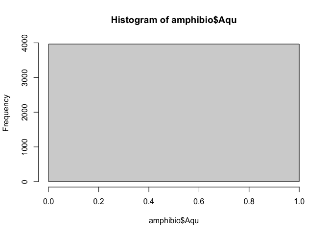

## Instructions
Answer the following questions and complete the exercises in RMarkdown. Please embed all of your code and push your final work to your repository. Your final lab report should be organized, clean, and run free from errors. Remember, you must remove the `#` for the included code chunks to run. Be sure to add your name to the author header above.  

Make sure to use the formatting conventions of RMarkdown to make your report neat and clean!  

## Load the libraries

```r
library(tidyverse)
library(janitor)
library(skimr)
```

## Data
**1. For this homework, we will use two different data sets. Please load `amniota` and `amphibio`.**  

`amniota` data:  
Myhrvold N, Baldridge E, Chan B, Sivam D, Freeman DL, Ernest SKM (2015). “An amniote life-history
database to perform comparative analyses with birds, mammals, and reptiles.” _Ecology_, *96*, 3109.
doi: 10.1890/15-0846.1 (URL: https://doi.org/10.1890/15-0846.1).

```r
amniota <- readr::read_csv("data/amniota.csv")
```

```
## 
## ── Column specification ────────────────────────────────────────────────────────
## cols(
##   .default = col_double(),
##   class = col_character(),
##   order = col_character(),
##   family = col_character(),
##   genus = col_character(),
##   species = col_character(),
##   common_name = col_character()
## )
## ℹ Use `spec()` for the full column specifications.
```

`amphibio` data:  
Oliveira BF, São-Pedro VA, Santos-Barrera G, Penone C, Costa GC (2017). “AmphiBIO, a global database
for amphibian ecological traits.” _Scientific Data_, *4*, 170123. doi: 10.1038/sdata.2017.123 (URL:
https://doi.org/10.1038/sdata.2017.123).

```r
amphibio<- readr::read_csv("data/amphibio.csv")
```

```
## 
## ── Column specification ────────────────────────────────────────────────────────
## cols(
##   .default = col_double(),
##   id = col_character(),
##   Order = col_character(),
##   Family = col_character(),
##   Genus = col_character(),
##   Species = col_character(),
##   Seeds = col_logical(),
##   OBS = col_logical()
## )
## ℹ Use `spec()` for the full column specifications.
```

```
## Warning: 125 parsing failures.
##  row col           expected                                                           actual                file
## 1410 OBS 1/0/T/F/TRUE/FALSE Identified as P. appendiculata in Boquimpani-Freitas et al. 2002 'data/amphibio.csv'
## 1416 OBS 1/0/T/F/TRUE/FALSE Identified as T. miliaris in Giaretta and Facure 2004            'data/amphibio.csv'
## 1447 OBS 1/0/T/F/TRUE/FALSE Considered endangered by Soto-Azat et al. 2013                   'data/amphibio.csv'
## 1448 OBS 1/0/T/F/TRUE/FALSE Considered extinct by Soto-Azat et al. 2013                      'data/amphibio.csv'
## 1471 OBS 1/0/T/F/TRUE/FALSE nomem dubitum                                                    'data/amphibio.csv'
## .... ... .................. ................................................................ ...................
## See problems(...) for more details.
```

## Questions  
**2. Do some exploratory analysis of the `amniota` data set. Use the function(s) of your choice. Try to get an idea of how NA's are represented in the data.**  


```r
summary(amniota)
```

```
##     class              order              family             genus          
##  Length:21322       Length:21322       Length:21322       Length:21322      
##  Class :character   Class :character   Class :character   Class :character  
##  Mode  :character   Mode  :character   Mode  :character   Mode  :character  
##                                                                             
##                                                                             
##                                                                             
##    species            subspecies   common_name        female_maturity_d 
##  Length:21322       Min.   :-999   Length:21322       Min.   :-30258.7  
##  Class :character   1st Qu.:-999   Class :character   1st Qu.:  -999.0  
##  Mode  :character   Median :-999   Mode  :character   Median :  -999.0  
##                     Mean   :-999                      Mean   :  -723.7  
##                     3rd Qu.:-999                      3rd Qu.:  -999.0  
##                     Max.   :-999                      Max.   :  9131.2  
##  litter_or_clutch_size_n litters_or_clutches_per_y adult_body_mass_g  
##  Min.   :-999.000        Min.   :-999.0            Min.   :     -999  
##  1st Qu.:-999.000        1st Qu.:-999.0            1st Qu.:        4  
##  Median :   1.692        Median :-999.0            Median :       24  
##  Mean   :-383.909        Mean   :-766.8            Mean   :    29107  
##  3rd Qu.:   3.200        3rd Qu.:-999.0            3rd Qu.:      135  
##  Max.   : 156.000        Max.   :  52.0            Max.   :149000000  
##  maximum_longevity_y  gestation_d       weaning_d     
##  Min.   :-999.000    Min.   :-999.0   Min.   :-999.0  
##  1st Qu.:-999.000    1st Qu.:-999.0   1st Qu.:-999.0  
##  Median :-999.000    Median :-999.0   Median :-999.0  
##  Mean   :-737.061    Mean   :-874.9   Mean   :-892.4  
##  3rd Qu.:   1.083    3rd Qu.:-999.0   3rd Qu.:-999.0  
##  Max.   : 211.000    Max.   :7396.9   Max.   :1826.2  
##  birth_or_hatching_weight_g weaning_weight_g     egg_mass_g     
##  Min.   :   -999.0          Min.   :    -999   Min.   :-999.00  
##  1st Qu.:   -999.0          1st Qu.:    -999   1st Qu.:-999.00  
##  Median :   -999.0          Median :    -999   Median :-999.00  
##  Mean   :    -88.6          Mean   :    1116   Mean   :-739.64  
##  3rd Qu.:   -999.0          3rd Qu.:    -999   3rd Qu.:   0.56  
##  Max.   :2250000.0          Max.   :17000000   Max.   :1500.00  
##   incubation_d    fledging_age_d    longevity_y       male_maturity_d 
##  Min.   :-999.0   Min.   :-999.0   Min.   :-999.000   Min.   :-999.0  
##  1st Qu.:-999.0   1st Qu.:-999.0   1st Qu.:-999.000   1st Qu.:-999.0  
##  Median :-999.0   Median :-999.0   Median :-999.000   Median :-999.0  
##  Mean   :-820.5   Mean   :-909.4   Mean   :-737.821   Mean   :-827.8  
##  3rd Qu.:-999.0   3rd Qu.:-999.0   3rd Qu.:   1.042   3rd Qu.:-999.0  
##  Max.   :1762.0   Max.   : 345.0   Max.   : 177.000   Max.   :9131.2  
##  inter_litter_or_interbirth_interval_y female_body_mass_g male_body_mass_g 
##  Min.   :-999.000                      Min.   :   -999    Min.   :   -999  
##  1st Qu.:-999.000                      1st Qu.:   -999    1st Qu.:   -999  
##  Median :-999.000                      Median :   -999    Median :   -999  
##  Mean   :-932.502                      Mean   :     41    Mean   :   1243  
##  3rd Qu.:-999.000                      3rd Qu.:     14    3rd Qu.:     13  
##  Max.   :   4.847                      Max.   :3700000    Max.   :4545000  
##  no_sex_body_mass_g   egg_width_mm    egg_length_mm    fledging_mass_g 
##  Min.   :     -999   Min.   :-999.0   Min.   :-999.0   Min.   :-999.0  
##  1st Qu.:     -999   1st Qu.:-999.0   1st Qu.:-999.0   1st Qu.:-999.0  
##  Median :     -999   Median :-999.0   Median :-999.0   Median :-999.0  
##  Mean   :    30689   Mean   :-970.5   Mean   :-968.9   Mean   :-984.6  
##  3rd Qu.:       28   3rd Qu.:-999.0   3rd Qu.:-999.0   3rd Qu.:-999.0  
##  Max.   :136000000   Max.   : 125.0   Max.   : 455.0   Max.   :9992.0  
##   adult_svl_cm       male_svl_cm     female_svl_cm    birth_or_hatching_svl_cm
##  Min.   :-999.000   Min.   :-999.0   Min.   :-999.0   Min.   :-999.0          
##  1st Qu.:-999.000   1st Qu.:-999.0   1st Qu.:-999.0   1st Qu.:-999.0          
##  Median :-999.000   Median :-999.0   Median :-999.0   Median :-999.0          
##  Mean   :-656.153   Mean   :-985.1   Mean   :-947.4   Mean   :-940.3          
##  3rd Qu.:   9.499   3rd Qu.:-999.0   3rd Qu.:-999.0   3rd Qu.:-999.0          
##  Max.   :3049.000   Max.   : 315.2   Max.   :1125.0   Max.   : 760.0          
##  female_svl_at_maturity_cm female_body_mass_at_maturity_g no_sex_svl_cm   
##  Min.   :-999.0            Min.   :  -999.0               Min.   :-999.0  
##  1st Qu.:-999.0            1st Qu.:  -999.0               1st Qu.:-999.0  
##  Median :-999.0            Median :  -999.0               Median :-999.0  
##  Mean   :-989.4            Mean   :  -980.6               Mean   :-747.1  
##  3rd Qu.:-999.0            3rd Qu.:  -999.0               3rd Qu.:-999.0  
##  Max.   : 580.0            Max.   :194000.0               Max.   :3300.0  
##  no_sex_maturity_d
##  Min.   : -999.0  
##  1st Qu.: -999.0  
##  Median : -999.0  
##  Mean   : -942.6  
##  3rd Qu.: -999.0  
##  Max.   :14610.0
```

The negative -999 in the data indicate that there are NAs


```r
amniota %>% 
  skimr::skim()
```


Table: Data summary

|                         |           |
|:------------------------|:----------|
|Name                     |Piped data |
|Number of rows           |21322      |
|Number of columns        |36         |
|_______________________  |           |
|Column type frequency:   |           |
|character                |6          |
|numeric                  |30         |
|________________________ |           |
|Group variables          |None       |


**Variable type: character**

|skim_variable | n_missing| complete_rate| min| max| empty| n_unique| whitespace|
|:-------------|---------:|-------------:|---:|---:|-----:|--------:|----------:|
|class         |         0|             1|   4|   8|     0|        3|          0|
|order         |         0|             1|   6|  19|     0|       72|          0|
|family        |         0|             1|   6|  19|     0|      465|          0|
|genus         |         0|             1|   2|  20|     0|     4336|          0|
|species       |         0|             1|   2|  21|     0|    11548|          0|
|common_name   |         0|             1|   2| 306|     0|    19625|          0|


**Variable type: numeric**

|skim_variable                         | n_missing| complete_rate|     mean|         sd|        p0|     p25|     p50|     p75|         p100|hist  |
|:-------------------------------------|---------:|-------------:|--------:|----------:|---------:|-------:|-------:|-------:|------------:|:-----|
|subspecies                            |         0|             1|  -999.00|       0.00|   -999.00| -999.00| -999.00| -999.00|      -999.00|▁▁▇▁▁ |
|female_maturity_d                     |         0|             1|  -723.70|     830.62| -30258.71| -999.00| -999.00| -999.00|      9131.25|▁▁▁▇▁ |
|litter_or_clutch_size_n               |         0|             1|  -383.91|     488.39|   -999.00| -999.00|    1.69|    3.20|       156.00|▅▁▁▁▇ |
|litters_or_clutches_per_y             |         0|             1|  -766.76|     422.48|   -999.00| -999.00| -999.00| -999.00|        52.00|▇▁▁▁▂ |
|adult_body_mass_g                     |         0|             1| 29107.30| 1278639.85|   -999.00|    4.44|   23.61|  135.00| 149000000.00|▇▁▁▁▁ |
|maximum_longevity_y                   |         0|             1|  -737.06|     444.36|   -999.00| -999.00| -999.00|    1.08|       211.00|▇▁▁▁▃ |
|gestation_d                           |         0|             1|  -874.91|     353.92|   -999.00| -999.00| -999.00| -999.00|      7396.92|▇▁▁▁▁ |
|weaning_d                             |         0|             1|  -892.45|     330.67|   -999.00| -999.00| -999.00| -999.00|      1826.25|▇▁▁▁▁ |
|birth_or_hatching_weight_g            |         0|             1|   -88.57|   26484.20|   -999.00| -999.00| -999.00| -999.00|   2250000.00|▇▁▁▁▁ |
|weaning_weight_g                      |         0|             1|  1116.10|  134348.60|   -999.00| -999.00| -999.00| -999.00|  17000000.00|▇▁▁▁▁ |
|egg_mass_g                            |         0|             1|  -739.64|     445.35|   -999.00| -999.00| -999.00|    0.56|      1500.00|▇▁▂▁▁ |
|incubation_d                          |         0|             1|  -820.49|     394.55|   -999.00| -999.00| -999.00| -999.00|      1762.00|▇▂▁▁▁ |
|fledging_age_d                        |         0|             1|  -909.42|     291.29|   -999.00| -999.00| -999.00| -999.00|       345.00|▇▁▁▁▁ |
|longevity_y                           |         0|             1|  -737.82|     443.03|   -999.00| -999.00| -999.00|    1.04|       177.00|▇▁▁▁▃ |
|male_maturity_d                       |         0|             1|  -827.77|     595.69|   -999.00| -999.00| -999.00| -999.00|      9131.25|▇▁▁▁▁ |
|inter_litter_or_interbirth_interval_y |         0|             1|  -932.50|     249.14|   -999.00| -999.00| -999.00| -999.00|         4.85|▇▁▁▁▁ |
|female_body_mass_g                    |         0|             1|    40.59|   27536.51|   -999.00| -999.00| -999.00|   14.50|   3700000.00|▇▁▁▁▁ |
|male_body_mass_g                      |         0|             1|  1242.90|   62044.69|   -999.00| -999.00| -999.00|   13.34|   4545000.00|▇▁▁▁▁ |
|no_sex_body_mass_g                    |         0|             1| 30689.26| 1467346.84|   -999.00| -999.00| -999.00|   27.77| 136000000.00|▇▁▁▁▁ |
|egg_width_mm                          |         0|             1|  -970.48|     168.36|   -999.00| -999.00| -999.00| -999.00|       125.00|▇▁▁▁▁ |
|egg_length_mm                         |         0|             1|  -968.89|     174.10|   -999.00| -999.00| -999.00| -999.00|       455.00|▇▁▁▁▁ |
|fledging_mass_g                       |         0|             1|  -984.64|     211.46|   -999.00| -999.00| -999.00| -999.00|      9992.00|▇▁▁▁▁ |
|adult_svl_cm                          |         0|             1|  -656.15|     490.74|   -999.00| -999.00| -999.00|    9.50|      3049.00|▇▃▁▁▁ |
|male_svl_cm                           |         0|             1|  -985.12|     120.02|   -999.00| -999.00| -999.00| -999.00|       315.20|▇▁▁▁▁ |
|female_svl_cm                         |         0|             1|  -947.35|     223.83|   -999.00| -999.00| -999.00| -999.00|      1125.00|▇▁▁▁▁ |
|birth_or_hatching_svl_cm              |         0|             1|  -940.34|     236.74|   -999.00| -999.00| -999.00| -999.00|       760.00|▇▁▁▁▁ |
|female_svl_at_maturity_cm             |         0|             1|  -989.36|      98.74|   -999.00| -999.00| -999.00| -999.00|       580.00|▇▁▁▁▁ |
|female_body_mass_at_maturity_g        |         0|             1|  -980.61|    1888.55|   -999.00| -999.00| -999.00| -999.00|    194000.00|▇▁▁▁▁ |
|no_sex_svl_cm                         |         0|             1|  -747.14|     442.27|   -999.00| -999.00| -999.00| -999.00|      3300.00|▇▂▁▁▁ |
|no_sex_maturity_d                     |         0|             1|  -942.59|     465.04|   -999.00| -999.00| -999.00| -999.00|     14610.00|▇▁▁▁▁ |

```r
#Curious where -30259 came from, maybe multiple -999 recordings?
-30259/-999
```

```
## [1] 30.28929
```

The NAs in this dataset seem to be represented by -999.


```r
amniota_no_nas <- amniota %>%
  na_if("-999")
summary(amniota_no_nas)
```

```
##     class              order              family             genus          
##  Length:21322       Length:21322       Length:21322       Length:21322      
##  Class :character   Class :character   Class :character   Class :character  
##  Mode  :character   Mode  :character   Mode  :character   Mode  :character  
##                                                                             
##                                                                             
##                                                                             
##                                                                             
##    species            subspecies    common_name        female_maturity_d 
##  Length:21322       Min.   : NA     Length:21322       Min.   :-30258.7  
##  Class :character   1st Qu.: NA     Class :character   1st Qu.:   288.4  
##  Mode  :character   Median : NA     Mode  :character   Median :   365.0  
##                     Mean   :NaN                        Mean   :   691.2  
##                     3rd Qu.: NA                        3rd Qu.:   819.3  
##                     Max.   : NA                        Max.   :  9131.2  
##                     NA's   :21322                      NA's   :17849     
##  litter_or_clutch_size_n litters_or_clutches_per_y adult_body_mass_g  
##  Min.   :  0.900         Min.   : 0.120            Min.   :        0  
##  1st Qu.:  2.000         1st Qu.: 1.000            1st Qu.:       15  
##  Median :  2.800         Median : 1.050            Median :       44  
##  Mean   :  3.826         Mean   : 1.752            Mean   :    37493  
##  3rd Qu.:  4.150         3rd Qu.: 2.000            3rd Qu.:      238  
##  Max.   :156.000         Max.   :52.000            Max.   :149000000  
##  NA's   :8244            NA's   :16374             NA's   :4645       
##  maximum_longevity_y  gestation_d        weaning_d      
##  Min.   :  0.083     Min.   :   5.00   Min.   :   1.94  
##  1st Qu.:  6.000     1st Qu.:  29.91   1st Qu.:  27.75  
##  Median : 12.308     Median :  63.92   Median :  51.60  
##  Mean   : 16.466     Mean   : 105.28   Mean   : 113.05  
##  3rd Qu.: 22.000     3rd Qu.: 151.88   3rd Qu.: 129.83  
##  Max.   :211.000     Max.   :7396.92   Max.   :1826.25  
##  NA's   :15822       NA's   :18926     NA's   :19279    
##  birth_or_hatching_weight_g weaning_weight_g     egg_mass_g      
##  Min.   :0.00e+00           Min.   :       1   Min.   :   0.218  
##  1st Qu.:1.30e+00           1st Qu.:      13   1st Qu.:   2.100  
##  Median :5.90e+00           Median :      43   Median :   5.100  
##  Mean   :4.48e+03           Mean   :   41386   Mean   :  22.252  
##  3rd Qu.:4.39e+01           3rd Qu.:     850   3rd Qu.:  20.100  
##  Max.   :2.25e+06           Max.   :17000000   Max.   :1500.000  
##  NA's   :17779              NA's   :20258      NA's   :15907     
##   incubation_d     fledging_age_d   longevity_y      male_maturity_d  
##  Min.   :   2.00   Min.   :  1.0   Min.   :  0.083   Min.   :  30.44  
##  1st Qu.:  17.00   1st Qu.: 16.5   1st Qu.:  5.500   1st Qu.: 365.00  
##  Median :  29.25   Median : 27.5   Median : 10.700   Median : 365.25  
##  Mean   :  46.67   Mean   : 36.8   Mean   : 13.521   Mean   : 787.16  
##  3rd Qu.:  59.50   3rd Qu.: 46.0   3rd Qu.: 18.200   3rd Qu.: 913.00  
##  Max.   :1762.00   Max.   :345.0   Max.   :177.000   Max.   :9131.25  
##  NA's   :17682     NA's   :19478   NA's   :15822     NA's   :19278    
##  inter_litter_or_interbirth_interval_y female_body_mass_g male_body_mass_g 
##  Min.   :0.047                         Min.   :      0    Min.   :      0  
##  1st Qu.:0.318                         1st Qu.:     14    1st Qu.:     16  
##  Median :0.999                         Median :     41    Median :     48  
##  Mean   :0.907                         Mean   :   2076    Mean   :   6197  
##  3rd Qu.:1.000                         3rd Qu.:    220    3rd Qu.:    246  
##  Max.   :4.847                         Max.   :3700000    Max.   :4545000  
##  NA's   :19904                         NA's   :14113      NA's   :14679    
##  no_sex_body_mass_g   egg_width_mm    egg_length_mm    fledging_mass_g  
##  Min.   :        0   Min.   :  2.50   Min.   :  2.50   Min.   :   4.85  
##  1st Qu.:       13   1st Qu.:  8.00   1st Qu.: 10.94   1st Qu.:  14.60  
##  Median :       35   Median : 13.00   Median : 19.98   Median :  24.80  
##  Mean   :    68952   Mean   : 22.99   Mean   : 36.40   Mean   : 452.27  
##  3rd Qu.:      164   3rd Qu.: 35.90   3rd Qu.: 58.92   3rd Qu.: 107.00  
##  Max.   :136000000   Max.   :125.00   Max.   :455.00   Max.   :9992.00  
##  NA's   :11663       NA's   :20727    NA's   :20702    NA's   :21111    
##   adult_svl_cm      male_svl_cm     female_svl_cm      birth_or_hatching_svl_cm
##  Min.   :   1.79   Min.   :  1.57   Min.   :   1.800   Min.   :  0.400         
##  1st Qu.:   9.50   1st Qu.: 21.41   1st Qu.:   5.756   1st Qu.:  2.450         
##  Median :  18.50   Median : 35.85   Median :   8.150   Median :  3.300         
##  Mean   :  38.20   Mean   : 50.44   Mean   :  20.609   Mean   : 12.099         
##  3rd Qu.:  40.50   3rd Qu.: 63.39   3rd Qu.:  17.721   3rd Qu.:  5.256         
##  Max.   :3049.00   Max.   :315.20   Max.   :1125.000   Max.   :759.999         
##  NA's   :14274     NA's   :21040    NA's   :20242      NA's   :20085           
##  female_svl_at_maturity_cm female_body_mass_at_maturity_g no_sex_svl_cm   
##  Min.   :  2.85            Min.   :    30.0               Min.   :   1.7  
##  1st Qu.:  4.90            1st Qu.:    82.5               1st Qu.:   5.7  
##  Median :  6.00            Median : 97050.0               Median :   7.7  
##  Mean   : 18.69            Mean   : 97032.5               Mean   :  20.0  
##  3rd Qu.:  8.40            3rd Qu.:194000.0               3rd Qu.:  11.0  
##  Max.   :580.00            Max.   :194000.0               Max.   :3300.0  
##  NA's   :21120             NA's   :21318                  NA's   :16052   
##  no_sex_maturity_d
##  Min.   :   33.0  
##  1st Qu.:  365.3  
##  Median :  913.1  
##  Mean   : 1604.5  
##  3rd Qu.: 2008.9  
##  Max.   :14610.0  
##  NA's   :20860
```


```r
#Trying to figure out what -30258.71100 is
amniota_no_nas %>%
  filter(female_maturity_d >= 50) %>%
  tabyl(female_maturity_d)
```

```
##  female_maturity_d   n     percent
##           50.56000   1 0.000296472
##           50.56048   4 0.001185888
##           50.82812   1 0.000296472
##           50.83906   2 0.000592944
##           50.88000   1 0.000296472
##           50.98726   2 0.000592944
##           51.00000   1 0.000296472
##           51.13248   1 0.000296472
##           51.21842   2 0.000592944
##           51.29000   1 0.000296472
##           51.41406   6 0.001778832
##           51.43500   1 0.000296472
##           51.89000   2 0.000592944
##           52.00000   1 0.000296472
##           52.04804   2 0.000592944
##           52.98816  12 0.003557664
##           53.06574   1 0.000296472
##           53.13000   2 0.000592944
##           53.35500   3 0.000889416
##           53.57000   7 0.002075304
##           53.85000   4 0.001185888
##           54.17608   2 0.000592944
##           54.19000   1 0.000296472
##           54.22704   1 0.000296472
##           54.30268   1 0.000296472
##           54.40650   2 0.000592944
##           55.39352   1 0.000296472
##           55.44000   1 0.000296472
##           55.94214   1 0.000296472
##           56.38000   1 0.000296472
##           56.50000   1 0.000296472
##           56.53278   1 0.000296472
##           56.79000   9 0.002668248
##           57.00000   2 0.000592944
##           57.14126   1 0.000296472
##           57.84760   2 0.000592944
##           58.00000  12 0.003557664
##           59.07202   1 0.000296472
##           59.35020   1 0.000296472
##           59.95794   5 0.001482360
##           60.00000   7 0.002075304
##           60.34600   3 0.000889416
##           60.87200   1 0.000296472
##           60.88000   2 0.000592944
##           60.93600   1 0.000296472
##           60.94000   2 0.000592944
##           60.94600   6 0.001778832
##           61.00000   2 0.000592944
##           61.63100   1 0.000296472
##           61.78508   3 0.000889416
##           61.87000   1 0.000296472
##           63.00252   2 0.000592944
##           63.80588   1 0.000296472
##           64.71000   1 0.000296472
##           64.92100   1 0.000296472
##           65.06716   1 0.000296472
##           65.43740   1 0.000296472
##           66.00000   1 0.000296472
##           67.26356   3 0.000889416
##           67.46000   1 0.000296472
##           68.37128   1 0.000296472
##           68.48100   1 0.000296472
##           68.97000   3 0.000889416
##           69.22678   1 0.000296472
##           69.39408   1 0.000296472
##           69.52000   1 0.000296472
##           69.78500   1 0.000296472
##           70.00280   1 0.000296472
##           70.61152   1 0.000296472
##           70.67580   1 0.000296472
##           70.91588   2 0.000592944
##           71.00000   5 0.001482360
##           71.19000   1 0.000296472
##           71.32680   1 0.000296472
##           71.81512   6 0.001778832
##           72.19886   2 0.000592944
##           73.04640   4 0.001185888
##           74.00000   1 0.000296472
##           74.09782   1 0.000296472
##           74.20000   3 0.000889416
##           74.67492   1 0.000296472
##           74.69038   1 0.000296472
##           75.00000  11 0.003261192
##           76.06500   2 0.000592944
##           76.09000   1 0.000296472
##           76.71500   1 0.000296472
##           77.03000   1 0.000296472
##           77.70500   1 0.000296472
##           78.15000   3 0.000889416
##           78.22698   1 0.000296472
##           78.48962   1 0.000296472
##           78.66000   1 0.000296472
##           78.78396   1 0.000296472
##           78.82924   3 0.000889416
##           79.00000   1 0.000296472
##           80.30374   5 0.001482360
##           80.73500   1 0.000296472
##           81.39254   1 0.000296472
##           81.76860   1 0.000296472
##           81.77726   1 0.000296472
##           81.87284   3 0.000889416
##           81.95780   2 0.000592944
##           82.17720   6 0.001778832
##           82.96528   1 0.000296472
##           83.20360   1 0.000296472
##           83.39464   3 0.000889416
##           83.69900   2 0.000592944
##           83.96218   2 0.000592944
##           84.15386   2 0.000592944
##           84.30772   1 0.000296472
##           84.35000   1 0.000296472
##           85.22080   1 0.000296472
##           85.34000   1 0.000296472
##           85.89254   1 0.000296472
##           86.11772   1 0.000296472
##           86.48000   1 0.000296472
##           87.77000   1 0.000296472
##           88.00900   1 0.000296472
##           89.85450   1 0.000296472
##           90.00000   2 0.000592944
##           90.79444   2 0.000592944
##           91.00000   1 0.000296472
##           91.15400   1 0.000296472
##           91.24000   6 0.001778832
##           91.30800   5 0.001482360
##           91.32000   1 0.000296472
##           91.41900   2 0.000592944
##           92.05400   1 0.000296472
##           92.80000   9 0.002668248
##           93.13416   2 0.000592944
##           93.24964   1 0.000296472
##           93.70170   2 0.000592944
##           94.14000   5 0.001482360
##           94.27350   2 0.000592944
##           94.35212   1 0.000296472
##           94.59000   5 0.001482360
##           94.96032   1 0.000296472
##           94.98016   1 0.000296472
##           95.07708   1 0.000296472
##           95.24000   1 0.000296472
##           95.87340   2 0.000592944
##           96.05000   3 0.000889416
##           97.24248   3 0.000889416
##           97.46954   2 0.000592944
##           97.69956   1 0.000296472
##           97.88360   6 0.001778832
##           97.95032   1 0.000296472
##           98.00000   2 0.000592944
##           98.91700   1 0.000296472
##           98.95850   1 0.000296472
##           99.17606   1 0.000296472
##           99.25172   7 0.002075304
##           99.32000   1 0.000296472
##          100.00000   3 0.000889416
##          100.24326   1 0.000296472
##          101.08000   1 0.000296472
##          101.17594   2 0.000592944
##          101.52594   1 0.000296472
##          101.96060   1 0.000296472
##          102.64500   8 0.002371776
##          102.66620   1 0.000296472
##          103.46000   5 0.001482360
##          105.16568   1 0.000296472
##          105.22000   1 0.000296472
##          105.39686   2 0.000592944
##          106.24400   2 0.000592944
##          106.38500   3 0.000889416
##          106.52600   1 0.000296472
##          106.54000   1 0.000296472
##          106.82000   2 0.000592944
##          106.82618   1 0.000296472
##          106.83036   1 0.000296472
##          107.16000   2 0.000592944
##          107.18942   7 0.002075304
##          107.71000   1 0.000296472
##          108.06700   1 0.000296472
##          109.00000   1 0.000296472
##          109.36000   1 0.000296472
##          113.04906   2 0.000592944
##          113.20100   1 0.000296472
##          114.03482   1 0.000296472
##          115.77776   2 0.000592944
##          116.52560   1 0.000296472
##          116.76494   2 0.000592944
##          118.00000   1 0.000296472
##          119.17678   2 0.000592944
##          119.62612   1 0.000296472
##          120.00000   5 0.001482360
##          120.70000   1 0.000296472
##          120.83092   1 0.000296472
##          120.88000   1 0.000296472
##          121.74400   2 0.000592944
##          121.76000   2 0.000592944
##          121.76328   1 0.000296472
##          122.26500   1 0.000296472
##          122.83250   1 0.000296472
##          123.00000   3 0.000889416
##          128.13556   1 0.000296472
##          128.74428  10 0.002964720
##          131.02200   2 0.000592944
##          132.40000   1 0.000296472
##          133.11950   1 0.000296472
##          135.00000   1 0.000296472
##          136.30900   1 0.000296472
##          136.31250   1 0.000296472
##          136.35328   1 0.000296472
##          136.98000   1 0.000296472
##          137.02000   1 0.000296472
##          137.10000   2 0.000592944
##          138.60000   1 0.000296472
##          139.08972   1 0.000296472
##          140.00000   1 0.000296472
##          140.97000   2 0.000592944
##          142.00000   2 0.000592944
##          144.54282   2 0.000592944
##          145.00000   2 0.000592944
##          145.02000   1 0.000296472
##          146.10230   1 0.000296472
##          146.80730   2 0.000592944
##          147.61460  16 0.004743552
##          147.92000   1 0.000296472
##          150.86111   2 0.000592944
##          150.96256   1 0.000296472
##          152.00000   1 0.000296472
##          152.20000   2 0.000592944
##          153.34000   1 0.000296472
##          153.46000   1 0.000296472
##          154.31052   2 0.000592944
##          155.06000   2 0.000592944
##          156.45500   1 0.000296472
##          156.78500   4 0.001185888
##          157.00000   1 0.000296472
##          157.32000   1 0.000296472
##          157.65848   1 0.000296472
##          157.84000   1 0.000296472
##          158.00000   1 0.000296472
##          158.26720   1 0.000296472
##          159.78900   3 0.000889416
##          161.91952   3 0.000889416
##          162.22388   1 0.000296472
##          163.00000   1 0.000296472
##          163.84000   1 0.000296472
##          164.00000   1 0.000296472
##          166.32000   3 0.000889416
##          167.70236   1 0.000296472
##          168.31108   1 0.000296472
##          169.16000   1 0.000296472
##          169.59000   1 0.000296472
##          171.10000   1 0.000296472
##          172.19040   1 0.000296472
##          172.31456   4 0.001185888
##          174.53628   1 0.000296472
##          175.00000   3 0.000889416
##          176.72854   1 0.000296472
##          177.20000   1 0.000296472
##          178.00000   5 0.001482360
##          179.01632   1 0.000296472
##          180.00000   2 0.000592944
##          180.71966   1 0.000296472
##          182.00000   1 0.000296472
##          182.07500   2 0.000592944
##          182.61600   2 0.000592944
##          182.62500   1 0.000296472
##          182.64000   3 0.000889416
##          183.59500   2 0.000592944
##          183.62300   3 0.000889416
##          184.00000   1 0.000296472
##          184.13780   1 0.000296472
##          185.61000   3 0.000889416
##          186.00000   1 0.000296472
##          186.41994   1 0.000296472
##          187.19000   1 0.000296472
##          188.68000   1 0.000296472
##          189.20500   1 0.000296472
##          190.55000   1 0.000296472
##          191.71600   2 0.000592944
##          191.90000   1 0.000296472
##          192.65988   1 0.000296472
##          192.91000   1 0.000296472
##          193.00000   1 0.000296472
##          194.80830   1 0.000296472
##          195.31556   1 0.000296472
##          196.50056   2 0.000592944
##          196.95400   1 0.000296472
##          196.96000   1 0.000296472
##          197.36994   1 0.000296472
##          197.37500   1 0.000296472
##          197.79500   1 0.000296472
##          198.00000   1 0.000296472
##          198.41000   1 0.000296472
##          200.04564   4 0.001185888
##          200.85500   1 0.000296472
##          202.08000   1 0.000296472
##          202.78556   4 0.001185888
##          210.00000   1 0.000296472
##          210.30524   1 0.000296472
##          210.45000   5 0.001482360
##          212.67262   1 0.000296472
##          212.91000   1 0.000296472
##          213.02600   2 0.000592944
##          213.05200   1 0.000296472
##          213.08000  15 0.004447080
##          213.23400   1 0.000296472
##          216.66500   1 0.000296472
##          219.00000   1 0.000296472
##          221.76000   3 0.000889416
##          223.70460   1 0.000296472
##          226.19000   1 0.000296472
##          227.35692   1 0.000296472
##          227.66128   5 0.001482360
##          227.99000   1 0.000296472
##          228.00000   2 0.000592944
##          228.27000   5 0.001482360
##          228.30000   6 0.001778832
##          228.36000   2 0.000592944
##          228.76500   1 0.000296472
##          229.14000   1 0.000296472
##          230.00000   1 0.000296472
##          231.09000   3 0.000889416
##          233.02600   2 0.000592944
##          233.47000   1 0.000296472
##          233.81000   1 0.000296472
##          234.47196   1 0.000296472
##          234.73398   1 0.000296472
##          234.83000   1 0.000296472
##          234.98500   1 0.000296472
##          236.12000   1 0.000296472
##          238.31388   1 0.000296472
##          240.00000  11 0.003261192
##          241.74400   1 0.000296472
##          241.98424   1 0.000296472
##          242.30090   6 0.001778832
##          242.57492   3 0.000889416
##          242.64000   2 0.000592944
##          243.00000   1 0.000296472
##          243.42713   1 0.000296472
##          243.52000   8 0.002371776
##          245.30000   3 0.000889416
##          250.18392   1 0.000296472
##          250.53000   1 0.000296472
##          251.00000   1 0.000296472
##          251.71000   5 0.001482360
##          252.88500   1 0.000296472
##          253.75000   2 0.000592944
##          254.50056   1 0.000296472
##          258.00000   3 0.000889416
##          258.65000   1 0.000296472
##          258.74000   4 0.001185888
##          259.43551   1 0.000296472
##          265.80000   2 0.000592944
##          265.85314   1 0.000296472
##          266.00000   1 0.000296472
##          266.41000   1 0.000296472
##          270.00000   1 0.000296472
##          271.73400   3 0.000889416
##          271.84000   1 0.000296472
##          272.00000   1 0.000296472
##          273.92400   2 0.000592944
##          273.96000   5 0.001482360
##          273.96200   1 0.000296472
##          274.00000   8 0.002371776
##          274.12000   1 0.000296472
##          274.26700   1 0.000296472
##          275.89000   1 0.000296472
##          276.05452   2 0.000592944
##          278.01500   2 0.000592944
##          278.27000   3 0.000889416
##          278.42000   1 0.000296472
##          279.05500   1 0.000296472
##          280.56000   1 0.000296472
##          283.18000   3 0.000889416
##          285.00000   1 0.000296472
##          285.18500   3 0.000889416
##          285.63000   2 0.000592944
##          288.00000   1 0.000296472
##          288.37000   4 0.001185888
##          289.00000   1 0.000296472
##          289.12000   1 0.000296472
##          289.18000   3 0.000889416
##          290.00000   1 0.000296472
##          292.47974   1 0.000296472
##          293.14000   1 0.000296472
##          294.00000   2 0.000592944
##          294.02060   4 0.001185888
##          294.06000   1 0.000296472
##          294.70000   1 0.000296472
##          295.44398   3 0.000889416
##          296.18028   1 0.000296472
##          297.72262   1 0.000296472
##          298.14000   1 0.000296472
##          298.75500   2 0.000592944
##          298.91000   2 0.000592944
##          299.26500   4 0.001185888
##          300.00000   1 0.000296472
##          300.20000   2 0.000592944
##          301.00000   1 0.000296472
##          301.73400   2 0.000592944
##          303.23400   1 0.000296472
##          303.62000   1 0.000296472
##          304.00000   7 0.002075304
##          304.16000   1 0.000296472
##          304.18000   2 0.000592944
##          304.26000   1 0.000296472
##          304.36000   7 0.002075304
##          304.40000   5 0.001482360
##          305.56970   2 0.000592944
##          307.20710   1 0.000296472
##          307.83232   2 0.000592944
##          308.92008   1 0.000296472
##          309.00000   2 0.000592944
##          309.26000   1 0.000296472
##          310.25000   1 0.000296472
##          310.33000   1 0.000296472
##          310.44720   2 0.000592944
##          311.36000   2 0.000592944
##          311.88500   1 0.000296472
##          312.00000   2 0.000592944
##          313.18644   2 0.000592944
##          314.00000   4 0.001185888
##          314.20194   3 0.000889416
##          314.39000   1 0.000296472
##          315.68000   3 0.000889416
##          315.99000   1 0.000296472
##          316.41256   1 0.000296472
##          317.10900   1 0.000296472
##          317.19500   1 0.000296472
##          318.73400   2 0.000592944
##          319.00000   4 0.001185888
##          319.43478   1 0.000296472
##          319.57800   2 0.000592944
##          319.59800   1 0.000296472
##          320.00000   1 0.000296472
##          320.07000   1 0.000296472
##          322.62160   1 0.000296472
##          323.00000   1 0.000296472
##          323.13000   1 0.000296472
##          323.23032   2 0.000592944
##          323.75106   1 0.000296472
##          323.83904   1 0.000296472
##          324.30386   1 0.000296472
##          324.38000   1 0.000296472
##          324.75212   1 0.000296472
##          324.92000   2 0.000592944
##          324.97400   1 0.000296472
##          325.00000   1 0.000296472
##          325.18500   1 0.000296472
##          325.24394   1 0.000296472
##          325.96956   7 0.002075304
##          326.15938   4 0.001185888
##          326.63000   1 0.000296472
##          326.81000   2 0.000592944
##          326.88264   1 0.000296472
##          327.00000   2 0.000592944
##          327.20000   1 0.000296472
##          327.40000   1 0.000296472
##          327.65256   5 0.001482360
##          328.80000   1 0.000296472
##          329.92624   1 0.000296472
##          331.09800   1 0.000296472
##          331.73400   1 0.000296472
##          332.60100   1 0.000296472
##          332.96984   1 0.000296472
##          333.73400   2 0.000592944
##          334.00000   2 0.000592944
##          334.79600   3 0.000889416
##          334.84000   1 0.000296472
##          335.00000   1 0.000296472
##          335.48000   2 0.000592944
##          336.63000   1 0.000296472
##          337.48506   1 0.000296472
##          337.54300   1 0.000296472
##          337.88000   1 0.000296472
##          338.28620   1 0.000296472
##          338.33000   1 0.000296472
##          339.05704   1 0.000296472
##          339.20500   1 0.000296472
##          339.56000   1 0.000296472
##          339.79000   1 0.000296472
##          341.23400   2 0.000592944
##          341.49192   1 0.000296472
##          341.49968   2 0.000592944
##          341.73000   1 0.000296472
##          342.05032   1 0.000296472
##          342.28900   1 0.000296472
##          343.62244   1 0.000296472
##          343.74000   1 0.000296472
##          343.92000   2 0.000592944
##          344.32500   1 0.000296472
##          344.83988   1 0.000296472
##          345.00000   1 0.000296472
##          345.24000   2 0.000592944
##          346.11000   1 0.000296472
##          346.16776   1 0.000296472
##          347.09500   1 0.000296472
##          347.57912   1 0.000296472
##          347.93500   3 0.000889416
##          348.06600   3 0.000889416
##          348.18000   1 0.000296472
##          348.89828   1 0.000296472
##          349.23400   3 0.000889416
##          350.00000   2 0.000592944
##          350.01400   1 0.000296472
##          350.06000   3 0.000889416
##          350.06400   1 0.000296472
##          350.37100   1 0.000296472
##          351.66500   4 0.001185888
##          351.88500   1 0.000296472
##          353.33316   4 0.001185888
##          353.51214   1 0.000296472
##          353.97068   1 0.000296472
##          354.00000   1 0.000296472
##          356.22458   1 0.000296472
##          356.50850   1 0.000296472
##          356.56000   1 0.000296472
##          357.41000   1 0.000296472
##          358.48000   1 0.000296472
##          359.02880   1 0.000296472
##          360.05000   1 0.000296472
##          360.05788   1 0.000296472
##          360.93684   1 0.000296472
##          362.31500   1 0.000296472
##          362.50000   2 0.000592944
##          363.37600   1 0.000296472
##          363.46800 162 0.048028461
##          364.23400 187 0.055440261
##          364.35900   9 0.002668248
##          365.00000 269 0.079750964
##          365.11600   4 0.001185888
##          365.12500  13 0.003854136
##          365.23200  13 0.003854136
##          365.24500   2 0.000592944
##          365.25000  60 0.017788319
##          365.26500   1 0.000296472
##          365.28000   8 0.002371776
##          365.46598   2 0.000592944
##          367.95500   2 0.000592944
##          368.23100   4 0.001185888
##          369.72000   1 0.000296472
##          369.81100   1 0.000296472
##          370.13500   1 0.000296472
##          371.23000   4 0.001185888
##          372.00000   3 0.000889416
##          372.09000   1 0.000296472
##          374.02162   1 0.000296472
##          374.16000   3 0.000889416
##          376.94000   1 0.000296472
##          377.37000   4 0.001185888
##          377.57000   7 0.002075304
##          380.00000   2 0.000592944
##          380.11600   2 0.000592944
##          380.14500   1 0.000296472
##          380.74000   1 0.000296472
##          382.62500   1 0.000296472
##          383.02712   1 0.000296472
##          383.18000   1 0.000296472
##          384.00000   1 0.000296472
##          384.81842   1 0.000296472
##          384.88500   1 0.000296472
##          385.35594   1 0.000296472
##          387.59252   1 0.000296472
##          388.00000   1 0.000296472
##          388.33100   1 0.000296472
##          389.42000   1 0.000296472
##          391.29600   2 0.000592944
##          391.96000   1 0.000296472
##          392.95500   1 0.000296472
##          393.50000   2 0.000592944
##          394.09602   1 0.000296472
##          395.00000   1 0.000296472
##          400.00000   2 0.000592944
##          401.00000   1 0.000296472
##          403.00000   3 0.000889416
##          403.27700   3 0.000889416
##          406.92000   4 0.001185888
##          407.23368   4 0.001185888
##          410.25500   4 0.001185888
##          413.00000   2 0.000592944
##          413.84000   6 0.001778832
##          414.82500   3 0.000889416
##          415.28500   2 0.000592944
##          416.47186   1 0.000296472
##          417.36000   4 0.001185888
##          419.40808   1 0.000296472
##          420.91000   9 0.002668248
##          422.36094   1 0.000296472
##          423.04000   1 0.000296472
##          426.92500   1 0.000296472
##          427.60100   4 0.001185888
##          434.92000   1 0.000296472
##          438.45000   1 0.000296472
##          438.87662   1 0.000296472
##          440.09500   1 0.000296472
##          445.00000   1 0.000296472
##          446.48800   1 0.000296472
##          450.00000   4 0.001185888
##          450.80000   2 0.000592944
##          451.11000   3 0.000889416
##          452.00000   1 0.000296472
##          454.33500   1 0.000296472
##          454.74000   1 0.000296472
##          455.10100  13 0.003854136
##          455.22600   1 0.000296472
##          455.69400   1 0.000296472
##          456.00000   3 0.000889416
##          456.25000   1 0.000296472
##          456.43750   3 0.000889416
##          456.60000   1 0.000296472
##          457.26740   1 0.000296472
##          457.29500   2 0.000592944
##          457.79180   1 0.000296472
##          458.36000   1 0.000296472
##          464.04000   1 0.000296472
##          464.44000   1 0.000296472
##          467.75500   1 0.000296472
##          471.14500   1 0.000296472
##          473.63000   1 0.000296472
##          476.00000   2 0.000592944
##          476.20000   1 0.000296472
##          477.00000   8 0.002371776
##          477.48500   1 0.000296472
##          478.00000   1 0.000296472
##          478.01500   1 0.000296472
##          479.00000   1 0.000296472
##          479.81772   2 0.000592944
##          481.87500   2 0.000592944
##          485.11000   1 0.000296472
##          486.97600   1 0.000296472
##          486.98800   1 0.000296472
##          487.00000   3 0.000889416
##          487.04000  11 0.003261192
##          492.96250   1 0.000296472
##          493.22000   1 0.000296472
##          496.00000   1 0.000296472
##          498.18500   1 0.000296472
##          498.70800   1 0.000296472
##          498.97000   2 0.000592944
##          500.00000   1 0.000296472
##          501.76184   1 0.000296472
##          502.76000   5 0.001482360
##          507.81458   1 0.000296472
##          508.47000   1 0.000296472
##          508.85520   1 0.000296472
##          510.44000   1 0.000296472
##          511.62916   1 0.000296472
##          512.10500   1 0.000296472
##          515.14000   1 0.000296472
##          515.94720   1 0.000296472
##          516.44500   1 0.000296472
##          517.00000   1 0.000296472
##          517.30000   2 0.000592944
##          518.12000   1 0.000296472
##          521.42500   2 0.000592944
##          526.54000   5 0.001482360
##          527.11000   1 0.000296472
##          528.95500   1 0.000296472
##          531.64000   1 0.000296472
##          532.63000   1 0.000296472
##          535.67360   1 0.000296472
##          537.30000   2 0.000592944
##          538.06000   1 0.000296472
##          539.02156   1 0.000296472
##          539.33834   1 0.000296472
##          540.00000   3 0.000889416
##          540.84000   1 0.000296472
##          542.06516   1 0.000296472
##          545.20200  23 0.006818856
##          545.96800  10 0.002964720
##          546.00000   4 0.001185888
##          546.73400   7 0.002075304
##          547.00000   2 0.000592944
##          547.50000   3 0.000889416
##          547.75000   3 0.000889416
##          547.84800   7 0.002075304
##          547.87500   9 0.002668248
##          547.92000   8 0.002371776
##          548.00000   6 0.001778832
##          550.45944   1 0.000296472
##          550.61500   1 0.000296472
##          550.84700   1 0.000296472
##          552.42500   1 0.000296472
##          553.18000   1 0.000296472
##          553.53384   1 0.000296472
##          556.88500   2 0.000592944
##          560.02240   1 0.000296472
##          561.39000   1 0.000296472
##          561.58000   1 0.000296472
##          563.67472   2 0.000592944
##          566.36000   1 0.000296472
##          566.41396   2 0.000592944
##          568.34750   1 0.000296472
##          569.39500   1 0.000296472
##          570.91000   1 0.000296472
##          571.90318   1 0.000296472
##          576.46800   1 0.000296472
##          577.00000   3 0.000889416
##          578.00000   8 0.002371776
##          578.28400   1 0.000296472
##          580.38000   2 0.000592944
##          581.24834   1 0.000296472
##          581.78000   2 0.000592944
##          584.40000   3 0.000889416
##          587.78000   2 0.000592944
##          589.18500   2 0.000592944
##          591.09500   1 0.000296472
##          594.51078   1 0.000296472
##          595.25000   1 0.000296472
##          597.85390   1 0.000296472
##          598.98500   1 0.000296472
##          600.00000   3 0.000889416
##          600.48500   1 0.000296472
##          601.59454   1 0.000296472
##          604.37500   1 0.000296472
##          604.53300   1 0.000296472
##          605.67640   1 0.000296472
##          608.72000   2 0.000592944
##          608.80000   1 0.000296472
##          609.86000   2 0.000592944
##          612.26000   1 0.000296472
##          612.67668   2 0.000592944
##          613.54800   1 0.000296472
##          614.19000   1 0.000296472
##          614.80720   1 0.000296472
##          619.41000   2 0.000592944
##          620.76000   1 0.000296472
##          623.93800   2 0.000592944
##          624.49108   2 0.000592944
##          627.52312   1 0.000296472
##          630.65000   1 0.000296472
##          631.37000   2 0.000592944
##          634.28624   2 0.000592944
##          634.37500   1 0.000296472
##          636.06900   1 0.000296472
##          636.83500   1 0.000296472
##          637.00000   2 0.000592944
##          637.60100   8 0.002371776
##          638.73200   1 0.000296472
##          639.00000   4 0.001185888
##          639.03000   1 0.000296472
##          639.07800   2 0.000592944
##          639.15600   1 0.000296472
##          639.18750   2 0.000592944
##          643.67500   1 0.000296472
##          645.23000   1 0.000296472
##          646.00000   1 0.000296472
##          647.77462   6 0.001778832
##          648.20880   1 0.000296472
##          649.04812   4 0.001185888
##          649.80860   2 0.000592944
##          650.61000   1 0.000296472
##          652.22800   1 0.000296472
##          652.76000   2 0.000592944
##          654.10218   4 0.001185888
##          654.37000   1 0.000296472
##          654.84000   1 0.000296472
##          657.45000   1 0.000296472
##          659.00000   1 0.000296472
##          659.43500   1 0.000296472
##          663.50480   1 0.000296472
##          666.44000   6 0.001778832
##          669.00000   2 0.000592944
##          669.37600   1 0.000296472
##          669.59200   1 0.000296472
##          669.90472   1 0.000296472
##          671.93000   1 0.000296472
##          672.49000   1 0.000296472
##          674.00000   2 0.000592944
##          674.14550   1 0.000296472
##          676.66000   1 0.000296472
##          676.99074   1 0.000296472
##          684.00000   1 0.000296472
##          689.42000   1 0.000296472
##          689.70000   1 0.000296472
##          689.89684   1 0.000296472
##          694.00000   1 0.000296472
##          695.16674   1 0.000296472
##          699.97000   1 0.000296472
##          700.00000   1 0.000296472
##          700.01400   1 0.000296472
##          703.75450   1 0.000296472
##          707.00000   3 0.000889416
##          708.00000   1 0.000296472
##          710.47000   1 0.000296472
##          711.59368   1 0.000296472
##          712.00000   1 0.000296472
##          714.83000   3 0.000889416
##          718.73200   1 0.000296472
##          726.20296   1 0.000296472
##          726.93600  44 0.013044767
##          727.70200   1 0.000296472
##          728.00000   1 0.000296472
##          728.46800  28 0.008301216
##          729.99500   1 0.000296472
##          730.00000  84 0.024903647
##          730.22700   1 0.000296472
##          730.23200   2 0.000592944
##          730.24000   1 0.000296472
##          730.25000   1 0.000296472
##          730.37500   1 0.000296472
##          730.46400   1 0.000296472
##          730.48000   2 0.000592944
##          730.49000   1 0.000296472
##          730.50000  18 0.005336496
##          730.56000   2 0.000592944
##          730.77436   1 0.000296472
##          733.29000   1 0.000296472
##          734.99000   1 0.000296472
##          737.15992   1 0.000296472
##          739.33500   1 0.000296472
##          742.46000   5 0.001482360
##          742.57500   2 0.000592944
##          742.60200   1 0.000296472
##          742.80700   1 0.000296472
##          745.34100   1 0.000296472
##          746.91586   1 0.000296472
##          748.74202   1 0.000296472
##          753.48000   1 0.000296472
##          753.66772   1 0.000296472
##          754.74000   1 0.000296472
##          755.15000  17 0.005040024
##          756.60000   1 0.000296472
##          758.15000   1 0.000296472
##          763.00000   1 0.000296472
##          763.62000   1 0.000296472
##          764.04400   1 0.000296472
##          768.00000   1 0.000296472
##          770.70710   1 0.000296472
##          771.12412   1 0.000296472
##          773.50000   1 0.000296472
##          775.25464   1 0.000296472
##          778.84500   1 0.000296472
##          785.91000   2 0.000592944
##          796.25506   1 0.000296472
##          797.00000   2 0.000592944
##          798.64064   1 0.000296472
##          803.51040   1 0.000296472
##          805.28000   1 0.000296472
##          815.00000   1 0.000296472
##          816.35000   1 0.000296472
##          816.59788   1 0.000296472
##          817.77000   2 0.000592944
##          819.33500   9 0.002668248
##          821.00000   4 0.001185888
##          821.38600   1 0.000296472
##          823.61616   1 0.000296472
##          827.69000   2 0.000592944
##          830.77770   1 0.000296472
##          834.72000   1 0.000296472
##          837.10000   1 0.000296472
##          841.82000   1 0.000296472
##          850.38184   1 0.000296472
##          850.45000   2 0.000592944
##          852.00000   1 0.000296472
##          855.55596   1 0.000296472
##          862.17000   1 0.000296472
##          868.10230   3 0.000889416
##          870.38500   1 0.000296472
##          873.92428   2 0.000592944
##          880.51348   3 0.000889416
##          882.00000   1 0.000296472
##          889.94864   1 0.000296472
##          897.08000   5 0.001482360
##          898.00000   1 0.000296472
##          900.00000   1 0.000296472
##          906.15208   1 0.000296472
##          906.56250   1 0.000296472
##          908.67000   6 0.001778832
##          909.33000   1 0.000296472
##          910.20200   5 0.001482360
##          910.96800  10 0.002964720
##          911.34300   1 0.000296472
##          912.00000   8 0.002371776
##          912.38782   1 0.000296472
##          912.50000   2 0.000592944
##          912.75000   1 0.000296472
##          912.86000   1 0.000296472
##          913.08000   2 0.000592944
##          913.12500   4 0.001185888
##          913.20000   1 0.000296472
##          914.00000   1 0.000296472
##          916.78054   1 0.000296472
##          920.00000   1 0.000296472
##          925.00000   1 0.000296472
##          933.78500   1 0.000296472
##          937.00000   2 0.000592944
##          943.94000   3 0.000889416
##          947.49486   1 0.000296472
##          949.60320   4 0.001185888
##          974.08000   1 0.000296472
##          977.75912   1 0.000296472
##          992.41096   1 0.000296472
##          999.53700   2 0.000592944
##         1000.00000   1 0.000296472
##         1000.79950   1 0.000296472
##         1001.06900   1 0.000296472
##         1001.80200   1 0.000296472
##         1001.83500   6 0.001778832
##         1004.43750   2 0.000592944
##         1006.87906   1 0.000296472
##         1009.00000   1 0.000296472
##         1015.00000   1 0.000296472
##         1026.51000   1 0.000296472
##         1034.00000   2 0.000592944
##         1034.62000   1 0.000296472
##         1040.00000   2 0.000592944
##         1041.61500   2 0.000592944
##         1049.69400   1 0.000296472
##         1056.43356   1 0.000296472
##         1057.85100   1 0.000296472
##         1065.00000   1 0.000296472
##         1074.90716   1 0.000296472
##         1075.87500   1 0.000296472
##         1078.47810   1 0.000296472
##         1090.40400  27 0.008004744
##         1090.58878   3 0.000889416
##         1091.93600   1 0.000296472
##         1092.70200   6 0.001778832
##         1093.96800   1 0.000296472
##         1095.00000  48 0.014230655
##         1095.17000   1 0.000296472
##         1095.34800   2 0.000592944
##         1095.69600   9 0.002668248
##         1095.72000   3 0.000889416
##         1095.72750   1 0.000296472
##         1095.75000  12 0.003557664
##         1096.00000   3 0.000889416
##         1100.00000   1 0.000296472
##         1113.70000   1 0.000296472
##         1132.72000   1 0.000296472
##         1136.17588   1 0.000296472
##         1138.91512   1 0.000296472
##         1145.93000   1 0.000296472
##         1151.41000   3 0.000889416
##         1156.72000   1 0.000296472
##         1157.00000   1 0.000296472
##         1168.61300   2 0.000592944
##         1178.87000   1 0.000296472
##         1183.56900   2 0.000592944
##         1184.20200   1 0.000296472
##         1186.00000   1 0.000296472
##         1187.00400   1 0.000296472
##         1200.00000   1 0.000296472
##         1204.00000   1 0.000296472
##         1205.32500   1 0.000296472
##         1215.19918   1 0.000296472
##         1226.61352   2 0.000592944
##         1227.12000   2 0.000592944
##         1231.00000   1 0.000296472
##         1236.91904   7 0.002075304
##         1252.09340   1 0.000296472
##         1262.74000   1 0.000296472
##         1268.00000   1 0.000296472
##         1270.87000   1 0.000296472
##         1272.13800   6 0.001778832
##         1274.43600   6 0.001778832
##         1277.87500   2 0.000592944
##         1278.00000   3 0.000889416
##         1278.15600   1 0.000296472
##         1278.31200   1 0.000296472
##         1278.34000   5 0.001482360
##         1278.35500   2 0.000592944
##         1278.37500   3 0.000889416
##         1278.75000   1 0.000296472
##         1287.44280   2 0.000592944
##         1294.44308   1 0.000296472
##         1318.86000   7 0.002075304
##         1320.47500   1 0.000296472
##         1326.65978   1 0.000296472
##         1329.09560   1 0.000296472
##         1341.92000   1 0.000296472
##         1363.00500   2 0.000592944
##         1366.56900   1 0.000296472
##         1369.80000   1 0.000296472
##         1380.26878   1 0.000296472
##         1380.27260   1 0.000296472
##         1389.70776   1 0.000296472
##         1400.09340   1 0.000296472
##         1438.28918   2 0.000592944
##         1453.62336   2 0.000592944
##         1453.87200  21 0.006225912
##         1456.93600   3 0.000889416
##         1457.50858   1 0.000296472
##         1457.70200   2 0.000592944
##         1459.00000   1 0.000296472
##         1460.00000  36 0.010672991
##         1460.46400   5 0.001482360
##         1460.92800   6 0.001778832
##         1460.96000   1 0.000296472
##         1461.00000  27 0.008004744
##         1475.00000   1 0.000296472
##         1479.00000   1 0.000296472
##         1481.67328   3 0.000889416
##         1483.00000   1 0.000296472
##         1490.00000   3 0.000889416
##         1490.14656   6 0.001778832
##         1496.00000   1 0.000296472
##         1499.31336   1 0.000296472
##         1500.79916   1 0.000296472
##         1505.00000   1 0.000296472
##         1514.38400   1 0.000296472
##         1521.90000   3 0.000889416
##         1523.48888   1 0.000296472
##         1526.85000   1 0.000296472
##         1532.00018   1 0.000296472
##         1535.98680   2 0.000592944
##         1538.68000   1 0.000296472
##         1572.29500   2 0.000592944
##         1573.89436   1 0.000296472
##         1583.18500   2 0.000592944
##         1584.46340   6 0.001778832
##         1590.88114   1 0.000296472
##         1597.86000   1 0.000296472
##         1611.00000   1 0.000296472
##         1617.06468   1 0.000296472
##         1618.85608   3 0.000889416
##         1635.60600   3 0.000889416
##         1635.92000   1 0.000296472
##         1638.27900   2 0.000592944
##         1638.67000   1 0.000296472
##         1639.43600   2 0.000592944
##         1640.00000   1 0.000296472
##         1642.00000   4 0.001185888
##         1642.50000   1 0.000296472
##         1643.00000   1 0.000296472
##         1643.12500   1 0.000296472
##         1643.54400   2 0.000592944
##         1643.58000   1 0.000296472
##         1643.60000   3 0.000889416
##         1643.62500   3 0.000889416
##         1650.01000   1 0.000296472
##         1652.37000   2 0.000592944
##         1654.50000   1 0.000296472
##         1665.76228   1 0.000296472
##         1672.76256   3 0.000889416
##         1674.58872   1 0.000296472
##         1683.65000   1 0.000296472
##         1684.59000   4 0.001185888
##         1706.92978   2 0.000592944
##         1710.80756   1 0.000296472
##         1726.47300   1 0.000296472
##         1727.44808   3 0.000889416
##         1729.53700   2 0.000592944
##         1730.28660   1 0.000296472
##         1731.81900   1 0.000296472
##         1734.00000   1 0.000296472
##         1734.30100   1 0.000296472
##         1751.89616   1 0.000296472
##         1752.50488   3 0.000889416
##         1764.00000   1 0.000296472
##         1767.45300   1 0.000296472
##         1803.12500   1 0.000296472
##         1812.34000   1 0.000296472
##         1817.34000  11 0.003261192
##         1821.17000   1 0.000296472
##         1821.93600   1 0.000296472
##         1822.68600   1 0.000296472
##         1825.00000  13 0.003854136
##         1825.62500   1 0.000296472
##         1826.00000   5 0.001482360
##         1826.20500   1 0.000296472
##         1826.22500   1 0.000296472
##         1826.25000   7 0.002075304
##         1845.03032   4 0.001185888
##         1862.00000   1 0.000296472
##         1862.30000   1 0.000296472
##         1916.84000   1 0.000296472
##         1947.34478   2 0.000592944
##         1959.80000   1 0.000296472
##         1962.56100   3 0.000889416
##         1964.78500   1 0.000296472
##         1978.94872   1 0.000296472
##         1997.21032   1 0.000296472
##         1999.07400   6 0.001778832
##         2000.00000   1 0.000296472
##         2005.87500   1 0.000296472
##         2008.87500   6 0.001778832
##         2026.12452   1 0.000296472
##         2030.00000   1 0.000296472
##         2069.22000   1 0.000296472
##         2129.00000   1 0.000296472
##         2140.02006   1 0.000296472
##         2180.80800   3 0.000889416
##         2185.13800   1 0.000296472
##         2185.40400   1 0.000296472
##         2190.00000   1 0.000296472
##         2191.39200   3 0.000889416
##         2191.44000   3 0.000889416
##         2191.47000   1 0.000296472
##         2191.50000   9 0.002668248
##         2204.86200   1 0.000296472
##         2207.29000   2 0.000592944
##         2232.17624   1 0.000296472
##         2263.77300   1 0.000296472
##         2311.41804   1 0.000296472
##         2313.22000   1 0.000296472
##         2351.48536   1 0.000296472
##         2373.00400   1 0.000296472
##         2373.34000   1 0.000296472
##         2373.46000   1 0.000296472
##         2374.06000   4 0.001185888
##         2374.09000   1 0.000296472
##         2374.12500   4 0.001185888
##         2444.50200   1 0.000296472
##         2447.17500   1 0.000296472
##         2455.48920   1 0.000296472
##         2472.01192   1 0.000296472
##         2480.22964   4 0.001185888
##         2502.31972   2 0.000592944
##         2544.27600   2 0.000592944
##         2555.00000   6 0.001778832
##         2555.87500   1 0.000296472
##         2556.62400   1 0.000296472
##         2556.68000   6 0.001778832
##         2556.71000   1 0.000296472
##         2556.75000   6 0.001778832
##         2561.00000   1 0.000296472
##         2623.28600   1 0.000296472
##         2734.02900   1 0.000296472
##         2739.24000   1 0.000296472
##         2739.30000   1 0.000296472
##         2739.37500   1 0.000296472
##         2740.00000   2 0.000592944
##         2799.53900   1 0.000296472
##         2807.74000   2 0.000592944
##         2829.00000   1 0.000296472
##         2849.06286   5 0.001482360
##         2880.76740   1 0.000296472
##         2900.00000   1 0.000296472
##         2920.00000  14 0.004150608
##         2921.00000   1 0.000296472
##         2921.92000   3 0.000889416
##         2921.97000   1 0.000296472
##         2922.00000   4 0.001185888
##         2936.81000   2 0.000592944
##         3031.57500   1 0.000296472
##         3049.83750   3 0.000889416
##         3058.81800   1 0.000296472
##         3069.40900   3 0.000889416
##         3091.06000   1 0.000296472
##         3104.00000   1 0.000296472
##         3104.54000   1 0.000296472
##         3104.58500   1 0.000296472
##         3126.01038   1 0.000296472
##         3141.07500   1 0.000296472
##         3144.58300   1 0.000296472
##         3274.59000   1 0.000296472
##         3285.00000   2 0.000592944
##         3286.08000   3 0.000889416
##         3287.08800   1 0.000296472
##         3287.16000   1 0.000296472
##         3287.16900   1 0.000296472
##         3287.20000   1 0.000296472
##         3287.25000   4 0.001185888
##         3323.77500   2 0.000592944
##         3347.96000   1 0.000296472
##         3469.82000   2 0.000592944
##         3469.87500   3 0.000889416
##         3470.00000   2 0.000592944
##         3491.92228   1 0.000296472
##         3500.23000   1 0.000296472
##         3569.03354   1 0.000296472
##         3580.06000   1 0.000296472
##         3636.98000   1 0.000296472
##         3650.00000   8 0.002371776
##         3651.25000   1 0.000296472
##         3652.00000   2 0.000592944
##         3652.32000   1 0.000296472
##         3652.40000   1 0.000296472
##         3652.50000  10 0.002964720
##         3670.76250   3 0.000889416
##         3689.02500   1 0.000296472
##         3725.55000   1 0.000296472
##         3833.46800   1 0.000296472
##         3835.12500   1 0.000296472
##         3857.52000   1 0.000296472
##         3871.65000   2 0.000592944
##         3944.70000   1 0.000296472
##         4015.00000   1 0.000296472
##         4017.64000   2 0.000592944
##         4206.86392   1 0.000296472
##         4245.18750   1 0.000296472
##         4253.80718   2 0.000592944
##         4380.00000   1 0.000296472
##         4382.88000   1 0.000296472
##         4383.00000   4 0.001185888
##         4565.62500   2 0.000592944
##         4605.00000   2 0.000592944
##         4650.00000   1 0.000296472
##         4745.00000   1 0.000296472
##         4748.25000   1 0.000296472
##         4821.30000   1 0.000296472
##         5113.36000   1 0.000296472
##         5295.98000   1 0.000296472
##         5478.75000   1 0.000296472
##         5500.00000   1 0.000296472
##         5840.00000   1 0.000296472
##         5844.00000   2 0.000592944
##         6026.46000   1 0.000296472
##         6209.08000   1 0.000296472
##         6299.72000   1 0.000296472
##         6391.56000   1 0.000296472
##         6500.00000   1 0.000296472
##         6939.75000   1 0.000296472
##         7305.00000   2 0.000592944
##         9131.25000   1 0.000296472
```

```r
#this might be what you were trying to do?
```

```r
#What Min-Yao suggested for getting rid of that one negative value:
amniota_na <- amniota %>% 
  na_if("-999") %>% #converts all -999 values to NA
  mutate(female_maturity_d_new = ifelse(female_maturity_d < 0, NA, female_maturity_d)) %>% 
  select(-female_maturity_d)

amniota_na %>% 
  summarize(number_nas = sum(is.na(amniota_na)))
```

```
## # A tibble: 1 x 1
##   number_nas
##        <int>
## 1     528200
```


**3. Do some exploratory analysis of the `amphibio` data set. Use the function(s) of your choice. Try to get an idea of how NA's are represented in the data.**  


```r
summary(amphibio)
```

```
##       id               Order              Family             Genus          
##  Length:6776        Length:6776        Length:6776        Length:6776       
##  Class :character   Class :character   Class :character   Class :character  
##  Mode  :character   Mode  :character   Mode  :character   Mode  :character  
##                                                                             
##                                                                             
##                                                                             
##                                                                             
##    Species               Fos            Ter            Aqu            Arb      
##  Length:6776        Min.   :1      Min.   :1      Min.   :1      Min.   :1     
##  Class :character   1st Qu.:1      1st Qu.:1      1st Qu.:1      1st Qu.:1     
##  Mode  :character   Median :1      Median :1      Median :1      Median :1     
##                     Mean   :1      Mean   :1      Mean   :1      Mean   :1     
##                     3rd Qu.:1      3rd Qu.:1      3rd Qu.:1      3rd Qu.:1     
##                     Max.   :1      Max.   :1      Max.   :1      Max.   :1     
##                     NA's   :6053   NA's   :1104   NA's   :2810   NA's   :4347  
##      Leaves        Flowers      Seeds             Fruits         Arthro    
##  Min.   :1      Min.   :1      Mode:logical   Min.   :1      Min.   :1     
##  1st Qu.:1      1st Qu.:1      TRUE:4         1st Qu.:1      1st Qu.:1     
##  Median :1      Median :1      NA's:6772      Median :1      Median :1     
##  Mean   :1      Mean   :1                     Mean   :1      Mean   :1     
##  3rd Qu.:1      3rd Qu.:1                     3rd Qu.:1      3rd Qu.:1     
##  Max.   :1      Max.   :1                     Max.   :1      Max.   :1     
##  NA's   :6752   NA's   :6772                  NA's   :6774   NA's   :5534  
##       Vert           Diu            Noc           Crepu         Wet_warm   
##  Min.   :1      Min.   :1      Min.   :1      Min.   :1      Min.   :1     
##  1st Qu.:1      1st Qu.:1      1st Qu.:1      1st Qu.:1      1st Qu.:1     
##  Median :1      Median :1      Median :1      Median :1      Median :1     
##  Mean   :1      Mean   :1      Mean   :1      Mean   :1      Mean   :1     
##  3rd Qu.:1      3rd Qu.:1      3rd Qu.:1      3rd Qu.:1      3rd Qu.:1     
##  Max.   :1      Max.   :1      Max.   :1      Max.   :1      Max.   :1     
##  NA's   :6657   NA's   :5876   NA's   :5156   NA's   :6608   NA's   :5997  
##     Wet_cold       Dry_warm       Dry_cold     Body_mass_g      
##  Min.   :1      Min.   :1      Min.   :1      Min.   :    0.16  
##  1st Qu.:1      1st Qu.:1      1st Qu.:1      1st Qu.:    2.60  
##  Median :1      Median :1      Median :1      Median :    9.29  
##  Mean   :1      Mean   :1      Mean   :1      Mean   :   94.56  
##  3rd Qu.:1      3rd Qu.:1      3rd Qu.:1      3rd Qu.:   31.82  
##  Max.   :1      Max.   :1      Max.   :1      Max.   :26000.00  
##  NA's   :6625   NA's   :6572   NA's   :6735   NA's   :6185      
##  Age_at_maturity_min_y Age_at_maturity_max_y  Body_size_mm    
##  Min.   :0.25          Min.   : 0.300        Min.   :   8.40  
##  1st Qu.:1.00          1st Qu.: 2.000        1st Qu.:  29.00  
##  Median :2.00          Median : 3.000        Median :  43.00  
##  Mean   :2.14          Mean   : 2.964        Mean   :  66.65  
##  3rd Qu.:3.00          3rd Qu.: 4.000        3rd Qu.:  69.15  
##  Max.   :7.00          Max.   :12.000        Max.   :1520.00  
##  NA's   :6392          NA's   :6392          NA's   :1549     
##  Size_at_maturity_min_mm Size_at_maturity_max_mm Longevity_max_y 
##  Min.   :  8.80          Min.   : 10.10          Min.   :  0.17  
##  1st Qu.: 27.50          1st Qu.: 32.00          1st Qu.:  6.00  
##  Median : 43.00          Median : 50.00          Median : 10.00  
##  Mean   : 56.63          Mean   : 67.46          Mean   : 11.68  
##  3rd Qu.: 58.00          3rd Qu.: 75.50          3rd Qu.: 15.00  
##  Max.   :350.00          Max.   :400.00          Max.   :121.80  
##  NA's   :6529            NA's   :6528            NA's   :6417    
##  Litter_size_min_n Litter_size_max_n Reproductive_output_y
##  Min.   :    1.0   Min.   :    1     Min.   : 0.080       
##  1st Qu.:   18.0   1st Qu.:   30     1st Qu.: 1.000       
##  Median :   80.0   Median :  186     Median : 1.000       
##  Mean   :  530.9   Mean   : 1034     Mean   : 1.034       
##  3rd Qu.:  300.0   3rd Qu.:  700     3rd Qu.: 1.000       
##  Max.   :25000.0   Max.   :45054     Max.   :15.000       
##  NA's   :5153      NA's   :5153      NA's   :2344         
##  Offspring_size_min_mm Offspring_size_max_mm      Dir              Lar        
##  Min.   : 0.200        Min.   : 0.400        Min.   :0.0000   Min.   :0.0000  
##  1st Qu.: 1.400        1st Qu.: 1.600        1st Qu.:0.0000   1st Qu.:0.0000  
##  Median : 2.000        Median : 2.300        Median :0.0000   Median :1.0000  
##  Mean   : 2.455        Mean   : 2.857        Mean   :0.2984   Mean   :0.6921  
##  3rd Qu.: 3.000        3rd Qu.: 3.500        3rd Qu.:1.0000   3rd Qu.:1.0000  
##  Max.   :20.000        Max.   :25.000        Max.   :1.0000   Max.   :1.0000  
##  NA's   :5446          NA's   :5446          NA's   :1079     NA's   :1079    
##       Viv           OBS         
##  Min.   :0.0000   Mode:logical  
##  1st Qu.:0.0000   NA's:6776     
##  Median :0.0000                 
##  Mean   :0.0095                 
##  3rd Qu.:0.0000                 
##  Max.   :1.0000                 
##  NA's   :1079
```

```r
glimpse(amphibio)
```

```
## Rows: 6,776
## Columns: 38
## $ id                      <chr> "Anf0001", "Anf0002", "Anf0003", "Anf0004", "…
## $ Order                   <chr> "Anura", "Anura", "Anura", "Anura", "Anura", …
## $ Family                  <chr> "Allophrynidae", "Alytidae", "Alytidae", "Aly…
## $ Genus                   <chr> "Allophryne", "Alytes", "Alytes", "Alytes", "…
## $ Species                 <chr> "Allophryne ruthveni", "Alytes cisternasii", …
## $ Fos                     <dbl> NA, NA, NA, NA, NA, 1, 1, 1, 1, 1, 1, 1, 1, N…
## $ Ter                     <dbl> 1, 1, 1, 1, 1, 1, 1, 1, 1, 1, 1, 1, 1, 1, 1, …
## $ Aqu                     <dbl> 1, 1, 1, 1, NA, 1, 1, 1, 1, 1, 1, 1, 1, 1, 1,…
## $ Arb                     <dbl> 1, 1, 1, 1, 1, 1, NA, NA, NA, NA, NA, NA, NA,…
## $ Leaves                  <dbl> NA, NA, NA, NA, NA, NA, NA, NA, NA, NA, NA, N…
## $ Flowers                 <dbl> NA, NA, NA, NA, NA, NA, NA, NA, NA, NA, NA, N…
## $ Seeds                   <lgl> NA, NA, NA, NA, NA, NA, NA, NA, NA, NA, NA, N…
## $ Fruits                  <dbl> NA, NA, NA, NA, NA, NA, NA, NA, NA, NA, NA, N…
## $ Arthro                  <dbl> 1, 1, 1, NA, 1, 1, 1, 1, 1, NA, 1, 1, NA, NA,…
## $ Vert                    <dbl> NA, NA, NA, NA, NA, NA, 1, NA, NA, NA, 1, 1, …
## $ Diu                     <dbl> 1, NA, NA, NA, NA, NA, 1, 1, 1, NA, 1, 1, NA,…
## $ Noc                     <dbl> 1, 1, 1, NA, 1, 1, 1, 1, 1, NA, 1, 1, 1, NA, …
## $ Crepu                   <dbl> 1, NA, NA, NA, NA, 1, NA, NA, NA, NA, NA, NA,…
## $ Wet_warm                <dbl> NA, NA, NA, NA, 1, 1, NA, NA, NA, NA, 1, NA, …
## $ Wet_cold                <dbl> 1, NA, NA, NA, NA, NA, 1, NA, NA, NA, NA, NA,…
## $ Dry_warm                <dbl> NA, NA, NA, NA, NA, NA, NA, NA, NA, NA, NA, N…
## $ Dry_cold                <dbl> NA, NA, NA, NA, NA, NA, NA, NA, NA, NA, NA, N…
## $ Body_mass_g             <dbl> 31.00, 6.10, NA, NA, 2.31, 13.40, 21.80, NA, …
## $ Age_at_maturity_min_y   <dbl> NA, 2.0, 2.0, NA, 3.0, 2.0, 3.0, NA, NA, NA, …
## $ Age_at_maturity_max_y   <dbl> NA, 2.0, 2.0, NA, 3.0, 3.0, 5.0, NA, NA, NA, …
## $ Body_size_mm            <dbl> 31.0, 50.0, 55.0, NA, 40.0, 55.0, 80.0, 60.0,…
## $ Size_at_maturity_min_mm <dbl> NA, 27, NA, NA, NA, 35, NA, NA, NA, NA, NA, N…
## $ Size_at_maturity_max_mm <dbl> NA, 36.0, NA, NA, NA, 40.5, NA, NA, NA, NA, N…
## $ Longevity_max_y         <dbl> NA, 6, NA, NA, NA, 7, 9, NA, NA, NA, NA, NA, …
## $ Litter_size_min_n       <dbl> 300, 60, 40, NA, 7, 53, 300, 1500, 1000, NA, …
## $ Litter_size_max_n       <dbl> 300, 180, 40, NA, 20, 171, 1500, 1500, 1000, …
## $ Reproductive_output_y   <dbl> 1, 4, 1, 4, 1, 4, 6, 1, 1, 1, 1, 1, 1, 1, NA,…
## $ Offspring_size_min_mm   <dbl> NA, 2.6, NA, NA, 5.4, 2.6, 1.5, NA, 1.5, NA, …
## $ Offspring_size_max_mm   <dbl> NA, 3.5, NA, NA, 7.0, 5.0, 2.0, NA, 1.5, NA, …
## $ Dir                     <dbl> 0, 0, 0, 0, 0, 0, 0, 0, 0, 0, 0, 0, 0, 0, 0, …
## $ Lar                     <dbl> 1, 1, 1, 1, 1, 1, 1, 1, 1, 1, 1, 1, 1, 1, 1, …
## $ Viv                     <dbl> 0, 0, 0, 0, 0, 0, 0, 0, 0, 0, 0, 0, 0, 0, 0, …
## $ OBS                     <lgl> NA, NA, NA, NA, NA, NA, NA, NA, NA, NA, NA, N…
```

The data for the amphibio dataset seems to be represented by NAs.


```r
hist(amphibio$Aqu)
```

<!-- -->

Uh oh...

<style>
div.blue { background-color:#e6f0ff; border-radius: 5px; padding: 20px;}
</style>
<div class = "blue">


```r
naniar::miss_var_summary(amphibio)
```

```
## # A tibble: 38 x 3
##    variable n_miss pct_miss
##    <chr>     <int>    <dbl>
##  1 OBS        6776    100  
##  2 Fruits     6774    100. 
##  3 Flowers    6772     99.9
##  4 Seeds      6772     99.9
##  5 Leaves     6752     99.6
##  6 Dry_cold   6735     99.4
##  7 Vert       6657     98.2
##  8 Wet_cold   6625     97.8
##  9 Crepu      6608     97.5
## 10 Dry_warm   6572     97.0
## # … with 28 more rows
```


**4. How many total NA's are in each data set? Do these values make sense? Are NA's represented by values?**   


```r
amniota %>% 
  summarize(number_nas = sum(is.na(amniota)))
```

```
## # A tibble: 1 x 1
##   number_nas
##        <int>
## 1          0
```
No, the values don't make sense for amniota.

```r
amphibio %>% 
  summarize(number_nas = sum(is.na(amphibio)))
```

```
## # A tibble: 1 x 1
##   number_nas
##        <int>
## 1     170691
```
Yes, in the case of amphibio. (Or it might be a bit big for the dataset? There were 0s in that and someone on Discord suggested the 0s were included as literally "not applicable" values as well)

**5. Make any necessary replacements in the data such that all NA's appear as "NA".**   

```r
#What Min-Yao suggested for getting rid of that one negative value:
amniota_na <- amniota %>% 
  na_if("-999") %>% #converts all -999 values to NA
  mutate(female_maturity_d_new = ifelse(female_maturity_d < 0, NA, female_maturity_d)) %>% 
  select(-female_maturity_d)

amniota_na %>% 
  summarize(number_nas = sum(is.na(amniota_na)))
```

```
## # A tibble: 1 x 1
##   number_nas
##        <int>
## 1     528200
```


```r
amphibio_na <- amphibio %>%
  na_if("0")
amphibio_na %>% 
  summarize(number_nas = sum(is.na(amphibio_na)))
```

```
## # A tibble: 1 x 1
##   number_nas
##        <int>
## 1     182085
```

**6. Use the package `naniar` to produce a summary, including percentages, of missing data in each column for the `amniota` data.**  

```r
naniar::miss_var_summary(amniota_na)
```

```
## # A tibble: 36 x 3
##    variable                       n_miss pct_miss
##    <chr>                           <int>    <dbl>
##  1 subspecies                      21322    100  
##  2 female_body_mass_at_maturity_g  21318    100. 
##  3 female_svl_at_maturity_cm       21120     99.1
##  4 fledging_mass_g                 21111     99.0
##  5 male_svl_cm                     21040     98.7
##  6 no_sex_maturity_d               20860     97.8
##  7 egg_width_mm                    20727     97.2
##  8 egg_length_mm                   20702     97.1
##  9 weaning_weight_g                20258     95.0
## 10 female_svl_cm                   20242     94.9
## # … with 26 more rows
```

**7. Use the package `naniar` to produce a summary, including percentages, of missing data in each column for the `amphibio` data.**

```r
naniar::miss_var_summary(amphibio_na)
```

```
## # A tibble: 38 x 3
##    variable n_miss pct_miss
##    <chr>     <int>    <dbl>
##  1 OBS        6776    100  
##  2 Fruits     6774    100. 
##  3 Flowers    6772     99.9
##  4 Seeds      6772     99.9
##  5 Leaves     6752     99.6
##  6 Dry_cold   6735     99.4
##  7 Viv        6722     99.2
##  8 Vert       6657     98.2
##  9 Wet_cold   6625     97.8
## 10 Crepu      6608     97.5
## # … with 28 more rows
```

**8. For the `amniota` data, calculate the number of NAs in the `egg_mass_g` column sorted by taxonomic class; i.e. how many NA's are present in the `egg_mass_g` column in birds, mammals, and reptiles? Does this results make sense biologically? How do these results affect your interpretation of NA's?**  


```r
amniota_na %>% 
  select(class, egg_mass_g) %>%
  naniar::miss_var_summary(order=T)
```

```
## # A tibble: 2 x 3
##   variable   n_miss pct_miss
##   <chr>       <int>    <dbl>
## 1 egg_mass_g  15907     74.6
## 2 class           0      0
```


**9. The `amphibio` data have variables that classify species as fossorial (burrowing), terrestrial, aquatic, or arboreal. Calculate the number of NA's in each of these variables. Do you think that the authors intend us to think that there are NA's in these columns or could they represent something else? Explain.**

```r
amphibio
```

```
## # A tibble: 6,776 x 38
##    id    Order Family Genus Species   Fos   Ter   Aqu   Arb Leaves Flowers Seeds
##    <chr> <chr> <chr>  <chr> <chr>   <dbl> <dbl> <dbl> <dbl>  <dbl>   <dbl> <lgl>
##  1 Anf0… Anura Allop… Allo… Alloph…    NA     1     1     1     NA      NA NA   
##  2 Anf0… Anura Alyti… Alyt… Alytes…    NA     1     1     1     NA      NA NA   
##  3 Anf0… Anura Alyti… Alyt… Alytes…    NA     1     1     1     NA      NA NA   
##  4 Anf0… Anura Alyti… Alyt… Alytes…    NA     1     1     1     NA      NA NA   
##  5 Anf0… Anura Alyti… Alyt… Alytes…    NA     1    NA     1     NA      NA NA   
##  6 Anf0… Anura Alyti… Alyt… Alytes…     1     1     1     1     NA      NA NA   
##  7 Anf0… Anura Alyti… Disc… Discog…     1     1     1    NA     NA      NA NA   
##  8 Anf0… Anura Alyti… Disc… Discog…     1     1     1    NA     NA      NA NA   
##  9 Anf0… Anura Alyti… Disc… Discog…     1     1     1    NA     NA      NA NA   
## 10 Anf0… Anura Alyti… Disc… Discog…     1     1     1    NA     NA      NA NA   
## # … with 6,766 more rows, and 26 more variables: Fruits <dbl>, Arthro <dbl>,
## #   Vert <dbl>, Diu <dbl>, Noc <dbl>, Crepu <dbl>, Wet_warm <dbl>,
## #   Wet_cold <dbl>, Dry_warm <dbl>, Dry_cold <dbl>, Body_mass_g <dbl>,
## #   Age_at_maturity_min_y <dbl>, Age_at_maturity_max_y <dbl>,
## #   Body_size_mm <dbl>, Size_at_maturity_min_mm <dbl>,
## #   Size_at_maturity_max_mm <dbl>, Longevity_max_y <dbl>,
## #   Litter_size_min_n <dbl>, Litter_size_max_n <dbl>,
## #   Reproductive_output_y <dbl>, Offspring_size_min_mm <dbl>,
## #   Offspring_size_max_mm <dbl>, Dir <dbl>, Lar <dbl>, Viv <dbl>, OBS <lgl>
```

```r
amphibio_na %>% 
  select(Fos, Ter, Aqu, Arb) %>%
  naniar::miss_var_summary(order=T)
```

```
## # A tibble: 4 x 3
##   variable n_miss pct_miss
##   <chr>     <int>    <dbl>
## 1 Fos        6053     89.3
## 2 Arb        4347     64.2
## 3 Aqu        2810     41.5
## 4 Ter        1104     16.3
```

I think that the NAs could also mean exactly that: 'Not applicable." Some species aren't aquatic, others aren't terrestrial and so on, so they don't apply to certain classifications.

**10. Now that we know how NA's are represented in the `amniota` data, how would you load the data such that the values which represent NA's are automatically converted?**

```r
amniota_converted_na <- 
  readr::read_csv(file = "data/amniota.csv", na = c("-999"))
```

```
## 
## ── Column specification ────────────────────────────────────────────────────────
## cols(
##   .default = col_double(),
##   class = col_character(),
##   order = col_character(),
##   family = col_character(),
##   genus = col_character(),
##   species = col_character(),
##   subspecies = col_logical(),
##   common_name = col_character(),
##   gestation_d = col_logical(),
##   weaning_d = col_logical(),
##   weaning_weight_g = col_logical(),
##   male_svl_cm = col_logical(),
##   female_svl_cm = col_logical(),
##   birth_or_hatching_svl_cm = col_logical(),
##   female_svl_at_maturity_cm = col_logical(),
##   female_body_mass_at_maturity_g = col_logical(),
##   no_sex_svl_cm = col_logical()
## )
## ℹ Use `spec()` for the full column specifications.
```

```
## Warning: 13577 parsing failures.
##  row                      col           expected actual               file
## 9803 birth_or_hatching_svl_cm 1/0/T/F/TRUE/FALSE    4.7 'data/amniota.csv'
## 9804 birth_or_hatching_svl_cm 1/0/T/F/TRUE/FALSE    4.7 'data/amniota.csv'
## 9805 birth_or_hatching_svl_cm 1/0/T/F/TRUE/FALSE    4.7 'data/amniota.csv'
## 9806 birth_or_hatching_svl_cm 1/0/T/F/TRUE/FALSE    4.7 'data/amniota.csv'
## 9807 birth_or_hatching_svl_cm 1/0/T/F/TRUE/FALSE    4.7 'data/amniota.csv'
## .... ........................ .................. ...... ..................
## See problems(...) for more details.
```
</div>

## Push your final code to GitHub!
Please be sure that you check the `keep md` file in the knit preferences.  
