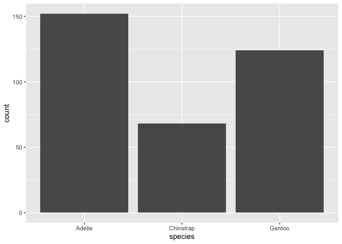
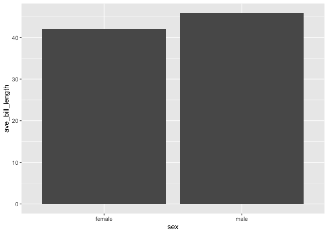
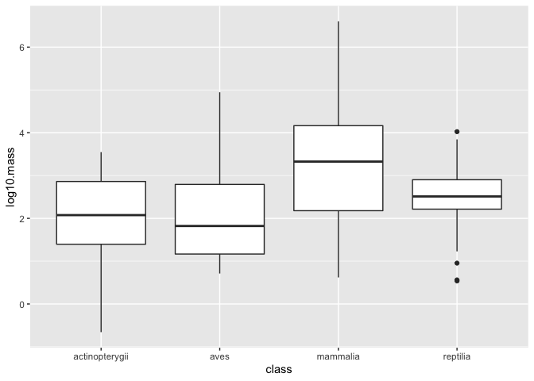
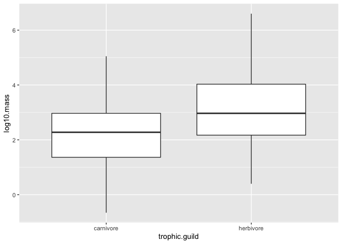
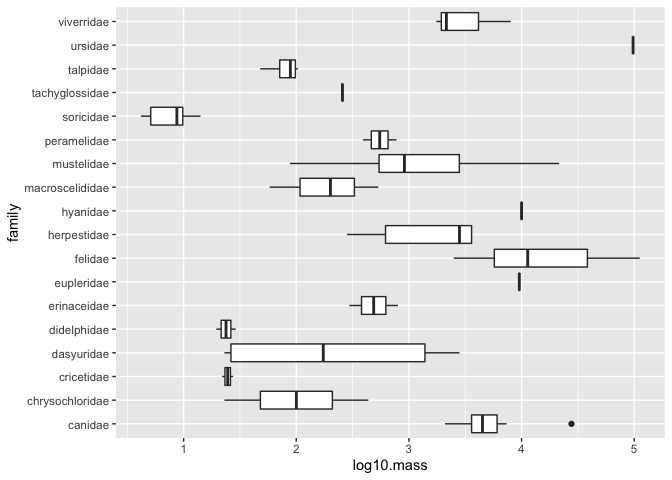
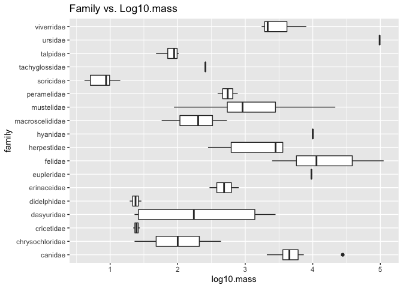

## Learning Goals
*At the end of this exercise, you will be able to:*    
1. Produce boxplots using `ggplot.`  
2. Customize labels on axes using `labs` and `themes`.  
3. Use `color`, `fill`, and `group` to customize plots and improve overall aesthetics.  

## Breakout Rooms  
Please take 5-8 minutes to check over your answers to HW 8 in your group. If you are stuck, please remember that you can check the key in [Joel's repository](https://github.com/jmledford3115/BIS15LW2021_jledford).  

##Resources
- [ggplot2 cheatsheet](https://www.rstudio.com/wp-content/uploads/2015/03/ggplot2-cheatsheet.pdf)
- [`ggplot` themes](https://ggplot2.tidyverse.org/reference/ggtheme.html)
- [Rebecca Barter `ggplot` Tutorial](http://www.rebeccabarter.com/blog/2017-11-17-ggplot2_tutorial/)

## Load the libraries

```r
library(tidyverse)
library(skimr)
library(janitor)
library(here)
library(palmerpenguins)
```

## Review
Now that you have been introduced to `ggplot`, let's practice a few more plot types. Remember that plots are built in layers: **plot= data + geom_ + aesthetics**. We have to specify each of these in order for a plot to be produced. If you get stuck, it is often helpful to stop and make a quick sketch of what you want or expect to see on a piece of scratch paper.  

Let's review using the `penguins` data. First, get an idea of the structure: Are the data tidy? Are there NA's? Are the variables discrete, categorical, or continuous?

```r
penguins
```

```
## # A tibble: 344 x 8
##    species island bill_length_mm bill_depth_mm flipper_length_… body_mass_g
##    <fct>   <fct>           <dbl>         <dbl>            <int>       <int>
##  1 Adelie  Torge…           39.1          18.7              181        3750
##  2 Adelie  Torge…           39.5          17.4              186        3800
##  3 Adelie  Torge…           40.3          18                195        3250
##  4 Adelie  Torge…           NA            NA                 NA          NA
##  5 Adelie  Torge…           36.7          19.3              193        3450
##  6 Adelie  Torge…           39.3          20.6              190        3650
##  7 Adelie  Torge…           38.9          17.8              181        3625
##  8 Adelie  Torge…           39.2          19.6              195        4675
##  9 Adelie  Torge…           34.1          18.1              193        3475
## 10 Adelie  Torge…           42            20.2              190        4250
## # … with 334 more rows, and 2 more variables: sex <fct>, year <int>
```

In a previous lab, we asked how many penguins are on each island.

```r
penguins %>% count(island, species, sort = F)
```

```
## # A tibble: 5 x 3
##   island    species       n
##   <fct>     <fct>     <int>
## 1 Biscoe    Adelie       44
## 2 Biscoe    Gentoo      124
## 3 Dream     Adelie       56
## 4 Dream     Chinstrap    68
## 5 Torgersen Adelie       52
```

What if we wanted a plot that showed the number of measured penguins per species and the number of measured penguins per island?

```r
penguins %>% 
  group_by(island) %>% #because you want to know how many are on each island
  ggplot(aes(x=species))+ #don't have to add y axis
  geom_bar() #use this for straight counts
```

<!-- -->


How about average bill length by sex?

```r
penguins %>% 
  count(sex)
```

```
## # A tibble: 3 x 2
##   sex        n
## * <fct>  <int>
## 1 female   165
## 2 male     168
## 3 <NA>      11
```
Issue because there's NAs. They probably represent juveniles, so not sexually mature yet. So, filtering that data out

```r
penguins %>% 
  filter(sex!="NA") %>% 
  group_by(sex) %>% 
  summarize(ave_bill_length=mean(bill_length_mm))
```

```
## # A tibble: 2 x 2
##   sex    ave_bill_length
## * <fct>            <dbl>
## 1 female            42.1
## 2 male              45.9
```
Geom_bar for plots! Cannot use geom_bar for continuous variables (Ex. can't make a count of bill length in mm. You can, but it's a continuous variable. Geom_bar meant to do counts. Not if you're trying to find range of values!)
Geom_col when specifying x and y axis!


```r
penguins %>% 
  filter(sex!="NA") %>% 
  group_by(sex) %>% 
  summarize(ave_bill_length=mean(bill_length_mm)) %>% 
  ggplot(aes(x=sex, y=ave_bill_length))+
  geom_col()
```

<!-- -->
-Only being shown how to make plots. We need to decide if the plot is appropriate or not!

## Box Plots
For the next series of examples, we will use the `homerange` data.  **Database of vertebrate home range sizes.**   

Reference: Tamburello N, Cote IM, Dulvy NK (2015) Energy and the scaling of animal space use. The American Naturalist 186(2):196-211. http://dx.doi.org/10.1086/682070.  
Data: http://datadryad.org/resource/doi:10.5061/dryad.q5j65/1  


```r
homerange <- read_csv(here("lab9", "data", "Tamburelloetal_HomeRangeDatabase.csv"))
homerange
```

```
## # A tibble: 569 x 24
##    taxon common.name class order family genus species primarymethod N    
##    <chr> <chr>       <chr> <chr> <chr>  <chr> <chr>   <chr>         <chr>
##  1 lake… american e… acti… angu… angui… angu… rostra… telemetry     16   
##  2 rive… blacktail … acti… cypr… catos… moxo… poecil… mark-recaptu… <NA> 
##  3 rive… central st… acti… cypr… cypri… camp… anomal… mark-recaptu… 20   
##  4 rive… rosyside d… acti… cypr… cypri… clin… fundul… mark-recaptu… 26   
##  5 rive… longnose d… acti… cypr… cypri… rhin… catara… mark-recaptu… 17   
##  6 rive… muskellunge acti… esoc… esoci… esox  masqui… telemetry     5    
##  7 mari… pollack     acti… gadi… gadid… poll… pollac… telemetry     2    
##  8 mari… saithe      acti… gadi… gadid… poll… virens  telemetry     2    
##  9 mari… lined surg… acti… perc… acant… acan… lineat… direct obser… <NA> 
## 10 mari… orangespin… acti… perc… acant… naso  litura… telemetry     8    
## # … with 559 more rows, and 15 more variables: mean.mass.g <dbl>,
## #   log10.mass <dbl>, alternative.mass.reference <chr>, mean.hra.m2 <dbl>,
## #   log10.hra <dbl>, hra.reference <chr>, realm <chr>, thermoregulation <chr>,
## #   locomotion <chr>, trophic.guild <chr>, dimension <chr>, preymass <dbl>,
## #   log10.preymass <dbl>, PPMR <dbl>, prey.size.reference <chr>
```

Boxplots help us visualize a range of values. So, on the x-axis we typically have something categorical and the y-axis is the range. In the case below, we are plotting `log10.mass` by taxonomic class in the `homerange` data. `geom_boxplot()` is the geom type for a standard box plot. The center line in each box represents the median, not the mean.

-Ex. family is catogircal. Y can be a range of values

Let's look at the variable `log10.mass` grouped by taxonomic class.

```r
homerange %>% 
  group_by(class) %>% 
  summarize(min_log10.mass=min(log10.mass),
            max_log10.mass=max(log10.mass),
            median_log10.mass=median(log10.mass))
```

```
## # A tibble: 4 x 4
##   class          min_log10.mass max_log10.mass median_log10.mass
## * <chr>                   <dbl>          <dbl>             <dbl>
## 1 actinopterygii         -0.658           3.55              2.08
## 2 aves                    0.712           4.95              1.82
## 3 mammalia                0.620           6.60              3.33
## 4 reptilia                0.539           4.03              2.51
```
X column: class/categorical variable (actinopterygii, aves, mammalia, reptilia)


```r
homerange %>% 
  ggplot(aes(x = class, y = log10.mass)) +
  geom_boxplot()
```

<!-- -->
Line in middle is median, not mean! Ex. with actinopterygii, median is a little above 2


## Practice
1. There are more herbivores than carnivores in the homerange data, but how do their masses compare? Make a summary and boxplot that compares their masses. Use `log10.mass`.

```r
names(homerange)
```

```
##  [1] "taxon"                      "common.name"               
##  [3] "class"                      "order"                     
##  [5] "family"                     "genus"                     
##  [7] "species"                    "primarymethod"             
##  [9] "N"                          "mean.mass.g"               
## [11] "log10.mass"                 "alternative.mass.reference"
## [13] "mean.hra.m2"                "log10.hra"                 
## [15] "hra.reference"              "realm"                     
## [17] "thermoregulation"           "locomotion"                
## [19] "trophic.guild"              "dimension"                 
## [21] "preymass"                   "log10.preymass"            
## [23] "PPMR"                       "prey.size.reference"
```


```r
homerange %>% 
  group_by(trophic.guild) %>% 
  summarize(min_log10.mass=min(log10.mass),
            max_log10.mass=max(log10.mass),
            median_log10.mass=median(log10.mass),
            total_n=n())
```

```
## # A tibble: 2 x 5
##   trophic.guild min_log10.mass max_log10.mass median_log10.mass total_n
## * <chr>                  <dbl>          <dbl>             <dbl>   <int>
## 1 carnivore             -0.658           5.05              2.28     342
## 2 herbivore              0.398           6.60              2.97     227
```


```r
homerange %>% 
  ggplot(aes(x = trophic.guild, y = log10.mass)) +
  geom_boxplot()
```

<!-- -->

2. Have a closer look at carnivorous mammals. Summarize and visualize the range of log10.mass by family.

```r
homerange %>% 
  filter(taxon=="mammals" & trophic.guild=="carnivore") %>% #Must be an "and" function!
  summarize(min_log10.mass=min(log10.mass),
            max_log10.mass=max(log10.mass),
            median_log10.mass=median(log10.mass),
            total_n=n()) %>% 
  pivot_longer(cols = everything(),
               names_to="measurement",
               values_to="value")
```

```
## # A tibble: 4 x 2
##   measurement        value
##   <chr>              <dbl>
## 1 min_log10.mass     0.620
## 2 max_log10.mass     5.05 
## 3 median_log10.mass  3.29 
## 4 total_n           80
```

3. Now use a boxplot to visualize the range of body mass by family of mammilian carnivore.

```r
homerange %>% 
  filter(class=="mammalia", trophic.guild=="carnivore") %>%  
  ggplot(aes(x = family, y = log10.mass)) +
  geom_boxplot()+
  coord_flip()
```

<!-- -->

```r
homerange %>% 
  filter(taxon=="mammals", trophic.guild=="carnivore") %>%  
  ggplot(aes(x = family, y = log10.mass)) +
  geom_boxplot()+
  coord_flip()
```

<!-- -->


```r
homerange %>%
  filter(taxon=="mammals", trophic.guild=="carnivore") %>%
  select(family, log10.mass) %>% 
  ggplot(aes(x=family, y=log10.mass))+
  geom_boxplot()+
  coord_flip()+
  labs(title="Family vs. Log10.mass")
```

<!-- -->


## That's it, let's take a break!   

-->[Home](https://jmledford3115.github.io/datascibiol/)
