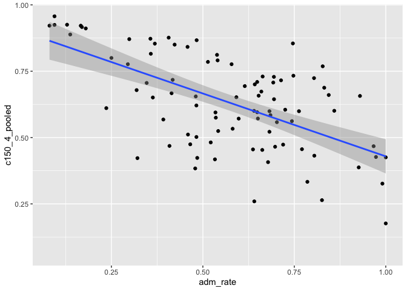

## Instructions
Answer the following questions and complete the exercises in RMarkdown. Please embed all of your code and push your final work to your repository. Your final lab report should be organized, clean, and run free from errors. Remember, you must remove the `#` for the included code chunks to run. Be sure to add your name to the author header above.  

Make sure to use the formatting conventions of RMarkdown to make your report neat and clean!  

## Load the libraries

```r
library(tidyverse)
library(janitor)
library(here)
library(naniar)
```

For this homework, we will take a departure from biological data and use data about California colleges. These data are a subset of the national college scorecard (https://collegescorecard.ed.gov/data/). Load the `ca_college_data.csv` as a new object called `colleges`.

```r
colleges <-read_csv(here("lab9", "data", "ca_college_data.csv"))
```

```
## 
## ── Column specification ────────────────────────────────────────────────────────
## cols(
##   INSTNM = col_character(),
##   CITY = col_character(),
##   STABBR = col_character(),
##   ZIP = col_character(),
##   ADM_RATE = col_double(),
##   SAT_AVG = col_double(),
##   PCIP26 = col_double(),
##   COSTT4_A = col_double(),
##   C150_4_POOLED = col_double(),
##   PFTFTUG1_EF = col_double()
## )
```

```r
colleges
```

```
## # A tibble: 341 x 10
##    INSTNM     CITY   STABBR ZIP   ADM_RATE SAT_AVG PCIP26 COSTT4_A C150_4_POOLED
##    <chr>      <chr>  <chr>  <chr>    <dbl>   <dbl>  <dbl>    <dbl>         <dbl>
##  1 Grossmont… El Ca… CA     9202…       NA      NA 0.0016     7956        NA    
##  2 College o… Visal… CA     9327…       NA      NA 0.0066     8109        NA    
##  3 College o… San M… CA     9440…       NA      NA 0.0038     8278        NA    
##  4 Ventura C… Ventu… CA     9300…       NA      NA 0.0035     8407        NA    
##  5 Oxnard Co… Oxnard CA     9303…       NA      NA 0.0085     8516        NA    
##  6 Moorpark … Moorp… CA     9302…       NA      NA 0.0151     8577        NA    
##  7 Skyline C… San B… CA     9406…       NA      NA 0          8580         0.233
##  8 Glendale … Glend… CA     9120…       NA      NA 0.002      9181        NA    
##  9 Citrus Co… Glend… CA     9174…       NA      NA 0.0021     9281        NA    
## 10 Fresno Ci… Fresno CA     93741       NA      NA 0.0324     9370        NA    
## # … with 331 more rows, and 1 more variable: PFTFTUG1_EF <dbl>
```

The variables are a bit hard to decipher, here is a key:  

INSTNM: Institution name  
CITY: California city  
STABBR: Location state  
ZIP: Zip code  
ADM_RATE: Admission rate  
SAT_AVG: SAT average score  
PCIP26: Percentage of degrees awarded in Biological And Biomedical Sciences  
COSTT4_A: Annual cost of attendance  
C150_4_POOLED: 4-year completion rate  
PFTFTUG1_EF: Percentage of undergraduate students who are first-time, full-time degree/certificate-seeking undergraduate students  

1. Use your preferred function(s) to have a look at the data and get an idea of its structure. Make sure you summarize NA's and determine whether or not the data are tidy. You may also consider dealing with any naming issues.

```r
colleges <- janitor::clean_names(colleges)
colleges
```

```
## # A tibble: 341 x 10
##    instnm     city   stabbr zip   adm_rate sat_avg pcip26 costt4_a c150_4_pooled
##    <chr>      <chr>  <chr>  <chr>    <dbl>   <dbl>  <dbl>    <dbl>         <dbl>
##  1 Grossmont… El Ca… CA     9202…       NA      NA 0.0016     7956        NA    
##  2 College o… Visal… CA     9327…       NA      NA 0.0066     8109        NA    
##  3 College o… San M… CA     9440…       NA      NA 0.0038     8278        NA    
##  4 Ventura C… Ventu… CA     9300…       NA      NA 0.0035     8407        NA    
##  5 Oxnard Co… Oxnard CA     9303…       NA      NA 0.0085     8516        NA    
##  6 Moorpark … Moorp… CA     9302…       NA      NA 0.0151     8577        NA    
##  7 Skyline C… San B… CA     9406…       NA      NA 0          8580         0.233
##  8 Glendale … Glend… CA     9120…       NA      NA 0.002      9181        NA    
##  9 Citrus Co… Glend… CA     9174…       NA      NA 0.0021     9281        NA    
## 10 Fresno Ci… Fresno CA     93741       NA      NA 0.0324     9370        NA    
## # … with 331 more rows, and 1 more variable: pftftug1_ef <dbl>
```


```r
glimpse(colleges)
```

```
## Rows: 341
## Columns: 10
## $ instnm        <chr> "Grossmont College", "College of the Sequoias", "College…
## $ city          <chr> "El Cajon", "Visalia", "San Mateo", "Ventura", "Oxnard",…
## $ stabbr        <chr> "CA", "CA", "CA", "CA", "CA", "CA", "CA", "CA", "CA", "C…
## $ zip           <chr> "92020-1799", "93277-2214", "94402-3784", "93003-3872", …
## $ adm_rate      <dbl> NA, NA, NA, NA, NA, NA, NA, NA, NA, NA, NA, NA, NA, NA, …
## $ sat_avg       <dbl> NA, NA, NA, NA, NA, NA, NA, NA, NA, NA, NA, NA, NA, NA, …
## $ pcip26        <dbl> 0.0016, 0.0066, 0.0038, 0.0035, 0.0085, 0.0151, 0.0000, …
## $ costt4_a      <dbl> 7956, 8109, 8278, 8407, 8516, 8577, 8580, 9181, 9281, 93…
## $ c150_4_pooled <dbl> NA, NA, NA, NA, NA, NA, 0.2334, NA, NA, NA, NA, 0.1704, …
## $ pftftug1_ef   <dbl> 0.3546, 0.5413, 0.3567, 0.3824, 0.2753, 0.4286, 0.2307, …
```


```r
naniar::miss_var_summary(colleges)
```

```
## # A tibble: 10 x 3
##    variable      n_miss pct_miss
##    <chr>          <int>    <dbl>
##  1 sat_avg          276     80.9
##  2 adm_rate         240     70.4
##  3 c150_4_pooled    221     64.8
##  4 costt4_a         124     36.4
##  5 pftftug1_ef       53     15.5
##  6 pcip26            35     10.3
##  7 instnm             0      0  
##  8 city               0      0  
##  9 stabbr             0      0  
## 10 zip                0      0
```

1) Each variable has its own column.

True

2) Each observation has its own row.

True

3) Each value has its own cell.

True


<style>
div.blue { background-color:#e6f0ff; border-radius: 5px; padding: 20px;}
</style>
<div class = "blue">

2. Which cities in California have the highest number of colleges?

```r
colleges%>% 
  select(city, instnm) %>% 
  group_by(city) %>%
  summarize(n=n(), .groups= 'keep') %>% 
  arrange(desc(n=n()))
```

```
## # A tibble: 161 x 2
## # Groups:   city [161]
##    city            n
##    <chr>       <int>
##  1 Alameda         3
##  2 Anaheim         4
##  3 Angwin          1
##  4 Aptos           1
##  5 Arcata          1
##  6 Atherton        1
##  7 Azusa           1
##  8 Bakersfield     3
##  9 Barstow         1
## 10 Belmont         1
## # … with 151 more rows
```

```r
#Not sure why arrange isn't working
```


```r
colleges %>%
  count(instnm, city, sort = T)
```

```
## # A tibble: 341 x 3
##    instnm                                         city              n
##    <chr>                                          <chr>         <int>
##  1 Academy of Art University                      San Francisco     1
##  2 Academy of Chinese Culture and Health Sciences Oakland           1
##  3 Allan Hancock College                          Santa Maria       1
##  4 Alliant International University-San Diego     San Diego         1
##  5 American Academy of Dramatic Arts-Los Angeles  Los Angeles       1
##  6 American Baptist Seminary of the West          Berkeley          1
##  7 American Beauty College                        West Covina       1
##  8 American Career College-Los Angeles            Los Angeles       1
##  9 American Conservatory Theater                  San Francisco     1
## 10 American Film Institute Conservatory           Los Angeles       1
## # … with 331 more rows
```


```r
colleges %>% 
  count(city) %>% 
  arrange(desc(n))
```

```
## # A tibble: 161 x 2
##    city              n
##    <chr>         <int>
##  1 Los Angeles      24
##  2 San Diego        18
##  3 San Francisco    15
##  4 Sacramento       10
##  5 Berkeley          9
##  6 Oakland           9
##  7 Claremont         7
##  8 Pasadena          6
##  9 Fresno            5
## 10 Irvine            5
## # … with 151 more rows
```
</div>

What professor's key had:

```r
colleges %>% 
  count(city) %>% 
  arrange(desc(n))
```

```
## # A tibble: 161 x 2
##    city              n
##    <chr>         <int>
##  1 Los Angeles      24
##  2 San Diego        18
##  3 San Francisco    15
##  4 Sacramento       10
##  5 Berkeley          9
##  6 Oakland           9
##  7 Claremont         7
##  8 Pasadena          6
##  9 Fresno            5
## 10 Irvine            5
## # … with 151 more rows
```


3. Based on your answer to #2, make a plot that shows the number of colleges in the top 10 cities.

```r
colleges %>%
  count(city) %>% 
  arrange(desc(n)) %>%
  top_n(10, n) %>% 
  ggplot(aes(x=reorder(city, n), y=n))+
  geom_col()+
  coord_flip()
```

<!-- -->
<style>
div.blue { background-color:#e6f0ff; border-radius: 5px; padding: 20px;}
</style>
<div class = "blue">

4. The column `COSTT4_A` is the annual cost of each institution. Which city has the highest average cost? Where is it located?

```r
colleges %>%
  group_by(city, stabbr) %>% 
  summarize(max_average_cost = mean(costt4_a, na.rm=T),
            total=n()) %>% 
  arrange(desc(max_average_cost))
```

```
## `summarise()` has grouped output by 'city'. You can override using the `.groups` argument.
```

```
## # A tibble: 161 x 4
## # Groups:   city [161]
##    city                stabbr max_average_cost total
##    <chr>               <chr>             <dbl> <int>
##  1 Claremont           CA                66498     7
##  2 Malibu              CA                66152     1
##  3 Valencia            CA                64686     1
##  4 Orange              CA                64501     3
##  5 Redlands            CA                61542     1
##  6 Moraga              CA                61095     1
##  7 Atherton            CA                56035     1
##  8 Thousand Oaks       CA                54373     1
##  9 Rancho Palos Verdes CA                50758     1
## 10 La Verne            CA                50603     1
## # … with 151 more rows
```

Claremont has the highest rated cost, and it's located in CA.

This is what the professor's key had:

```r
colleges %>% 
  group_by(city) %>% 
  summarize(mean_cost_yr=mean(costt4_a, na.rm=TRUE),
            total=n()) %>% 
  arrange(desc(mean_cost_yr))
```

```
## # A tibble: 161 x 3
##    city                mean_cost_yr total
##    <chr>                      <dbl> <int>
##  1 Claremont                  66498     7
##  2 Malibu                     66152     1
##  3 Valencia                   64686     1
##  4 Orange                     64501     3
##  5 Redlands                   61542     1
##  6 Moraga                     61095     1
##  7 Atherton                   56035     1
##  8 Thousand Oaks              54373     1
##  9 Rancho Palos Verdes        50758     1
## 10 La Verne                   50603     1
## # … with 151 more rows
```


5. Based on your answer to #4, make a plot that compares the cost of the individual colleges in the most expensive city. Bonus! Add UC Davis here to see how it compares :>).

```r
colleges %>% 
  filter(city=="Claremont" & costt4_a!="NA") %>% 
  group_by(city) %>% 
  ggplot(aes(x=instnm, y=costt4_a))+
  geom_col()+
  coord_flip()
```

<!-- -->
</div>

This is what the professor's key had:

```r
colleges %>% 
  filter(instnm== "University of California-Davis" | city=="Claremont" & costt4_a!="NA") %>% 
  ggplot(aes(x=instnm, y=costt4_a)) + 
  geom_col()+
  coord_flip()
```

<!-- -->


6. The column `ADM_RATE` is the admissions rate by college and `C150_4_POOLED` is the four-year completion rate. Use a scatterplot to show the relationship between these two variables. What do you think this means?

```r
ggplot(data=colleges, mapping=aes(x=adm_rate, y=c150_4_pooled))+
  geom_point(na.rm=T)
```

<!-- -->

There is a negative correlation between the admission rates into colleges and how many students complete their 4 year admission rate.

This is what the professor's key had:

```r
colleges %>% 
  ggplot(aes(x=adm_rate, y=c150_4_pooled))+
  geom_point(na.rm=T)+
  geom_smooth(method=lm, se=F, na.rm=T)
```

```
## `geom_smooth()` using formula 'y ~ x'
```

<!-- -->


7. Is there a relationship between cost and four-year completion rate? (You don't need to do the stats, just produce a plot). What do you think this means?

```r
ggplot(data=colleges, mapping=aes(x=adm_rate, y=c150_4_pooled)) +
  geom_point(na.rm = T)+
  geom_smooth(method=lm, se=T)
```

```
## `geom_smooth()` using formula 'y ~ x'
```

```
## Warning: Removed 251 rows containing non-finite values (stat_smooth).
```

<!-- -->

This is what professor's key had:

```r
colleges %>% 
  ggplot(aes(x=costt4_a, y=c150_4_pooled))+
  geom_point(na.rm=T)+
  geom_smooth(method=lm, se=F, na.rm=T)
```

```
## `geom_smooth()` using formula 'y ~ x'
```

<!-- -->


<style>
div.blue { background-color:#e6f0ff; border-radius: 5px; padding: 20px;}
</style>
<div class = "blue">

8. The column titled `INSTNM` is the institution name. We are only interested in the University of California colleges. Make a new data frame that is restricted to UC institutions. You can remove `Hastings College of Law` and `UC San Francisco` as we are only interested in undergraduate institutions.

```r
colleges_UCs <- colleges %>%
  filter_all(any_vars(str_detect(., pattern = "University of California"))) 
colleges_UCs
```

```
## # A tibble: 10 x 10
##    instnm     city   stabbr zip   adm_rate sat_avg pcip26 costt4_a c150_4_pooled
##    <chr>      <chr>  <chr>  <chr>    <dbl>   <dbl>  <dbl>    <dbl>         <dbl>
##  1 Universit… La Jo… CA     92093    0.357    1324  0.216    31043         0.872
##  2 Universit… Irvine CA     92697    0.406    1206  0.107    31198         0.876
##  3 Universit… River… CA     92521    0.663    1078  0.149    31494         0.73 
##  4 Universit… Los A… CA     9009…    0.180    1334  0.155    33078         0.911
##  5 Universit… Davis  CA     9561…    0.423    1218  0.198    33904         0.850
##  6 Universit… Santa… CA     9506…    0.578    1201  0.193    34608         0.776
##  7 Universit… Berke… CA     94720    0.169    1422  0.105    34924         0.916
##  8 Universit… Santa… CA     93106    0.358    1281  0.108    34998         0.816
##  9 Universit… San F… CA     9410…   NA          NA NA           NA        NA    
## 10 Universit… San F… CA     9414…   NA          NA NA           NA        NA    
## # … with 1 more variable: pftftug1_ef <dbl>
```

```r
#filter_all: filter within a selection of variables
#any_vars: apply predicate to all variables
#str_detect: detect the precense or absence of a pattern in a string
#Ask difference between filter_all vs filter
#Why dot?
```

Remove `Hastings College of Law` and `UC San Francisco` and store the final data frame as a new object `univ_calif_final`.

```r
colleges_UCs_final <- colleges_UCs %>%
  filter(city !="San Francisco")
colleges_UCs_final
```

```
## # A tibble: 8 x 10
##   instnm      city   stabbr zip   adm_rate sat_avg pcip26 costt4_a c150_4_pooled
##   <chr>       <chr>  <chr>  <chr>    <dbl>   <dbl>  <dbl>    <dbl>         <dbl>
## 1 University… La Jo… CA     92093    0.357    1324  0.216    31043         0.872
## 2 University… Irvine CA     92697    0.406    1206  0.107    31198         0.876
## 3 University… River… CA     92521    0.663    1078  0.149    31494         0.73 
## 4 University… Los A… CA     9009…    0.180    1334  0.155    33078         0.911
## 5 University… Davis  CA     9561…    0.423    1218  0.198    33904         0.850
## 6 University… Santa… CA     9506…    0.578    1201  0.193    34608         0.776
## 7 University… Berke… CA     94720    0.169    1422  0.105    34924         0.916
## 8 University… Santa… CA     93106    0.358    1281  0.108    34998         0.816
## # … with 1 more variable: pftftug1_ef <dbl>
```

Use `separate()` to separate institution name into two new columns "UNIV" and "CAMPUS".

```r
colleges_UCs_final <-colleges_UCs_final %>% 
  separate(instnm, into= c("university", "campus"), sep="-")
colleges_UCs_final
```

```
## # A tibble: 8 x 11
##   university     campus   city    stabbr zip    adm_rate sat_avg pcip26 costt4_a
##   <chr>          <chr>    <chr>   <chr>  <chr>     <dbl>   <dbl>  <dbl>    <dbl>
## 1 University of… San Die… La Jol… CA     92093     0.357    1324  0.216    31043
## 2 University of… Irvine   Irvine  CA     92697     0.406    1206  0.107    31198
## 3 University of… Riversi… Rivers… CA     92521     0.663    1078  0.149    31494
## 4 University of… Los Ang… Los An… CA     90095…    0.180    1334  0.155    33078
## 5 University of… Davis    Davis   CA     95616…    0.423    1218  0.198    33904
## 6 University of… Santa C… Santa … CA     95064…    0.578    1201  0.193    34608
## 7 University of… Berkeley Berkel… CA     94720     0.169    1422  0.105    34924
## 8 University of… Santa B… Santa … CA     93106     0.358    1281  0.108    34998
## # … with 2 more variables: c150_4_pooled <dbl>, pftftug1_ef <dbl>
```

```r
#Remember to apply this to dataframe!
```

9. The column `ADM_RATE` is the admissions rate by campus. Which UC has the lowest and highest admissions rates? Produce a numerical summary and an appropriate plot.

```r
colleges_UCs_final %>%
  select(adm_rate, campus) %>% 
  group_by(adm_rate) %>% 
  arrange(adm_rate)
```

```
## # A tibble: 8 x 2
## # Groups:   adm_rate [8]
##   adm_rate campus       
##      <dbl> <chr>        
## 1    0.169 Berkeley     
## 2    0.180 Los Angeles  
## 3    0.357 San Diego    
## 4    0.358 Santa Barbara
## 5    0.406 Irvine       
## 6    0.423 Davis        
## 7    0.578 Santa Cruz   
## 8    0.663 Riverside
```


```r
colleges_UCs_final %>% 
  group_by(adm_rate) %>% 
  arrange(adm_rate) %>%
  ggplot(aes(x=reorder(campus, adm_rate), y=adm_rate))+
  geom_col()+
  coord_flip()
```

<!-- -->

10. If you wanted to get a degree in biological or biomedical sciences, which campus confers the majority of these degrees? Produce a numerical summary and an appropriate plot.

```r
colleges_UCs_final %>%
  select(pcip26, campus) %>% 
  group_by(pcip26) %>% 
  arrange(desc(pcip26))
```

```
## # A tibble: 8 x 2
## # Groups:   pcip26 [8]
##   pcip26 campus       
##    <dbl> <chr>        
## 1  0.216 San Diego    
## 2  0.198 Davis        
## 3  0.193 Santa Cruz   
## 4  0.155 Los Angeles  
## 5  0.149 Riverside    
## 6  0.108 Santa Barbara
## 7  0.107 Irvine       
## 8  0.105 Berkeley
```


```r
colleges_UCs_final %>% 
  group_by(pcip26) %>% 
  arrange(desc(pcip26)) %>%
  ggplot(aes(x=reorder(campus, pcip26), y=pcip26))+
  geom_col()+
  coord_flip()
```

<!-- -->
</div>

What professor did:

```r
colleges_UCs_final %>% 
  select(campus, pcip26) %>% 
  arrange(pcip26)
```

```
## # A tibble: 8 x 2
##   campus        pcip26
##   <chr>          <dbl>
## 1 Berkeley       0.105
## 2 Irvine         0.107
## 3 Santa Barbara  0.108
## 4 Riverside      0.149
## 5 Los Angeles    0.155
## 6 Santa Cruz     0.193
## 7 Davis          0.198
## 8 San Diego      0.216
```


```r
colleges_UCs_final %>% 
  ggplot(aes(x=reorder(campus, pcip26), y=pcip26))+
  geom_col()
```

<!-- -->


## Knit Your Output and Post to [GitHub](https://github.com/FRS417-DataScienceBiologists)
